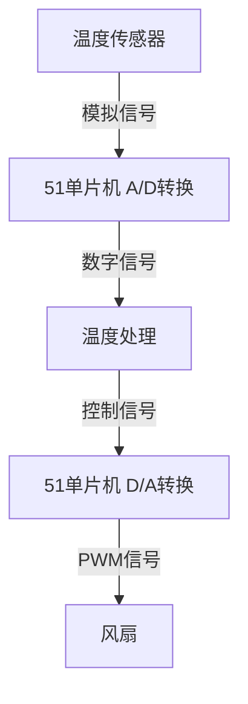

# 51单片机信号处理

## 介绍

在嵌入式系统中，信号处理是一个非常重要的环节。51单片机作为一款经典的微控制器，广泛应用于各种嵌入式设备中。信号处理的核心任务之一是将模拟信号转换为数字信号（A/D转换），或者将数字信号转换为模拟信号（D/A转换）。本文将详细介绍51单片机中的A/D与D/A转换，并通过实际案例帮助初学者理解这些概念。

## A/D转换（模数转换）

### 什么是A/D转换？

A/D转换（Analog-to-Digital Conversion）是将模拟信号转换为数字信号的过程。模拟信号是连续变化的信号，而数字信号是离散的。A/D转换器（ADC）是完成这一转换的硬件设备。

### 51单片机中的A/D转换

51单片机通常内置或外接A/D转换模块。以下是一个简单的A/D转换代码示例：

```c
#include <reg51.h>

sbit ADC_CS = P1^0;  // 片选信号
sbit ADC_CLK = P1^1; // 时钟信号
sbit ADC_DOUT = P1^2; // 数据输出

unsigned int read_adc() {
    unsigned int value = 0;
    ADC_CS = 0;  // 使能ADC
    ADC_CLK = 0;
    
    for (int i = 0; i < 12; i++) {
        ADC_CLK = 1;
        value <<= 1;
        value |= ADC_DOUT;
        ADC_CLK = 0;
    }
    
    ADC_CS = 1;  // 禁用ADC
    return value;
}

void main() {
    unsigned int adc_value;
    while (1) {
        adc_value = read_adc();
        // 处理adc_value
    }
}
```

### 输入与输出

- **输入**：模拟信号（例如温度传感器的输出电压）。
- **输出**：数字信号（例如12位二进制数）。

## D/A转换（数模转换）

### 什么是D/A转换？

D/A转换（Digital-to-Analog Conversion）是将数字信号转换为模拟信号的过程。D/A转换器（DAC）是完成这一转换的硬件设备。

### 51单片机中的D/A转换

51单片机通常通过PWM（脉宽调制）或外接DAC芯片来实现D/A转换。以下是一个简单的PWM实现D/A转换的代码示例：

```c
#include <reg51.h>

sbit PWM_OUT = P1^3;  // PWM输出引脚

void pwm_out(unsigned char duty_cycle) {
    PWM_OUT = 1;
    delay(duty_cycle);
    PWM_OUT = 0;
    delay(255 - duty_cycle);
}

void main() {
    unsigned char duty_cycle = 128;  // 50%占空比
    while (1) {
        pwm_out(duty_cycle);
    }
}
```

### 输入与输出

- **输入**：数字信号（例如8位二进制数）。
- **输出**：模拟信号（例如PWM波形）。

## 实际案例

### 温度监控系统

假设我们有一个温度监控系统，使用51单片机读取温度传感器的模拟信号，并通过A/D转换将其转换为数字信号。然后，单片机根据温度值控制风扇的转速，通过D/A转换输出PWM信号。



### 代码实现

```c
#include <reg51.h>

sbit ADC_CS = P1^0;
sbit ADC_CLK = P1^1;
sbit ADC_DOUT = P1^2;
sbit PWM_OUT = P1^3;

unsigned int read_adc() {
    unsigned int value = 0;
    ADC_CS = 0;
    ADC_CLK = 0;
    
    for (int i = 0; i < 12; i++) {
        ADC_CLK = 1;
        value <<= 1;
        value |= ADC_DOUT;
        ADC_CLK = 0;
    }
    
    ADC_CS = 1;
    return value;
}

void pwm_out(unsigned char duty_cycle) {
    PWM_OUT = 1;
    delay(duty_cycle);
    PWM_OUT = 0;
    delay(255 - duty_cycle);
}

void main() {
    unsigned int adc_value;
    unsigned char duty_cycle;
    
    while (1) {
        adc_value = read_adc();
        duty_cycle = adc_value >> 4;  // 将12位ADC值转换为8位PWM占空比
        pwm_out(duty_cycle);
    }
}
```

## 总结

通过本文，我们了解了51单片机中的A/D与D/A转换的基本原理，并通过实际案例展示了这些概念的应用。A/D转换将模拟信号转换为数字信号，而D/A转换则将数字信号转换为模拟信号。这些技术在嵌入式系统中有着广泛的应用，例如温度监控、电机控制等。

## 附加资源与练习

- **练习1**：尝试修改代码，使PWM占空比随温度变化而变化。
- **练习2**：使用外接DAC芯片实现D/A转换，并比较其与PWM实现的区别。
- **资源**：查阅51单片机数据手册，了解更多关于A/D与D/A转换的细节。

:::tip
建议初学者在学习过程中多动手实践，通过实际项目加深对A/D与D/A转换的理解。
:::