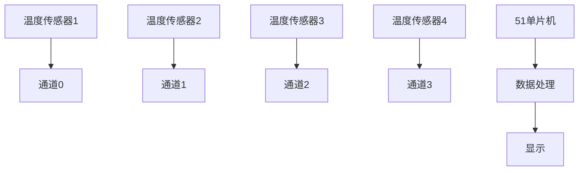

## 介绍

在嵌入式系统中，模拟信号的采集是一个常见的任务。51单片机内置的A/D转换器可以用于将模拟信号转换为数字信号。然而，在实际应用中，我们通常需要同时采集多个通道的模拟信号。本文将详细介绍如何在51单片机中实现多通道采集，并通过代码示例和实际案例帮助你理解这一概念。

## 多通道采集的基本原理

51单片机的A/D转换器通常支持多通道输入。每个通道对应一个模拟输入引脚，通过配置寄存器可以选择要采集的通道。多通道采集的基本原理是通过切换通道，依次采集每个通道的模拟信号，并将其转换为数字信号。

### 通道选择

在51单片机中，通常通过设置特定的寄存器来选择要采集的通道。例如，假设我们有一个8通道的A/D转换器，可以通过设置寄存器中的位来选择通道0到通道7。

### 采集过程

多通道采集的过程通常包括以下步骤：

1. 选择要采集的通道。
2. 启动A/D转换。
3. 等待转换完成。
4. 读取转换结果。
5. 重复上述步骤，采集下一个通道。

## 代码示例

以下是一个简单的代码示例，展示了如何在51单片机中实现多通道采集。假设我们使用8通道的A/D转换器，并且每个通道的采集结果存储在数组中。

```c
#include <reg51.h>

#define ADC_CHANNELS 8

unsigned int adc_results[ADC_CHANNELS];

void ADC_Init() {
    // 初始化A/D转换器
    ADCCON = 0x80;  // 使能A/D转换器
}

unsigned int ADC_Read(unsigned char channel) {
    ADCCON &= 0xF8;  // 清除通道选择位
    ADCCON |= channel;  // 选择通道
    ADCCON |= 0x40;  // 启动A/D转换
    while (!(ADCCON & 0x20));  // 等待转换完成
    return ADCDATA;  // 返回转换结果
}

void main() {
    unsigned char i;
    ADC_Init();
    for (i = 0; i < ADC_CHANNELS; i++) {
        adc_results[i] = ADC_Read(i);  // 采集每个通道的数据
    }
    while (1);  // 主循环
}
```

### 代码解释

- `ADC_Init()` 函数用于初始化A/D转换器。
- `ADC_Read()` 函数用于读取指定通道的A/D转换结果。
- 在主函数中，我们依次采集每个通道的数据，并将其存储在 `adc_results` 数组中。

## 实际应用案例

### 温度监测系统

假设我们正在设计一个温度监测系统，该系统需要同时监测多个位置的温度。我们可以使用51单片机的多通道采集功能，将每个温度传感器的输出连接到不同的A/D通道。通过多通道采集，我们可以实时获取每个位置的温度数据，并进行进一步的处理和显示。



在这个案例中，我们使用4个温度传感器，分别连接到51单片机的4个A/D通道。通过多通道采集，我们可以同时监测4个位置的温度，并将结果显示在屏幕上。

## 总结

多通道采集是51单片机中一个非常重要的功能，它允许我们同时采集多个模拟信号。通过本文的学习，你应该已经掌握了多通道采集的基本原理和实现方法。在实际应用中，多通道采集可以用于各种场景，如温度监测、电压监测等。

## 附加资源与练习

- **练习1**：修改代码示例，使其能够采集16个通道的数据。
- **练习2**：设计一个简单的电压监测系统，使用多通道采集功能监测多个电压值，并将结果显示在LCD屏幕上。
- **参考资源**：查阅51单片机的数据手册，了解更多关于A/D转换器的详细信息。

通过不断练习和探索，你将能够更好地掌握51单片机的多通道采集技术，并将其应用到实际项目中。