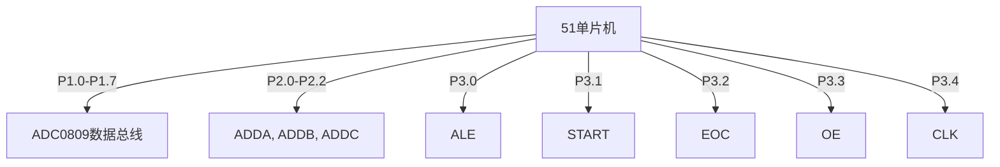

## 介绍

ADC0809 是一款常用的8位模数转换器（ADC），广泛应用于51单片机系统中。它可以将模拟信号转换为数字信号，便于单片机进行处理。本教程将逐步讲解如何在51单片机中使用ADC0809，并提供代码示例和实际应用案例。

## 硬件连接

ADC0809 与51单片机的连接主要包括以下几个引脚：

- **IN0-IN7**：8个模拟输入通道。
- **ADDA, ADDB, ADDC**：通道选择引脚，用于选择要转换的模拟输入通道。
- **ALE**：地址锁存使能，用于锁存通道选择信号。
- **START**：启动转换信号。
- **EOC**：转换结束信号，用于指示转换是否完成。
- **OE**：输出使能，用于使能数字输出。
- **CLK**：时钟输入，用于驱动ADC0809的转换过程。

以下是一个典型的连接示意图：



## 代码实现

以下是一个简单的代码示例，展示了如何使用51单片机控制ADC0809进行模数转换：

```c
#include <reg51.h>

sbit ALE = P3^0;
sbit START = P3^1;
sbit EOC = P3^2;
sbit OE = P3^3;
sbit CLK = P3^4;

void delay(unsigned int time) {
    unsigned int i, j;
    for(i = 0; i < time; i++)
        for(j = 0; j < 120; j++);
}

void main() {
    unsigned char channel = 0; // 选择通道0
    unsigned char result;

    while(1) {
        // 选择通道
        P2 = channel;

        // 锁存通道选择
        ALE = 1;
        delay(1);
        ALE = 0;

        // 启动转换
        START = 1;
        delay(1);
        START = 0;

        // 等待转换完成
        while(EOC == 0);

        // 使能输出
        OE = 1;

        // 读取转换结果
        result = P1;

        // 关闭输出使能
        OE = 0;

        // 处理结果（例如显示或存储）
        // ...

        // 延时一段时间后继续下一次转换
        delay(1000);
    }
}
```

:::note
**注意**：在实际应用中，可能需要根据具体的硬件配置调整代码中的引脚定义和延时时间。
:::

## 实际应用场景

ADC0809 可以用于各种需要将模拟信号转换为数字信号的场景，例如：

- **温度监测**：通过温度传感器采集模拟信号，使用ADC0809转换为数字信号后，单片机可以读取并处理温度数据。
- **光强检测**：通过光敏电阻采集环境光强信号，使用ADC0809转换为数字信号后，单片机可以自动调节灯光亮度。
- **电压测量**：通过分压电路采集电压信号，使用ADC0809转换为数字信号后，单片机可以显示或记录电压值。

## 总结

本教程详细介绍了如何在51单片机中使用ADC0809进行模数转换，包括硬件连接、代码实现以及实际应用场景。通过本教程，初学者可以掌握ADC0809的基本使用方法，并能够将其应用于实际项目中。

## 附加资源与练习

- **练习1**：尝试修改代码，使其能够循环读取所有8个通道的模拟信号。
- **练习2**：设计一个简单的温度监测系统，使用ADC0809采集温度传感器的模拟信号，并在LCD上显示温度值。
- **参考资源**：查阅ADC0809的数据手册，了解更多关于其工作原理和性能参数的信息。

:::tip
**提示**：在实际项目中，建议使用示波器或逻辑分析仪来调试ADC0809的时序，确保转换过程正确无误。
:::