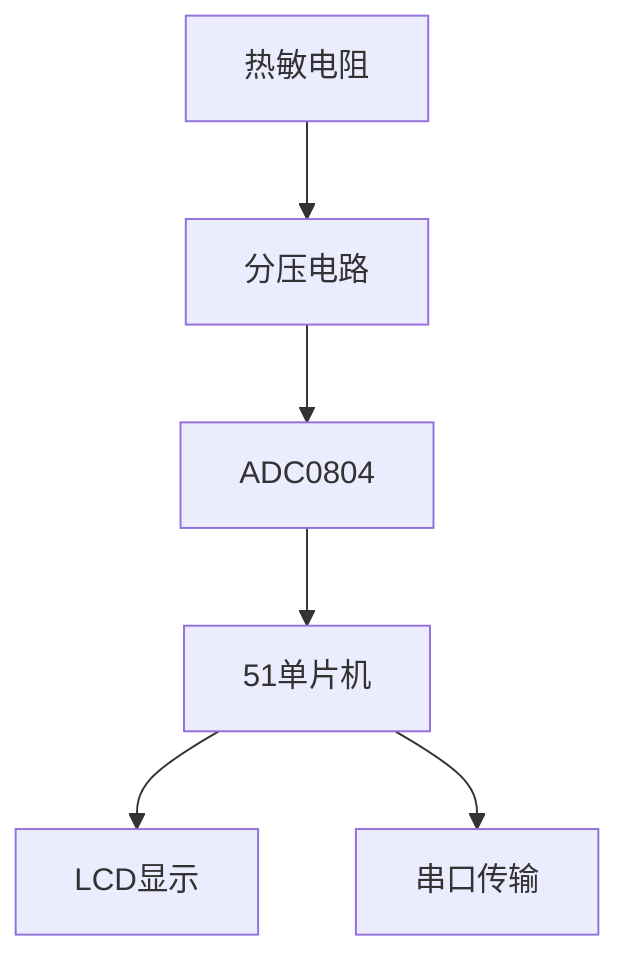

## 介绍

在嵌入式系统中，模拟量采集是一个非常重要的功能。51单片机通过A/D（模数）转换器可以将模拟信号（如电压、温度等）转换为数字信号，以便单片机进行处理和控制。本文将详细介绍51单片机模拟量采集的基本原理、实现方法以及实际应用。

## A/D转换的基本原理

A/D转换是将连续的模拟信号转换为离散的数字信号的过程。51单片机通常使用逐次逼近型A/D转换器，其工作原理如下：

1. **采样**：对模拟信号进行采样，获取离散的电压值。
2. **量化**：将采样得到的电压值量化为数字值。
3. **编码**：将量化后的数字值编码为二进制形式。

## 51单片机的A/D转换

51单片机通常通过外部A/D转换芯片（如ADC0804）或内部集成的A/D模块来实现模拟量采集。以下是一个使用ADC0804的示例代码：

```c
#include <reg51.h>

sbit CS = P3^0;  // 片选信号
sbit RD = P3^1;  // 读信号
sbit WR = P3^2;  // 写信号
sbit INTR = P3^3; // 中断信号

unsigned char read_adc() {
    unsigned char adc_value;
    CS = 0;  // 选中ADC0804
    WR = 0;  // 启动转换
    WR = 1;
    while (INTR == 1);  // 等待转换完成
    RD = 0;  // 读取转换结果
    adc_value = P1;  // 读取P1口的数据
    RD = 1;
    CS = 1;  // 取消选中
    return adc_value;
}

void main() {
    unsigned char result;
    while (1) {
        result = read_adc();
        // 处理result
    }
}
```

### 代码解释

- `CS`、`RD`、`WR` 和 `INTR` 是控制ADC0804的信号引脚。
- `read_adc()` 函数用于读取A/D转换的结果。
- `main()` 函数中不断读取A/D转换结果并进行处理。

## 实际应用案例

### 温度监测系统

假设我们需要设计一个温度监测系统，使用热敏电阻测量环境温度，并通过51单片机进行A/D转换。以下是系统的简要流程：

1. **传感器信号采集**：热敏电阻的阻值随温度变化，通过分压电路将阻值变化转换为电压信号。
2. **A/D转换**：使用ADC0804将电压信号转换为数字信号。
3. **数据处理**：单片机读取数字信号并计算温度值。
4. **显示或传输**：将温度值显示在LCD上或通过串口传输到上位机。



## 总结

通过本文的学习，你应该已经掌握了51单片机模拟量采集的基本原理和实现方法。A/D转换是嵌入式系统中非常重要的功能，广泛应用于各种传感器信号的采集和处理。

## 附加资源与练习

- **练习1**：尝试修改示例代码，使其能够读取多个模拟信号并进行处理。
- **练习2**：设计一个简单的光照强度监测系统，使用光敏电阻和51单片机实现A/D转换。
- **资源**：查阅51单片机和ADC0804的数据手册，深入了解其工作原理和寄存器配置。

:::tip
在实际项目中，A/D转换的精度和速度是非常重要的参数，选择合适的A/D转换器和优化代码可以提高系统的性能。
:::