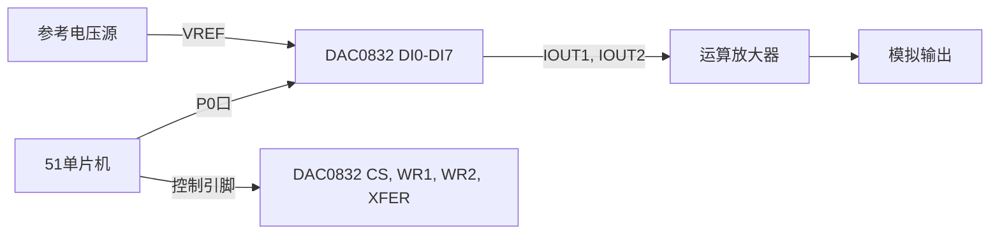

## 介绍

在嵌入式系统中，数字到模拟转换（D/A转换）是一个重要的功能，它允许单片机将数字信号转换为模拟信号，从而控制外部设备，如电机、音频设备等。DAC0832是一款常用的8位D/A转换芯片，广泛应用于51单片机项目中。本文将详细介绍如何在51单片机中使用DAC0832，并通过代码示例和实际案例帮助你理解其工作原理和应用场景。

## DAC0832简介

DAC0832是一款8位分辨率的数字到模拟转换器，具有双缓冲输入寄存器，可以实现单极性或双极性输出。它的主要特点包括：

- 8位分辨率
- 双缓冲输入寄存器
- 单电源供电（+5V）
- 低功耗
- 快速建立时间

## DAC0832引脚功能

DAC0832共有20个引脚，以下是其主要引脚的功能说明：

- `VREF`：参考电压输入，决定输出电压的范围。
- `IOUT1` 和 `IOUT2`：模拟电流输出，通常通过运算放大器转换为电压输出。
- `CS`：片选信号，低电平有效。
- `WR1` 和 `WR2`：写信号，用于控制数据的写入。
- `XFER`：传输控制信号，用于将输入寄存器的数据传输到DAC寄存器。
- `DI0-DI7`：8位数据输入，用于接收来自单片机的数字信号。

## 硬件连接

在使用DAC0832时，需要将其与51单片机正确连接。以下是典型的连接方式：

1. 将DAC0832的`DI0-DI7`引脚连接到51单片机的P0口（或其他I/O口）。
2. 将`CS`、`WR1`、`WR2`和`XFER`引脚分别连接到单片机的控制引脚。
3. 将`VREF`引脚连接到参考电压源（通常为+5V）。
4. 将`IOUT1`和`IOUT2`引脚通过运算放大器转换为电压输出。



## 软件编程

接下来，我们将通过一个简单的代码示例来演示如何使用51单片机控制DAC0832输出模拟信号。

```c
#include <reg51.h>

sbit CS = P2^0;  // 片选信号
sbit WR1 = P2^1; // 写信号1
sbit WR2 = P2^2; // 写信号2
sbit XFER = P2^3; // 传输控制信号

void DAC0832_Write(unsigned char value) {
    CS = 0;  // 选中DAC0832
    WR1 = 0; // 允许写入数据
    P0 = value; // 将数据写入DAC0832
    WR1 = 1; // 停止写入
    XFER = 0; // 将数据从输入寄存器传输到DAC寄存器
    XFER = 1; // 停止传输
    CS = 1;  // 取消选中DAC0832
}

void main() {
    unsigned char i;
    while (1) {
        for (i = 0; i < 255; i++) {
            DAC0832_Write(i); // 输出递增的模拟信号
            delay(); // 延时函数，控制输出速度
        }
    }
}
```

### 代码解释

1. `DAC0832_Write`函数用于向DAC0832写入数据。首先，通过`CS`和`WR1`信号将数据写入输入寄存器，然后通过`XFER`信号将数据传输到DAC寄存器。
2. 在`main`函数中，我们通过循环递增的方式向DAC0832写入数据，从而输出一个递增的模拟信号。

## 实际应用案例

DAC0832可以应用于多种场景，例如：

- **音频信号生成**：通过DAC0832生成音频信号，驱动扬声器播放声音。
- **电机控制**：通过DAC0832输出模拟信号，控制电机的转速。
- **波形生成**：通过DAC0832生成各种波形信号，如正弦波、方波等。

### 案例：生成正弦波

以下是一个简单的代码示例，用于生成正弦波信号：

```c
#include <reg51.h>
#include <math.h>

sbit CS = P2^0;
sbit WR1 = P2^1;
sbit WR2 = P2^2;
sbit XFER = P2^3;

void DAC0832_Write(unsigned char value) {
    CS = 0;
    WR1 = 0;
    P0 = value;
    WR1 = 1;
    XFER = 0;
    XFER = 1;
    CS = 1;
}

void main() {
    unsigned char i;
    float angle;
    while (1) {
        for (i = 0; i < 255; i++) {
            angle = 2 * 3.14159 * i / 255; // 计算角度
            DAC0832_Write(127 + 127 * sin(angle)); // 输出正弦波
            delay();
        }
    }
}
```

### 代码解释

1. 在`main`函数中，我们通过计算正弦函数的值，并将其映射到0-255的范围内，从而生成正弦波信号。
2. `DAC0832_Write`函数将计算得到的值写入DAC0832，输出相应的模拟信号。

## 总结

通过本文的学习，你应该已经掌握了如何在51单片机中使用DAC0832进行数字到模拟转换。我们介绍了DAC0832的基本原理、引脚功能、硬件连接方法以及软件编程实现。通过实际应用案例，你还可以看到DAC0832在音频信号生成、电机控制和波形生成等方面的应用。

## 附加资源与练习

- **练习1**：尝试修改代码，生成一个三角波信号。
- **练习2**：将DAC0832与LED灯连接，通过改变输出信号控制LED的亮度。
- **参考资源**：查阅DAC0832的数据手册，了解更多关于其特性和应用的信息。

希望本文能帮助你在51单片机的学习中更进一步！如果有任何问题，欢迎在评论区留言讨论。