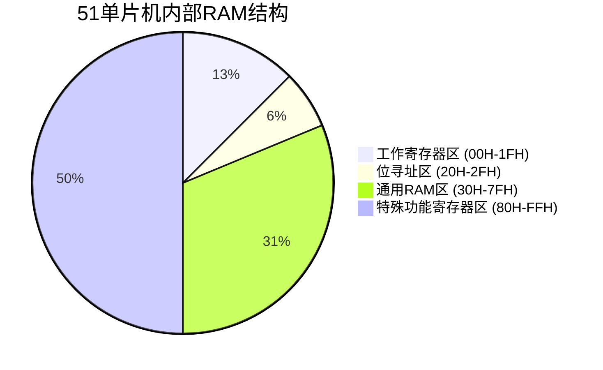

# 51单片机内部RAM

## 介绍

51单片机（如Intel 8051系列）是一种广泛使用的8位微控制器，其内部RAM（随机存取存储器）是程序运行时的关键资源之一。内部RAM用于存储临时数据、变量和堆栈信息，是单片机执行程序时不可或缺的部分。本文将详细介绍51单片机内部RAM的结构、使用方法以及实际应用场景。

## 内部RAM的结构

51单片机的内部RAM通常分为以下几个部分：

1. **工作寄存器区（00H-1FH）**：共32个字节，分为4个寄存器组（Bank 0-Bank 3），每组包含8个寄存器（R0-R7）。通过设置PSW（程序状态字）中的RS1和RS0位，可以选择使用哪个寄存器组。

2. **位寻址区（20H-2FH）**：共16个字节，每个字节的每一位都可以单独寻址，用于存储布尔变量或标志位。

3. **通用RAM区（30H-7FH）**：共80个字节，用于存储普通变量和数据。

4. **特殊功能寄存器（SFR）区（80H-FFH）**：用于控制和访问单片机的各种外设和功能模块。



## 工作寄存器区

工作寄存器区是51单片机内部RAM中最常用的部分之一。它分为4个寄存器组，每组包含8个寄存器（R0-R7）。通过设置PSW中的RS1和RS0位，可以选择使用哪个寄存器组。

```assembly
; 选择寄存器组1
SETB PSW.3  ; RS1 = 1
CLR PSW.4   ; RS0 = 0

; 使用寄存器R0
MOV R0, #0x55
```

:::note
**注意**：默认情况下，51单片机使用寄存器组0（Bank 0）。
:::

## 位寻址区

位寻址区允许对每个字节的每一位进行单独寻址。这在处理布尔变量或标志位时非常有用。

```assembly
; 设置位寻址区的第0位
SETB 20H.0

; 清除位寻址区的第1位
CLR 20H.1
```

:::tip
**提示**：位寻址区的每个字节都可以通过位地址（如20H.0）或字节地址（如20H）进行访问。
:::

## 通用RAM区

通用RAM区用于存储普通变量和数据。这部分RAM的地址范围是30H-7FH。

```assembly
; 在通用RAM区存储数据
MOV 30H, #0xAA
MOV 31H, #0x55
```

## 特殊功能寄存器区

特殊功能寄存器区（SFR）用于控制和访问单片机的各种外设和功能模块。常见的SFR包括P0、P1、P2、P3（端口寄存器）、ACC（累加器）、B（B寄存器）等。

```assembly
; 设置P1端口为输出
MOV P1, #0xFF
```

## 实际应用案例

### 案例1：使用工作寄存器区进行简单计算

```assembly
; 选择寄存器组1
SETB PSW.3  ; RS1 = 1
CLR PSW.4   ; RS0 = 0

; 将R0和R1相加，结果存入R2
MOV R0, #10
MOV R1, #20
ADD A, R0
ADD A, R1
MOV R2, A
```

### 案例2：使用位寻址区控制LED

```assembly
; 假设LED连接到P1.0
SETB 20H.0  ; 设置位寻址区的第0位
MOV C, 20H.0
MOV P1.0, C ; 将位寻址区的第0位值赋给P1.0
```

## 总结

51单片机的内部RAM是其程序运行的核心资源之一。通过合理使用工作寄存器区、位寻址区、通用RAM区和特殊功能寄存器区，可以有效地管理和存储数据，实现各种功能。希望本文能帮助你更好地理解51单片机内部RAM的结构和使用方法。

## 附加资源与练习

- **练习1**：编写一个程序，使用工作寄存器区进行两个数的乘法运算，并将结果存储在通用RAM区。
- **练习2**：编写一个程序，使用位寻址区控制8个LED的亮灭状态。

:::caution
**注意**：在实际编程中，务必注意RAM的使用情况，避免超出可用范围。
:::