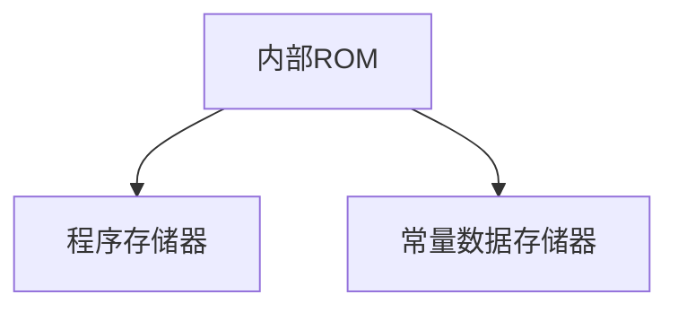

# 51单片机内部ROM

## 介绍

51单片机（如Intel 8051系列）是一种广泛使用的微控制器，其内部存储器包括ROM（只读存储器）和RAM（随机存取存储器）。ROM用于存储程序代码和常量数据，而RAM用于存储运行时的变量和临时数据。本文将重点介绍51单片机的内部ROM，帮助初学者理解其工作原理和应用场景。

## 什么是内部ROM？

内部ROM（Read-Only Memory）是一种非易失性存储器，即使在断电后也能保留数据。在51单片机中，内部ROM通常用于存储程序代码和常量数据。ROM的内容在制造时被写入，用户无法通过常规手段修改。

## 内部ROM的结构

51单片机的内部ROM通常分为以下几个部分：

1. **程序存储器**：用于存储程序代码。
2. **常量数据存储器**：用于存储常量数据，如查找表、字符串等。



## 内部ROM的工作原理

当51单片机上电时，CPU会从ROM的起始地址（通常是0x0000）开始读取程序代码并执行。ROM中的数据只能被读取，不能被修改。这种特性使得ROM非常适合存储程序代码和常量数据。

## 代码示例

以下是一个简单的代码示例，展示了如何在51单片机中使用内部ROM存储常量数据。

```c
#include <reg51.h>

// 定义一个常量数组，存储在ROM中
code unsigned char lookup_table[] = {0x00, 0x01, 0x02, 0x03, 0x04};

void main() {
    unsigned char i;
    for (i = 0; i < 5; i++) {
        P1 = lookup_table[i];  // 将ROM中的数据输出到P1口
    }
}
```

### 代码解释

- `code` 关键字用于声明存储在ROM中的常量数据。
- `lookup_table` 是一个存储在ROM中的常量数组。
- `P1` 是51单片机的P1口，用于输出数据。

## 实际应用案例

### 案例1：LED控制

假设我们需要控制一组LED灯，使其按照预定的模式闪烁。我们可以将LED的闪烁模式存储在ROM中，然后通过程序读取并控制LED。

```c
#include <reg51.h>

// 存储在ROM中的LED闪烁模式
code unsigned char led_pattern[] = {0x01, 0x02, 0x04, 0x08, 0x10, 0x20, 0x40, 0x80};

void main() {
    unsigned char i;
    while (1) {
        for (i = 0; i < 8; i++) {
            P1 = led_pattern[i];  // 将ROM中的数据输出到P1口
            delay(500);  // 延时500ms
        }
    }
}

void delay(unsigned int ms) {
    unsigned int i, j;
    for (i = 0; i < ms; i++)
        for (j = 0; j < 120; j++);
}
```

### 案例2：字符显示

假设我们需要在LCD显示屏上显示一段固定的字符串。我们可以将字符串存储在ROM中，然后通过程序读取并显示。

```c
#include <reg51.h>

// 存储在ROM中的字符串
code unsigned char message[] = "Hello, World!";

void main() {
    unsigned char i;
    for (i = 0; message[i] != '\0'; i++) {
        P1 = message[i];  // 将ROM中的字符输出到P1口
    }
}
```

## 总结

51单片机的内部ROM是一种非常重要的存储器，用于存储程序代码和常量数据。通过理解ROM的工作原理和应用场景，我们可以更好地设计和优化单片机程序。

## 附加资源与练习

- **练习1**：尝试修改上述代码，使LED灯按照不同的模式闪烁。
- **练习2**：编写一个程序，将存储在ROM中的字符串显示在LCD显示屏上。

:::tip
**提示**：在实际开发中，合理利用ROM可以节省RAM空间，提高程序的运行效率。
:::

:::caution
**注意**：ROM中的数据在程序运行期间无法修改，因此在设计程序时需要仔细考虑数据的存储位置。
:::