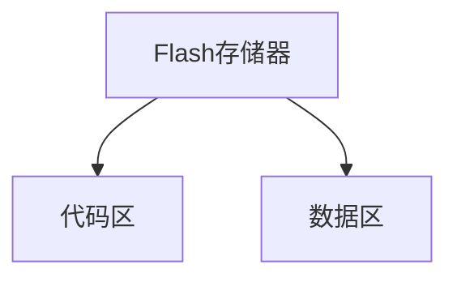

## 介绍

51单片机（如STC89C52、AT89S52等）通常内置了Flash存储器，用于存储程序代码和常量数据。Flash存储器是一种非易失性存储器，即使在断电后也能保留数据。与传统的ROM（只读存储器）不同，Flash存储器可以通过编程进行擦除和写入操作，这使得它在嵌入式系统中非常有用。

在本节中，我们将深入探讨51单片机的Flash存储技术，包括其工作原理、编程方法以及实际应用。

## Flash存储的工作原理

Flash存储器由多个存储单元组成，每个存储单元可以存储一个位（bit）的数据。这些存储单元被组织成页（Page）和扇区（Sector），以便于管理和操作。

### 存储结构

51单片机的Flash存储器通常分为以下几个部分：

1. **代码区**：用于存储程序代码。
2. **数据区**：用于存储常量数据或配置参数。



### 读写操作

Flash存储器的读写操作与RAM（随机存取存储器）不同。Flash存储器的写入操作需要先擦除再写入，而读取操作则可以直接进行。

:::note
**注意**：Flash存储器的擦除操作通常是以扇区为单位进行的，因此在写入数据之前，必须确保目标扇区已经被擦除。
:::

## 编程方法

在51单片机中，Flash存储器的编程通常通过特定的指令或函数来完成。以下是一个简单的示例，展示如何在STC89C52单片机中写入和读取Flash存储器中的数据。

### 示例代码

```c
#include <stc89c52.h>

#define FLASH_ADDRESS 0x2000  // 定义Flash存储地址

void write_flash(unsigned int address, unsigned char data) {
    EA = 0;  // 关闭中断
    ISP_CONTR = 0x81;  // 使能ISP功能
    ISP_CMD = 0x02;  // 设置写命令
    ISP_ADDRH = (unsigned char)(address >> 8);  // 设置地址高字节
    ISP_ADDRL = (unsigned char)(address & 0xFF);  // 设置地址低字节
    ISP_DATA = data;  // 写入数据
    ISP_TRIG = 0x46;  // 触发写操作
    ISP_TRIG = 0xB9;
    EA = 1;  // 恢复中断
}

unsigned char read_flash(unsigned int address) {
    EA = 0;  // 关闭中断
    ISP_CONTR = 0x81;  // 使能ISP功能
    ISP_CMD = 0x01;  // 设置读命令
    ISP_ADDRH = (unsigned char)(address >> 8);  // 设置地址高字节
    ISP_ADDRL = (unsigned char)(address & 0xFF);  // 设置地址低字节
    ISP_TRIG = 0x46;  // 触发读操作
    ISP_TRIG = 0xB9;
    EA = 1;  // 恢复中断
    return ISP_DATA;  // 返回读取的数据
}

void main() {
    unsigned char data = 0x55;  // 要写入的数据
    write_flash(FLASH_ADDRESS, data);  // 写入数据
    unsigned char read_data = read_flash(FLASH_ADDRESS);  // 读取数据
    while (1) {
        // 主循环
    }
}
```

### 代码解释

1. **write_flash函数**：该函数用于将数据写入指定的Flash地址。首先关闭中断，然后设置ISP（在系统编程）相关寄存器，最后触发写操作。
2. **read_flash函数**：该函数用于从指定的Flash地址读取数据。与写操作类似，首先关闭中断，然后设置ISP相关寄存器，最后触发读操作。
3. **main函数**：在主函数中，我们首先写入一个数据到Flash存储器，然后读取该数据并存储在变量中。

## 实际应用场景

Flash存储器在51单片机中的应用非常广泛，以下是一些常见的应用场景：

1. **固件升级**：通过Flash存储器，可以实现单片机的固件升级。用户可以通过串口或其他接口将新的固件程序写入Flash存储器中。
2. **数据存储**：Flash存储器可以用于存储配置参数、校准数据等，这些数据在系统重启后仍然可以保留。
3. **代码保护**：通过将关键代码存储在Flash存储器中，可以防止代码被非法读取或修改。

## 总结

51单片机的Flash存储器是一种非常重要的非易失性存储器，广泛应用于嵌入式系统中。通过本文的学习，你应该已经掌握了Flash存储器的基本工作原理、编程方法以及实际应用场景。

:::tip
**提示**：在实际开发中，务必注意Flash存储器的擦除和写入操作，避免数据丢失或损坏。
:::

## 附加资源与练习

1. **练习**：尝试修改示例代码，实现多个数据的连续写入和读取操作。
2. **资源**：查阅STC89C52单片机的数据手册，了解更多关于Flash存储器的详细信息。

通过不断实践和探索，你将能够更好地理解和应用51单片机的Flash存储技术。