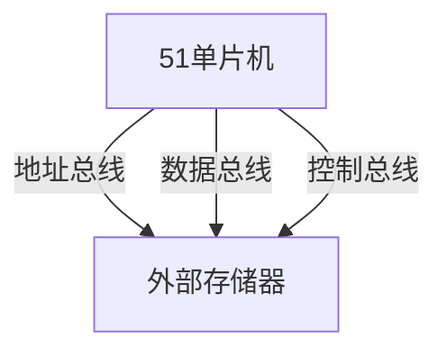

# 51单片机总线概述

## 引言

在嵌入式系统中，总线（Bus）是连接单片机与外部设备或模块的重要通信通道。51单片机作为一种经典的8位微控制器，其总线结构简单且功能强大，广泛应用于各种嵌入式项目中。本文将详细介绍51单片机的总线概念、类型及其在实际应用中的作用。

## 什么是总线？

总线是计算机系统中用于传输数据、地址和控制信号的公共通道。在51单片机中，总线可以分为三类：

1. **数据总线（Data Bus）**：用于在单片机与外部设备之间传输数据。
2. **地址总线（Address Bus）**：用于指定数据存储或读取的位置。
3. **控制总线（Control Bus）**：用于传输控制信号，如读写信号、中断信号等。

## 51单片机的总线结构

51单片机的总线结构相对简单，主要包括以下几个部分：

- **P0口**：作为数据总线和地址总线的低8位复用端口。
- **P2口**：作为地址总线的高8位。
- **控制信号**：如`ALE`（地址锁存使能）、`PSEN`（程序存储使能）、`RD`（读信号）、`WR`（写信号）等。

### 数据总线

数据总线是双向的，用于在单片机与外部设备之间传输数据。51单片机的数据总线宽度为8位，即一次可以传输8位数据。

### 地址总线

地址总线是单向的，用于指定数据存储或读取的位置。51单片机的地址总线宽度为16位，可以寻址64KB的内存空间。

### 控制总线

控制总线用于传输控制信号，如读写信号、中断信号等。这些信号决定了数据总线和地址总线的操作方式。

## 代码示例

以下是一个简单的代码示例，展示了如何使用51单片机的总线与外部设备进行通信。

```c
#include <reg51.h>

void main() {
    unsigned char data = 0x55;  // 要发送的数据
    unsigned int address = 0x1000;  // 目标地址

    // 将地址的高8位写入P2口
    P2 = (address >> 8) & 0xFF;

    // 将地址的低8位写入P0口
    P0 = address & 0xFF;

    // 发送ALE信号以锁存地址
    ALE = 1;
    ALE = 0;

    // 将数据写入P0口
    P0 = data;

    // 发送WR信号以写入数据
    WR = 0;
    WR = 1;
}
```

:::note
**注意**：在实际应用中，可能需要根据具体的外部设备调整信号的时序和逻辑。
:::

## 实际应用案例

### 案例1：扩展外部存储器

在51单片机中，由于内部存储空间有限，常常需要扩展外部存储器。通过总线，单片机可以访问外部RAM或ROM，从而扩展其存储能力。



### 案例2：与外部设备通信

51单片机可以通过总线与各种外部设备（如LCD显示器、传感器等）进行通信。例如，通过I2C或SPI总线，单片机可以读取传感器的数据并显示在LCD上。

## 总结

总线是51单片机与外部设备通信的核心通道，理解其工作原理对于嵌入式开发至关重要。本文介绍了51单片机的总线结构、类型及其在实际应用中的案例，希望能帮助初学者更好地掌握这一概念。

## 附加资源与练习

- **资源**：
  - [51单片机数据手册](https://www.example.com)
  - [嵌入式系统总线技术](https://www.example.com)

- **练习**：
  1. 编写一个程序，使用51单片机的总线与外部RAM进行数据读写。
  2. 设计一个电路，使用51单片机通过I2C总线与温度传感器通信，并将数据显示在LCD上。

:::tip
**提示**：在编写代码时，务必注意信号的时序和逻辑，以确保通信的准确性。
:::