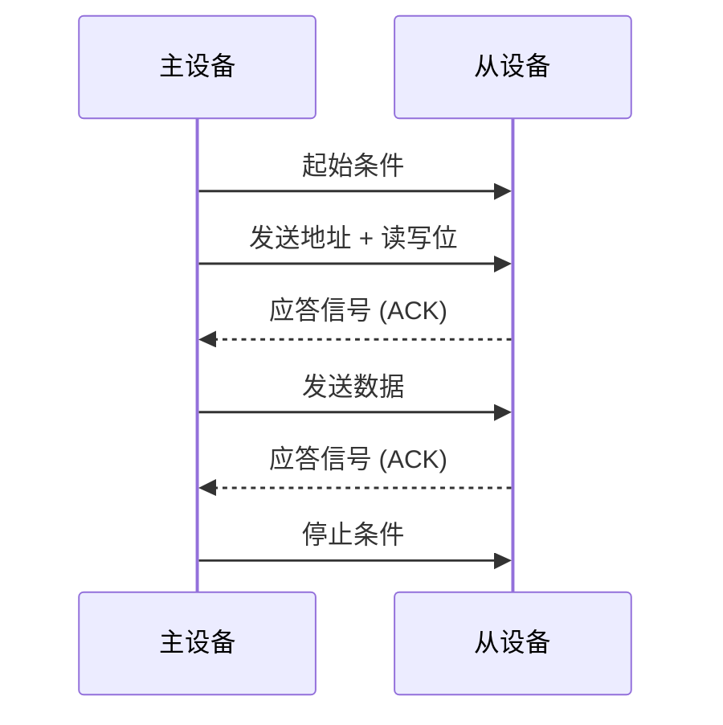

# 51单片机I2C总线

## 介绍

I2C（Inter-Integrated Circuit）总线是一种由Philips公司开发的双线式串行通信协议，广泛应用于单片机与外围设备之间的通信。它仅需两根线（SDA：数据线，SCL：时钟线）即可实现多设备之间的数据传输，具有简单、高效的特点。在51单片机中，I2C总线常用于连接EEPROM、温度传感器、LCD显示屏等外设。

:::note
I2C总线支持多主多从模式，允许多个主设备和多个从设备在同一总线上通信。
:::

## I2C总线的工作原理

I2C总线通过两根线进行通信：
- **SCL（Serial Clock Line）**：时钟线，由主设备控制，用于同步数据传输。
- **SDA（Serial Data Line）**：数据线，用于传输数据。

I2C通信的基本流程如下：
1. **起始条件（Start Condition）**：主设备拉低SDA线，随后拉低SCL线，表示通信开始。
2. **地址传输**：主设备发送从设备的7位或10位地址，并附带一个读写位（0表示写，1表示读）。
3. **应答信号（ACK/NACK）**：从设备接收到地址后，发送一个应答信号（ACK）表示确认。
4. **数据传输**：主设备或从设备通过SDA线发送数据，每发送一个字节后，接收方都会发送一个应答信号。
5. **停止条件（Stop Condition）**：主设备拉高SDA线，随后拉高SCL线，表示通信结束。



## 51单片机中的I2C实现

在51单片机中，I2C通信通常通过软件模拟实现，因为大多数51单片机没有硬件I2C模块。以下是一个简单的I2C通信代码示例：

```c
#include <reg51.h>

#define SDA P2_0  // 定义SDA引脚
#define SCL P2_1  // 定义SCL引脚

void I2C_Start() {
    SDA = 1;
    SCL = 1;
    SDA = 0;
    SCL = 0;
}

void I2C_Stop() {
    SDA = 0;
    SCL = 1;
    SDA = 1;
}

void I2C_WriteByte(unsigned char byte) {
    unsigned char i;
    for (i = 0; i < 8; i++) {
        SDA = (byte & 0x80) >> 7;
        byte <<= 1;
        SCL = 1;
        SCL = 0;
    }
    SDA = 1;  // 释放SDA线，等待从设备应答
    SCL = 1;
    SCL = 0;
}

unsigned char I2C_ReadByte() {
    unsigned char i, byte = 0;
    SDA = 1;  // 释放SDA线
    for (i = 0; i < 8; i++) {
        SCL = 1;
        byte = (byte << 1) | SDA;
        SCL = 0;
    }
    return byte;
}

void I2C_SendACK() {
    SDA = 0;
    SCL = 1;
    SCL = 0;
    SDA = 1;
}

void I2C_SendNACK() {
    SDA = 1;
    SCL = 1;
    SCL = 0;
}
```

:::tip
在实际应用中，I2C通信的时序非常重要，确保SCL和SDA线的电平变化严格按照协议要求进行。
:::

## 实际应用案例

假设我们需要通过I2C总线读取一个温度传感器（如LM75）的数据。以下是实现步骤：

1. **初始化I2C总线**：调用 `I2C_Start()` 函数启动I2C通信。
2. **发送设备地址**：发送LM75的7位地址（例如0x48）和写位（0）。
3. **发送寄存器地址**：发送要读取的温度寄存器的地址。
4. **重新启动I2C通信**：再次调用 `I2C_Start()` 函数。
5. **发送设备地址和读位**：发送LM75的7位地址和读位（1）。
6. **读取数据**：调用 `I2C_ReadByte()` 函数读取温度数据。
7. **结束通信**：调用 `I2C_Stop()` 函数结束通信。

```c
unsigned char Read_Temperature() {
    unsigned char temp;
    I2C_Start();
    I2C_WriteByte(0x90);  // LM75地址 + 写位
    I2C_WriteByte(0x00);  // 温度寄存器地址
    I2C_Start();
    I2C_WriteByte(0x91);  // LM75地址 + 读位
    temp = I2C_ReadByte();
    I2C_SendNACK();
    I2C_Stop();
    return temp;
}
```

:::caution
在实际应用中，温度传感器的地址和寄存器地址可能因型号不同而有所变化，请参考具体设备的 datasheet。
:::

## 总结

I2C总线是一种简单而强大的通信协议，适用于51单片机与多种外设的连接。通过软件模拟I2C通信，我们可以在没有硬件I2C模块的51单片机上实现高效的数据传输。本文介绍了I2C总线的基本原理、代码实现以及一个实际应用案例，希望能帮助初学者更好地理解和应用I2C总线。

## 附加资源与练习

- **练习1**：尝试修改代码，使其支持10位地址的I2C设备。
- **练习2**：使用I2C总线连接一个EEPROM芯片，并实现数据的读写操作。
- **参考资源**：查阅I2C协议规范文档，深入了解I2C总线的更多细节。

:::warning
在调试I2C通信时，务必使用逻辑分析仪或示波器检查时序，确保通信正常。
:::