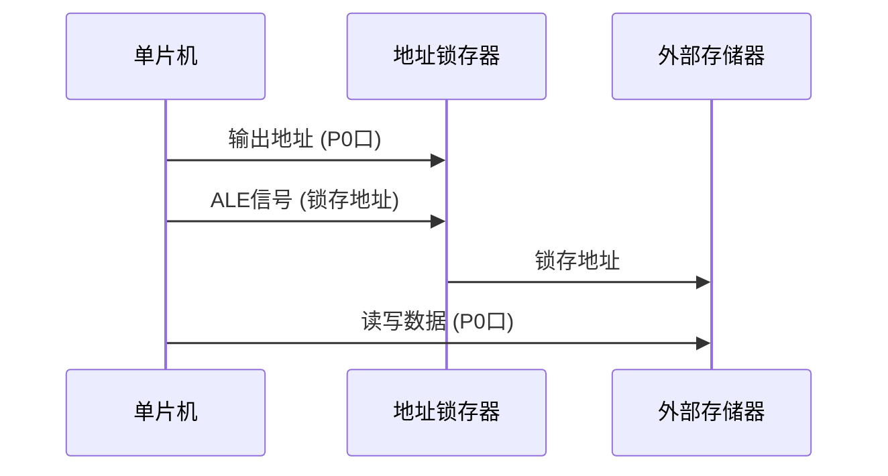

# 51单片机地址复用

## 介绍

在51单片机中，**地址复用**是一种重要的技术，它允许通过同一组引脚传输地址和数据信息，从而减少引脚数量，简化硬件设计。地址复用通常用于外部存储器扩展或I/O接口扩展的场景中。

51单片机的P0口是一个典型的复用端口。它既可以作为数据总线（Data Bus），也可以作为地址总线的低8位（Address Bus）。通过地址锁存器（如74HC373），单片机可以在同一组引脚上分时传输地址和数据信息。

## 地址复用的原理

地址复用的核心思想是**分时复用**。具体来说，单片机首先通过P0口输出地址信息，然后通过地址锁存器将地址信息锁存。接着，P0口切换为数据总线模式，用于传输数据。这种分时复用的方式使得单片机能够使用较少的引脚完成更多的功能。

### 地址复用的时序

以下是地址复用的典型时序：

1. **地址输出阶段**：单片机通过P0口输出低8位地址信息，同时通过ALE（Address Latch Enable）信号控制地址锁存器锁存地址。
2. **数据读写阶段**：P0口切换为数据总线模式，用于读取或写入数据。



## 代码示例

以下是一个简单的代码示例，展示了如何使用51单片机的地址复用功能访问外部存储器。

```c
#include <reg51.h>

sbit ALE = P2^0;  // ALE信号引脚
sbit RD = P2^1;   // 读信号引脚
sbit WR = P2^2;   // 写信号引脚

void write_to_memory(unsigned char address, unsigned char data) {
    P0 = address;  // 输出地址
    ALE = 1;       // 锁存地址
    ALE = 0;
    P0 = data;     // 输出数据
    WR = 0;        // 写信号
    WR = 1;
}

unsigned char read_from_memory(unsigned char address) {
    P0 = address;  // 输出地址
    ALE = 1;       // 锁存地址
    ALE = 0;
    RD = 0;        // 读信号
    unsigned char data = P0;  // 读取数据
    RD = 1;
    return data;
}

void main() {
    write_to_memory(0x10, 0xAA);  // 向地址0x10写入数据0xAA
    unsigned char data = read_from_memory(0x10);  // 从地址0x10读取数据
}
```

:::note
在代码中，`P0`口用于分时传输地址和数据，`ALE`信号用于锁存地址，`RD`和`WR`信号分别用于控制读和写操作。
:::

## 实际应用场景

地址复用技术广泛应用于需要扩展外部存储器或I/O接口的单片机系统中。例如：

1. **外部RAM扩展**：当51单片机需要访问外部RAM时，地址复用可以大大减少引脚数量，简化电路设计。
2. **LCD显示模块控制**：某些LCD模块需要通过地址总线传输命令和数据，地址复用可以节省单片机的引脚资源。
3. **多路I/O扩展**：通过地址复用，单片机可以控制多个I/O设备，而无需为每个设备分配独立的引脚。

## 总结

地址复用是51单片机中一种重要的技术，它通过分时复用的方式，利用同一组引脚传输地址和数据信息，从而减少引脚数量，简化硬件设计。掌握地址复用的原理和实现方法，对于初学者理解单片机的外部存储器扩展和I/O接口控制具有重要意义。

## 附加资源与练习

1. **练习**：尝试修改代码示例，使其能够访问外部RAM的不同地址，并验证数据的读写是否正确。
2. **进一步学习**：查阅51单片机的数据手册，了解其他复用引脚的功能和使用方法。
3. **扩展阅读**：学习如何使用74HC373等地址锁存器实现地址复用，并设计一个简单的电路验证其功能。

:::tip
在实际项目中，地址复用技术可以显著减少硬件复杂度，但需要注意时序的精确控制，以确保数据的正确传输。
:::