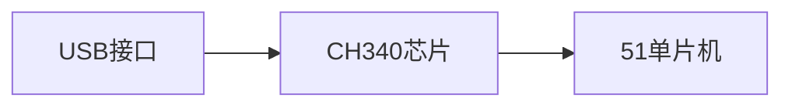

# 51单片机USB接口

## 介绍

USB（Universal Serial Bus，通用串行总线）是一种广泛使用的通信接口标准，用于连接计算机与外部设备。51单片机作为一种经典的8位微控制器，虽然本身不支持USB协议，但可以通过外部芯片或软件模拟的方式实现USB通信。本文将介绍如何在51单片机上实现USB接口功能，并提供相关代码示例和实际应用场景。

## USB接口的基本概念

USB接口是一种高速、可靠的串行通信接口，具有以下特点：
- **热插拔**：设备可以在不关闭电源的情况下插入或拔出。
- **即插即用**：操作系统可以自动识别并配置设备。
- **多设备支持**：通过集线器可以连接多个设备。

51单片机本身没有内置USB控制器，因此需要通过外部芯片（如CH340、FT232等）或软件模拟的方式实现USB通信。

## 使用外部芯片实现USB接口

### CH340芯片

CH340是一种常用的USB转串口芯片，可以将USB信号转换为串口信号，从而与51单片机通信。以下是使用CH340芯片的典型电路连接：



### 代码示例

以下是一个简单的代码示例，展示如何使用CH340芯片与51单片机进行通信：

```c
#include <reg52.h>

void UART_Init() {
    SCON = 0x50;  // 设置串口模式1，8位数据，1位停止位
    TMOD = 0x20;  // 设置定时器1为模式2
    TH1 = 0xFD;   // 设置波特率为9600
    TL1 = 0xFD;
    TR1 = 1;      // 启动定时器1
    ES = 1;       // 使能串口中断
    EA = 1;       // 使能总中断
}

void UART_SendByte(unsigned char byte) {
    SBUF = byte;
    while (!TI);
    TI = 0;
}

void UART_SendString(unsigned char *str) {
    while (*str) {
        UART_SendByte(*str++);
    }
}

void main() {
    UART_Init();
    UART_SendString("Hello, USB!");
    while (1);
}
```

### 输入与输出

- **输入**：通过USB接口发送数据到CH340芯片，芯片将数据转换为串口信号并发送到51单片机。
- **输出**：51单片机通过串口发送数据到CH340芯片，芯片将数据转换为USB信号并发送到计算机。

## 软件模拟USB接口

在某些情况下，可以通过软件模拟USB协议来实现USB通信。这种方法通常需要较高的编程技巧和对USB协议的深入理解。

### 代码示例

以下是一个简单的软件模拟USB通信的代码示例：

```c
#include <reg52.h>

void USB_Init() {
    // 初始化USB模拟相关寄存器
}

void USB_SendByte(unsigned char byte) {
    // 模拟USB数据发送
}

void USB_SendString(unsigned char *str) {
    while (*str) {
        USB_SendByte(*str++);
    }
}

void main() {
    USB_Init();
    USB_SendString("Hello, USB!");
    while (1);
}
```

### 输入与输出

- **输入**：通过软件模拟USB协议接收数据。
- **输出**：通过软件模拟USB协议发送数据。

## 实际应用场景

### 数据采集系统

在数据采集系统中，51单片机可以通过USB接口将采集到的数据实时传输到计算机进行处理和分析。

### 嵌入式设备调试

在嵌入式设备开发过程中，可以通过USB接口将调试信息发送到计算机，方便开发人员进行调试和故障排查。

## 总结

本文介绍了51单片机如何通过外部芯片或软件模拟的方式实现USB接口功能。通过CH340芯片，可以方便地将USB信号转换为串口信号，从而实现与51单片机的通信。软件模拟USB接口则需要较高的编程技巧和对USB协议的深入理解。

## 附加资源与练习

- **资源**：
  - [USB协议规范](https://www.usb.org/)
  - [CH340芯片数据手册](https://www.wch.cn/downloads/CH340DS1_PDF.html)
- **练习**：
  - 尝试使用CH340芯片实现一个简单的USB通信程序。
  - 研究并尝试软件模拟USB协议，实现基本的USB通信功能。

:::tip
建议初学者先从使用外部芯片实现USB接口开始，逐步掌握USB通信的基本原理和实现方法。
:::