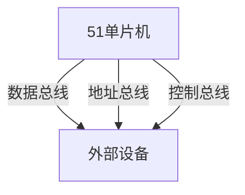

## 介绍

51单片机是一种广泛使用的8位微控制器，其并行总线是单片机与外部设备进行数据交换的重要通道。并行总线通过多根数据线同时传输数据，具有传输速度快、结构简单的特点。理解并行总线的工作原理对于掌握51单片机的硬件接口设计至关重要。

## 并行总线的基本结构

51单片机的并行总线主要由以下几部分组成：

1. **数据总线（Data Bus）**：用于传输数据，通常是8位宽。
2. **地址总线（Address Bus）**：用于指定存储器或外设的地址，通常是16位宽。
3. **控制总线（Control Bus）**：用于传输控制信号，如读写信号、片选信号等。



## 并行总线的工作原理

并行总线通过同时传输多个数据位来实现高速数据传输。以51单片机为例，其并行总线的工作过程如下：

1. **地址选择**：单片机通过地址总线发送目标设备的地址。
2. **数据传输**：通过数据总线进行数据的读取或写入。
3. **控制信号**：控制总线上的信号（如`RD`、`WR`）决定数据传输的方向。

:::note
**注意**：并行总线的传输速度受限于总线的宽度和时钟频率。51单片机的并行总线通常工作在12MHz的时钟频率下。
:::

## 代码示例

以下是一个简单的代码示例，展示了如何使用51单片机的并行总线与外部设备进行数据交换。

```c
#include <reg51.h>

#define DATA_PORT P0  // 数据总线连接到P0口
#define ADDR_PORT P2  // 地址总线连接到P2口

void write_data(unsigned char addr, unsigned char data) {
    ADDR_PORT = addr;  // 设置地址
    DATA_PORT = data;  // 写入数据
    // 模拟写信号
    P3_6 = 0;  // WR信号置低
    P3_6 = 1;  // WR信号置高
}

unsigned char read_data(unsigned char addr) {
    ADDR_PORT = addr;  // 设置地址
    // 模拟读信号
    P3_7 = 0;  // RD信号置低
    unsigned char data = DATA_PORT;  // 读取数据
    P3_7 = 1;  // RD信号置高
    return data;
}

void main() {
    unsigned char data = 0x55;
    write_data(0x01, data);  // 向地址0x01写入数据0x55
    unsigned char read_data_value = read_data(0x01);  // 从地址0x01读取数据
}
```

:::tip
**提示**：在实际应用中，确保地址总线和数据总线的连接正确，并注意控制信号的时序。
:::

## 实际应用案例

### 案例1：LED显示控制

假设我们需要通过51单片机的并行总线控制一个8位LED显示器。我们可以将LED显示器的数据线连接到单片机的P0口，地址线连接到P2口，控制信号连接到P3口。

```c
void display_led(unsigned char pattern) {
    write_data(0x02, pattern);  // 向地址0x02写入LED显示模式
}

void main() {
    display_led(0xAA);  // 显示交替亮灭的LED模式
}
```

### 案例2：外部存储器读写

51单片机可以通过并行总线与外部存储器（如EEPROM）进行数据交换。以下代码展示了如何向EEPROM写入数据并读取数据。

```c
void write_eeprom(unsigned char addr, unsigned char data) {
    write_data(addr, data);  // 向EEPROM写入数据
}

unsigned char read_eeprom(unsigned char addr) {
    return read_data(addr);  // 从EEPROM读取数据
}

void main() {
    write_eeprom(0x10, 0x5A);  // 向EEPROM地址0x10写入数据0x5A
    unsigned char data = read_eeprom(0x10);  // 从EEPROM地址0x10读取数据
}
```

## 总结

51单片机的并行总线是其与外部设备进行数据交换的重要接口。通过理解并行总线的基本结构和工作原理，我们可以设计出高效的单片机系统。本文通过代码示例和实际应用案例，帮助初学者掌握并行总线的使用方法。

## 附加资源与练习

- **练习1**：尝试修改代码示例，使其能够通过并行总线控制一个16位的LED显示器。
- **练习2**：设计一个简单的电路，使用51单片机的并行总线与外部EEPROM进行数据交换，并编写相应的代码。

:::caution
**注意**：在进行硬件连接时，务必确保电源和信号线的正确连接，避免损坏设备。
:::