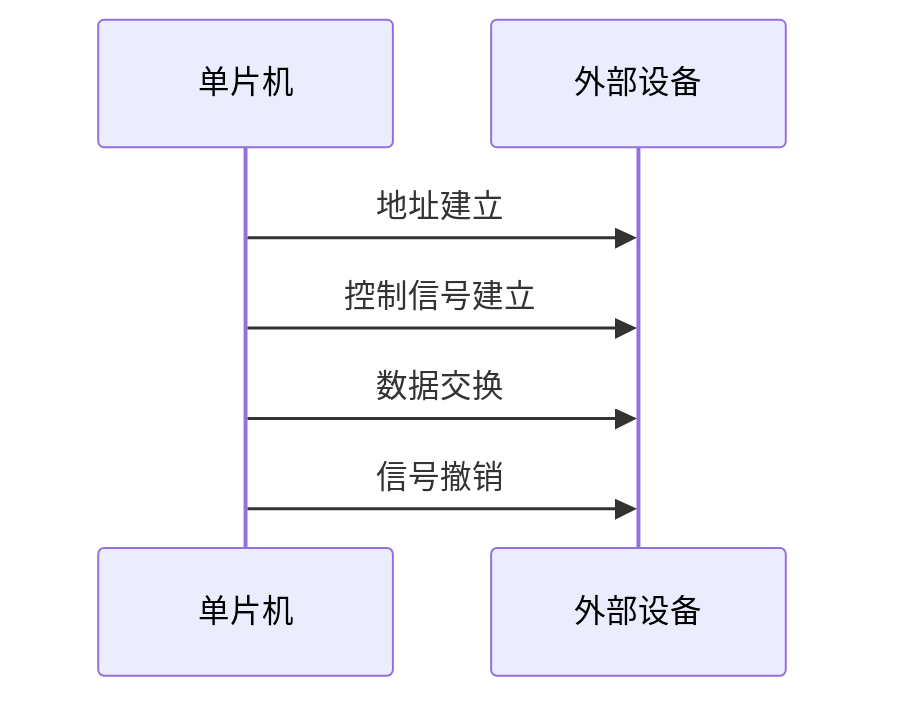

# 51单片机总线时序

## 介绍

在51单片机中，总线时序是指单片机与外部设备（如存储器、I/O设备等）进行数据交换时，信号在时间上的排列顺序。理解总线时序对于正确配置和使用单片机的外设至关重要。总线时序通常包括地址总线、数据总线和控制总线的信号变化顺序。

## 总线时序的基本概念

51单片机的外部总线由三部分组成：

1. **地址总线（Address Bus）**：用于传输单片机访问外部设备时的地址信息。
2. **数据总线（Data Bus）**：用于在单片机和外部设备之间传输数据。
3. **控制总线（Control Bus）**：用于传输控制信号，如读/写信号、片选信号等。

总线时序描述了这些信号在时间上的变化关系，确保单片机与外部设备之间的通信能够正确进行。

## 总线时序的工作原理

在51单片机中，总线时序通常分为以下几个阶段：

1. **地址建立阶段**：单片机将地址信息输出到地址总线上。
2. **控制信号建立阶段**：单片机输出控制信号（如读/写信号）到控制总线上。
3. **数据交换阶段**：单片机通过数据总线与外部设备进行数据交换。
4. **信号撤销阶段**：单片机撤销地址和控制信号，结束本次总线操作。

以下是一个典型的总线时序图：



## 代码示例

以下是一个简单的代码示例，展示了如何使用51单片机的外部总线与外部设备进行数据交换。

```c
#include <reg51.h>

#define EXTERNAL_DEVICE_ADDRESS 0x8000

void write_to_external_device(unsigned char data) {
    // 设置地址
    P2 = (EXTERNAL_DEVICE_ADDRESS >> 8);  // 高8位地址
    P0 = (EXTERNAL_DEVICE_ADDRESS & 0xFF); // 低8位地址

    // 设置控制信号
    RD = 1;  // 读信号无效
    WR = 0;  // 写信号有效

    // 写入数据
    P1 = data;

    // 撤销控制信号
    WR = 1;
}

unsigned char read_from_external_device() {
    unsigned char data;

    // 设置地址
    P2 = (EXTERNAL_DEVICE_ADDRESS >> 8);  // 高8位地址
    P0 = (EXTERNAL_DEVICE_ADDRESS & 0xFF); // 低8位地址

    // 设置控制信号
    WR = 1;  // 写信号无效
    RD = 0;  // 读信号有效

    // 读取数据
    data = P1;

    // 撤销控制信号
    RD = 1;

    return data;
}

void main() {
    unsigned char data = 0x55;

    write_to_external_device(data);
    data = read_from_external_device();
}
```

:::note
在上面的代码中，`P0`、`P1`、`P2` 分别用于传输地址和数据，`RD` 和 `WR` 是控制信号。通过设置这些信号，单片机可以与外部设备进行数据交换。
:::

## 实际应用案例

### 案例1：扩展外部存储器

在实际应用中，51单片机的内部存储器可能不足以存储大量数据。此时，可以通过外部总线扩展外部存储器（如EEPROM或SRAM）。通过正确配置总线时序，单片机可以访问外部存储器并读取或写入数据。

### 案例2：控制外部设备

51单片机可以通过外部总线控制外部设备，如LCD显示屏、ADC/DAC转换器等。通过设置正确的总线时序，单片机可以向这些设备发送控制命令或读取设备的状态。

## 总结

总线时序是51单片机与外部设备进行数据交换的关键。通过理解总线时序的工作原理，并正确配置地址、数据和控制信号，单片机可以高效地与外部设备进行通信。本文通过基本概念、代码示例和实际应用案例，帮助初学者掌握51单片机总线时序的相关知识。

## 附加资源与练习

- **练习1**：尝试修改代码示例，使其能够访问不同的外部设备地址。
- **练习2**：设计一个简单的电路，使用51单片机控制一个LED显示屏，并通过外部总线发送显示数据。
- **资源**：阅读51单片机的数据手册，了解更多关于总线时序的详细信息。

:::tip
建议初学者在学习总线时序时，结合实际的硬件电路进行实验，这样可以更直观地理解总线时序的工作原理。
:::