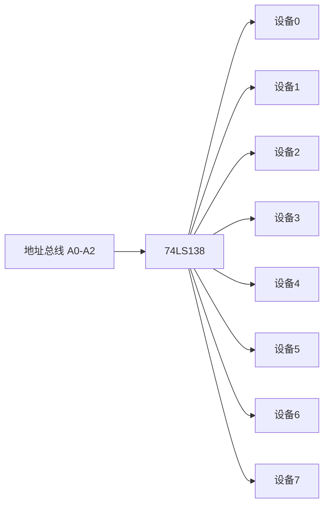

## 介绍

在51单片机系统中，地址译码是一个关键的概念。它用于将单片机的地址总线信号转换为具体的设备或存储单元的选通信号。通过地址译码，单片机可以准确地访问外部设备或存储器，从而实现数据的读写操作。

地址译码的核心是将地址总线上的二进制信号转换为唯一的设备选择信号。这个过程类似于邮政编码系统，每个地址对应一个唯一的设备或存储单元。

## 地址译码的基本原理

51单片机的地址总线通常由16根线组成（A0-A15），可以寻址64KB的地址空间。地址译码器的作用是将这些地址信号转换为具体的设备选择信号。

### 地址译码器的类型

1. **全译码**：使用所有地址线进行译码，确保每个设备有唯一的地址空间。
2. **部分译码**：仅使用部分地址线进行译码，可能导致地址重叠。

### 地址译码的实现

地址译码通常通过逻辑门电路（如与门、或门、非门）或专用的译码器芯片（如74LS138）来实现。

#### 74LS138 译码器

74LS138 是一个常用的3-8译码器，它可以将3位二进制输入转换为8个独立的输出信号。每个输出信号对应一个设备或存储单元。



## 代码示例

以下是一个简单的地址译码示例，使用74LS138译码器来选择不同的设备。

```c
#include <reg51.h>

sbit device0 = P1^0;
sbit device1 = P1^1;
sbit device2 = P1^2;
sbit device3 = P1^3;
sbit device4 = P1^4;
sbit device5 = P1^5;
sbit device6 = P1^6;
sbit device7 = P1^7;

void select_device(unsigned char address) {
    switch(address) {
        case 0x00: device0 = 0; break;
        case 0x01: device1 = 0; break;
        case 0x02: device2 = 0; break;
        case 0x03: device3 = 0; break;
        case 0x04: device4 = 0; break;
        case 0x05: device5 = 0; break;
        case 0x06: device6 = 0; break;
        case 0x07: device7 = 0; break;
        default: break;
    }
}

void main() {
    select_device(0x02); // 选择设备2
    while(1);
}
```

:::note
在上面的代码中，`select_device` 函数根据输入的地址选择相应的设备。通过改变 `address` 的值，可以选择不同的设备。
:::

## 实际应用场景

### 扩展存储器

在51单片机系统中，地址译码常用于扩展外部存储器。例如，使用74LS138译码器将64KB的地址空间划分为多个8KB的存储块，每个存储块对应一个外部存储器芯片。

### 多设备控制

在工业控制系统中，单片机可能需要控制多个外部设备。通过地址译码，可以为每个设备分配唯一的地址，从而实现精确的设备控制。

## 总结

地址译码是51单片机系统中一个重要的概念，它通过将地址总线信号转换为设备选择信号，实现了对多个设备或存储单元的有效管理。理解地址译码的原理和实现方法，对于设计和调试单片机系统至关重要。

## 附加资源与练习

1. **练习**：尝试使用74LS138译码器设计一个地址译码电路，将64KB的地址空间划分为8个8KB的存储块。
2. **资源**：阅读74LS138的数据手册，了解其详细的工作原理和使用方法。
3. **扩展阅读**：学习其他类型的译码器（如74LS139、74LS154）及其在单片机系统中的应用。

通过以上内容的学习和实践，你将能够掌握51单片机地址译码的基本原理和应用方法，为进一步学习单片机系统设计打下坚实的基础。