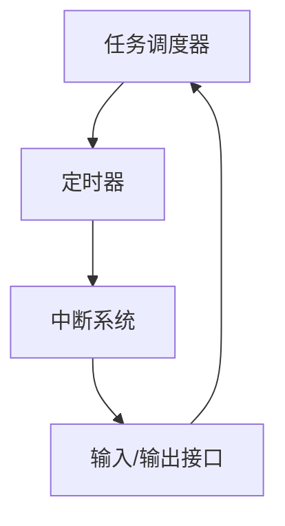

# 51单片机实时系统概述

## 介绍

实时系统（Real-Time System）是指能够在严格的时间限制内完成特定任务的计算机系统。在嵌入式系统中，实时控制是核心功能之一，尤其是在51单片机的应用中。51单片机因其成本低、易于编程和广泛的应用场景，成为许多初学者学习嵌入式系统的首选。

实时系统可以分为**硬实时系统**和**软实时系统**：
- **硬实时系统**：任务必须在规定的时间内完成，否则会导致严重后果。例如，汽车的安全气囊控制系统。
- **软实时系统**：任务的时间限制相对宽松，即使未能按时完成，也不会导致严重后果。例如，多媒体播放器。

本文将重点介绍如何在51单片机上实现实时控制，并通过代码示例和实际案例帮助初学者理解这一概念。

---

## 实时系统的基本组成

一个典型的51单片机实时系统通常包括以下几个部分：
1. **任务调度器**：负责管理和分配任务的执行顺序。
2. **定时器**：用于精确控制任务的执行时间。
3. **中断系统**：用于处理外部事件或紧急任务。
4. **输入/输出接口**：与外部设备进行数据交互。

以下是一个简单的实时系统流程图：



---

## 51单片机的实时控制实现

### 1. 任务调度器

任务调度器是实时系统的核心，它决定了任务的执行顺序。在51单片机中，可以通过简单的循环结构实现任务调度。例如：

```c
void main() {
    while (1) {
        task1(); // 任务1
        task2(); // 任务2
        task3(); // 任务3
    }
}
```

:::tip
在实际应用中，任务调度器需要根据任务的优先级和时间要求进行优化。
:::

### 2. 定时器

51单片机内置了定时器/计数器模块，可以用于精确控制任务的执行时间。以下是一个使用定时器0的示例：

```c
#include <reg51.h>

void Timer0_Init() {
    TMOD = 0x01; // 设置定时器0为模式1
    TH0 = 0xFC;  // 设置定时器初值
    TL0 = 0x18;
    ET0 = 1;     // 使能定时器0中断
    EA = 1;      // 使能全局中断
    TR0 = 1;     // 启动定时器0
}

void Timer0_ISR() interrupt 1 {
    TH0 = 0xFC;  // 重装定时器初值
    TL0 = 0x18;
    // 执行定时任务
}

void main() {
    Timer0_Init();
    while (1) {
        // 主循环
    }
}
```

:::note
定时器的初值需要根据系统时钟频率和所需的时间间隔进行计算。
:::

### 3. 中断系统

中断是实时系统中处理紧急任务的重要手段。51单片机支持多个中断源，例如外部中断、定时器中断等。以下是一个外部中断的示例：

```c
#include <reg51.h>

void External_Interrupt_Init() {
    IT0 = 1; // 设置外部中断0为下降沿触发
    EX0 = 1; // 使能外部中断0
    EA = 1;  // 使能全局中断
}

void External_Interrupt_ISR() interrupt 0 {
    // 处理外部中断任务
}

void main() {
    External_Interrupt_Init();
    while (1) {
        // 主循环
    }
}
```

---

## 实际应用案例

### 案例1：智能家居中的温度控制

在智能家居系统中，51单片机可以用于实时监测和控制室内温度。例如，当温度超过设定值时，单片机可以立即启动风扇或空调。

```c
void Temperature_Control() {
    if (temperature > setpoint) {
        turn_on_fan();
    } else {
        turn_off_fan();
    }
}
```

### 案例2：工业自动化中的电机控制

在工业自动化中，51单片机可以用于实时控制电机的启停和转速。例如，通过PWM（脉宽调制）信号控制电机的转速。

```c
void Motor_Control(int speed) {
    PWM_Set(speed); // 设置PWM占空比
}
```

---

## 总结

51单片机实时系统是嵌入式开发中的重要组成部分，广泛应用于智能家居、工业自动化、汽车电子等领域。通过任务调度器、定时器和中断系统的配合，可以实现高效、精确的实时控制。

:::caution
在实际开发中，需要注意任务优先级、时间限制和资源竞争等问题，以确保系统的稳定性和可靠性。
:::

---

## 附加资源与练习

### 资源
- [51单片机编程手册](https://example.com)
- [实时系统设计指南](https://example.com)

### 练习
1. 编写一个程序，使用51单片机的定时器实现LED灯的闪烁控制。
2. 设计一个简单的任务调度器，实现多个任务的优先级控制。
3. 尝试使用外部中断实现按键控制功能。

希望本文能帮助你更好地理解51单片机实时系统的概念和应用！如果有任何问题，欢迎在评论区留言讨论。