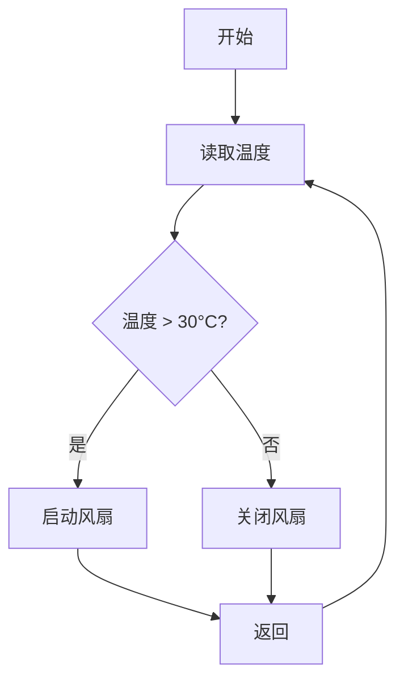

## 介绍

51单片机是一种广泛应用于嵌入式系统的微控制器，因其成本低、易于学习和使用而受到初学者的青睐。实时控制是51单片机的一个重要应用领域，涉及对时间敏感的任务进行快速响应和处理。本文将介绍51单片机在实时控制中的实际应用，并通过代码示例和案例帮助初学者理解其工作原理。

## 实时控制的基本概念

实时控制是指系统能够在规定的时间内对输入信号进行处理并输出相应的控制信号。实时控制系统通常用于工业自动化、机器人控制、家电控制等领域。51单片机通过其定时器、中断和I/O端口等功能模块，能够实现高效的实时控制。

### 定时器和中断

51单片机内置了多个定时器，可以通过配置定时器来实现精确的时间控制。中断机制则允许单片机在特定事件发生时暂停当前任务，转而执行优先级更高的任务。定时器和中断的结合是实现实时控制的关键。

## 代码示例：LED闪烁控制

以下是一个简单的代码示例，展示了如何使用51单片机的定时器和中断实现LED的闪烁控制。

```c
#include <reg51.h>

sbit LED = P1^0;  // 定义LED连接的引脚

void Timer0_ISR(void) interrupt 1 {
    LED = ~LED;  // 每次中断时切换LED状态
    TH0 = 0xFC;  // 重新加载定时器初值
    TL0 = 0x18;
}

void main() {
    TMOD = 0x01;  // 设置定时器0为模式1（16位定时器）
    TH0 = 0xFC;   // 设置定时器初值
    TL0 = 0x18;
    ET0 = 1;      // 使能定时器0中断
    EA = 1;       // 使能全局中断
    TR0 = 1;      // 启动定时器0

    while (1) {
        // 主循环中可以执行其他任务
    }
}
```

### 代码解释

1. **LED引脚定义**：`sbit LED = P1^0;` 定义了LED连接的引脚为P1.0。
2. **定时器配置**：`TMOD = 0x01;` 设置定时器0为模式1（16位定时器）。
3. **中断服务程序**：`Timer0_ISR` 是定时器0的中断服务程序，每次中断时切换LED的状态。
4. **定时器初值**：`TH0` 和 `TL0` 用于设置定时器的初值，控制中断的时间间隔。
5. **中断使能**：`ET0 = 1;` 和 `EA = 1;` 分别使能定时器0中断和全局中断。
6. **启动定时器**：`TR0 = 1;` 启动定时器0。

### 输入和输出

- **输入**：定时器0的定时时间。
- **输出**：LED的闪烁状态。

## 实际案例：温度控制系统

以下是一个实际案例，展示了如何使用51单片机实现一个简单的温度控制系统。

### 系统需求

- 使用温度传感器（如DS18B20）采集环境温度。
- 当温度超过设定阈值时，启动风扇降温。
- 当温度低于设定阈值时，关闭风扇。

### 代码示例

```c
#include <reg51.h>
#include <ds18b20.h>  // 假设已包含DS18B20的驱动库

sbit FAN = P2^0;  // 定义风扇连接的引脚

void Timer0_ISR(void) interrupt 1 {
    float temperature = DS18B20_ReadTemp();  // 读取温度
    if (temperature > 30.0) {
        FAN = 1;  // 启动风扇
    } else {
        FAN = 0;  // 关闭风扇
    }
    TH0 = 0xFC;  // 重新加载定时器初值
    TL0 = 0x18;
}

void main() {
    TMOD = 0x01;  // 设置定时器0为模式1（16位定时器）
    TH0 = 0xFC;   // 设置定时器初值
    TL0 = 0x18;
    ET0 = 1;      // 使能定时器0中断
    EA = 1;       // 使能全局中断
    TR0 = 1;      // 启动定时器0

    while (1) {
        // 主循环中可以执行其他任务
    }
}
```

### 系统流程图



### 案例解释

1. **温度读取**：通过DS18B20温度传感器读取环境温度。
2. **温度判断**：如果温度超过30°C，启动风扇；否则关闭风扇。
3. **定时器中断**：定时器中断用于定期读取温度并控制风扇。

## 总结

本文介绍了51单片机在实时控制中的应用实例，通过LED闪烁控制和温度控制系统两个案例，展示了如何使用51单片机的定时器和中断功能实现实时控制。初学者可以通过这些示例代码和案例，逐步掌握51单片机的实时控制技术。

## 附加资源与练习

- **资源**：
  - [51单片机编程手册](https://example.com/51-manual)
  - [DS18B20温度传感器数据手册](https://example.com/ds18b20-datasheet)

- **练习**：
  1. 修改LED闪烁控制的代码，使LED的闪烁频率可调。
  2. 扩展温度控制系统，增加LCD显示当前温度。
  3. 尝试使用其他传感器（如湿度传感器）实现更复杂的实时控制系统。

:::tip
建议初学者在完成每个练习后，尝试调试代码并观察实际效果，以加深对51单片机实时控制的理解。
:::