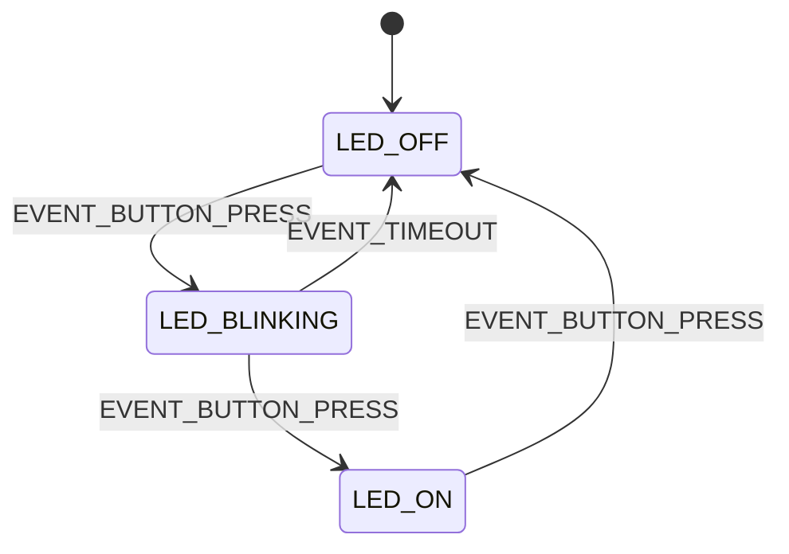

# 51单片机状态机设计

## 介绍

状态机（State Machine）是编程中一种常用的设计模式，特别适用于处理复杂的逻辑流程。在嵌入式系统中，状态机可以帮助我们清晰地管理系统的状态和行为，尤其是在实时控制系统中。本文将介绍如何在51单片机中设计和实现状态机，并通过实际案例展示其应用。

## 什么是状态机？

状态机是一种数学模型，用于描述系统在不同状态之间的转换。它由以下几个部分组成：

- **状态（State）**：系统在某一时刻所处的条件或模式。
- **事件（Event）**：触发状态转换的条件或输入。
- **转换（Transition）**：从一个状态到另一个状态的过程。
- **动作（Action）**：在状态转换时执行的操作。

状态机可以分为两种类型：**有限状态机（Finite State Machine, FSM）**和**无限状态机**。在嵌入式系统中，我们通常使用有限状态机。

## 状态机的基本结构

在51单片机中，状态机通常通过`switch-case`语句或函数指针数组来实现。以下是一个简单的状态机结构：

```c
typedef enum {
    STATE_IDLE,
    STATE_RUNNING,
    STATE_STOPPED
} State;

State currentState = STATE_IDLE;

void stateMachine() {
    switch (currentState) {
        case STATE_IDLE:
            // 处理空闲状态
            break;
        case STATE_RUNNING:
            // 处理运行状态
            break;
        case STATE_STOPPED:
            // 处理停止状态
            break;
        default:
            // 处理未知状态
            break;
    }
}
```

## 状态机的设计步骤

1. **定义状态**：首先，明确系统可能处于的所有状态。例如，一个简单的电机控制系统可能有`IDLE`、`RUNNING`和`STOPPED`三种状态。

2. **定义事件**：确定哪些事件会触发状态转换。例如，按下启动按钮可能触发从`IDLE`到`RUNNING`的转换。

3. **定义转换规则**：明确每个状态下，哪些事件会导致状态转换，并定义转换后的状态。

4. **定义动作**：在状态转换时，可能需要执行某些操作。例如，从`IDLE`到`RUNNING`时，可能需要启动电机。

5. **实现状态机**：使用`switch-case`语句或函数指针数组来实现状态机逻辑。

## 实际案例：简单的LED控制系统

假设我们要设计一个简单的LED控制系统，LED有三种状态：关闭、闪烁和常亮。我们可以使用状态机来实现这个系统。

### 状态定义

```c
typedef enum {
    LED_OFF,
    LED_BLINKING,
    LED_ON
} LedState;
```

### 事件定义

```c
typedef enum {
    EVENT_BUTTON_PRESS,
    EVENT_TIMEOUT
} Event;
```

### 状态机实现

```c
LedState currentLedState = LED_OFF;

void ledStateMachine(Event event) {
    switch (currentLedState) {
        case LED_OFF:
            if (event == EVENT_BUTTON_PRESS) {
                currentLedState = LED_BLINKING;
                startBlinking();
            }
            break;
        case LED_BLINKING:
            if (event == EVENT_BUTTON_PRESS) {
                currentLedState = LED_ON;
                turnOnLed();
            } else if (event == EVENT_TIMEOUT) {
                currentLedState = LED_OFF;
                turnOffLed();
            }
            break;
        case LED_ON:
            if (event == EVENT_BUTTON_PRESS) {
                currentLedState = LED_OFF;
                turnOffLed();
            }
            break;
        default:
            break;
    }
}
```

### 状态转换图



## 总结

状态机是嵌入式系统中非常强大的工具，能够帮助我们清晰地管理系统的状态和行为。通过定义状态、事件、转换规则和动作，我们可以设计出高效且易于维护的系统。

## 附加资源与练习

- **练习**：尝试设计一个简单的温控系统，使用状态机管理加热器的状态（关闭、加热、保持温度）。
- **资源**：阅读更多关于有限状态机的资料，了解如何在更复杂的系统中应用状态机。

:::tip
在实际项目中，状态机的设计需要根据具体需求进行调整。确保状态机的设计简洁明了，避免过度复杂化。
:::