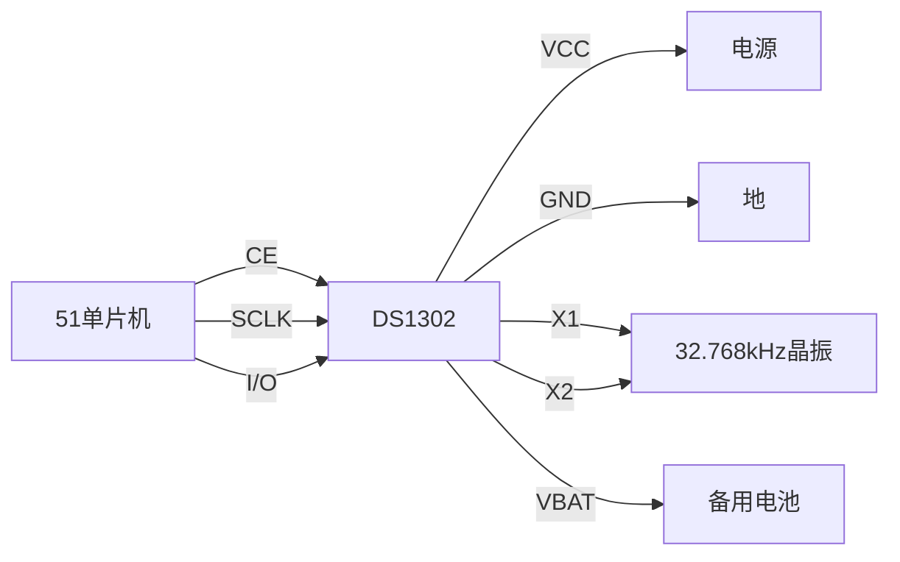

## 介绍

DS1302是一款低功耗的实时时钟（RTC）芯片，广泛应用于51单片机项目中。它能够提供精确的年、月、日、时、分、秒等时间信息，并且具有掉电保护功能，即使在系统断电的情况下，也能继续计时。本文将详细介绍如何在51单片机中使用DS1302模块，包括硬件连接、代码实现以及实际应用案例。

## DS1302的基本原理

DS1302通过三线接口（CE、SCLK、I/O）与单片机通信，支持读写操作。它内部有一个31字节的RAM，用于存储时间信息和用户数据。DS1302的主要特点包括：

- 实时时钟功能，支持秒、分、时、日、月、年和星期。
- 31字节的静态RAM。
- 低功耗设计，适合电池供电的应用。
- 简单的三线接口，易于与单片机连接。

## 硬件连接

DS1302与51单片机的连接非常简单，通常只需要连接三根信号线：

- **CE**：片选信号，高电平有效。
- **SCLK**：时钟信号，用于同步数据传输。
- **I/O**：数据输入输出线，双向通信。

此外，DS1302还需要一个32.768kHz的晶振来提供时钟信号，并且通常需要一个备用电池（如CR2032）来在系统断电时保持计时。



## 代码实现

以下是一个简单的51单片机与DS1302通信的代码示例。代码实现了读取DS1302中的时间信息，并将其显示在串口上。

```c
#include <reg52.h>

sbit CE = P1^0;  // 片选信号
sbit SCLK = P1^1; // 时钟信号
sbit IO = P1^2;   // 数据线

void DS1302_WriteByte(unsigned char addr, unsigned char dat) {
    unsigned char i;
    CE = 0;
    SCLK = 0;
    CE = 1;
    for (i = 0; i < 8; i++) {
        IO = addr & 0x01;
        SCLK = 1;
        SCLK = 0;
        addr >>= 1;
    }
    for (i = 0; i < 8; i++) {
        IO = dat & 0x01;
        SCLK = 1;
        SCLK = 0;
        dat >>= 1;
    }
    CE = 0;
}

unsigned char DS1302_ReadByte(unsigned char addr) {
    unsigned char i, dat = 0;
    CE = 0;
    SCLK = 0;
    CE = 1;
    for (i = 0; i < 8; i++) {
        IO = addr & 0x01;
        SCLK = 1;
        SCLK = 0;
        addr >>= 1;
    }
    for (i = 0; i < 8; i++) {
        dat >>= 1;
        if (IO) dat |= 0x80;
        SCLK = 1;
        SCLK = 0;
    }
    CE = 0;
    return dat;
}

void main() {
    unsigned char second, minute, hour;
    DS1302_WriteByte(0x8E, 0x00); // 关闭写保护
    DS1302_WriteByte(0x80, 0x00); // 设置秒
    DS1302_WriteByte(0x82, 0x30); // 设置分
    DS1302_WriteByte(0x84, 0x12); // 设置时
    DS1302_WriteByte(0x8E, 0x80); // 开启写保护

    while (1) {
        second = DS1302_ReadByte(0x81);
        minute = DS1302_ReadByte(0x83);
        hour = DS1302_ReadByte(0x85);
        // 将时间信息通过串口发送
        // 这里假设串口初始化代码已省略
    }
}
```

:::note
在代码中，`DS1302_WriteByte`函数用于向DS1302写入数据，`DS1302_ReadByte`函数用于从DS1302读取数据。通过这两个函数，可以实现对DS1302的读写操作。
:::

## 实际应用案例

DS1302广泛应用于需要精确计时的场合，例如：

- **电子钟**：利用DS1302提供的时间信息，驱动数码管或LCD显示屏显示当前时间。
- **数据记录仪**：在数据采集系统中，使用DS1302记录数据采集的时间戳。
- **定时控制系统**：在工业控制中，使用DS1302实现定时开关机、定时报警等功能。

例如，在一个智能家居系统中，DS1302可以用于控制照明系统的定时开关。通过读取DS1302的时间信息，系统可以在设定的时间自动打开或关闭灯光。

## 总结

本文介绍了如何在51单片机中使用DS1302实时时钟模块，包括其基本原理、硬件连接、代码实现以及实际应用场景。通过本文的学习，你应该能够掌握DS1302的基本使用方法，并能够在自己的项目中应用它。

## 附加资源与练习

- **练习1**：修改代码，使其能够显示星期信息。
- **练习2**：尝试使用DS1302的RAM功能，存储和读取用户数据。
- **资源**：查阅DS1302的数据手册，了解更多高级功能和使用技巧。

通过不断实践和探索，你将能够更深入地理解DS1302的工作原理，并在实际项目中灵活应用。