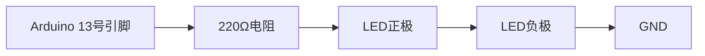

# Arduino 第一个程序

Arduino是一个开源的电子原型平台，广泛应用于各种创意项目和物联网设备中。对于初学者来说，编写第一个程序是迈入Arduino世界的第一步。本文将带你从零开始，完成一个简单的Arduino程序——点亮LED灯。

## 1. 硬件准备

在开始编写代码之前，我们需要准备好硬件设备。以下是所需材料：

- Arduino开发板（如Arduino Uno）
- 一个LED灯
- 一个220Ω电阻
- 若干杜邦线
- 面包板

### 连接电路

将LED的正极（长脚）通过220Ω电阻连接到Arduino的13号数字引脚，负极（短脚）连接到GND（地线）。以下是电路连接示意图：



:::note
确保电阻和LED的连接正确，否则LED可能无法点亮或损坏。
:::

## 2. 编写第一个程序

接下来，我们将编写一个简单的Arduino程序，控制LED灯的亮灭。Arduino程序通常由两个主要函数组成：`setup()` 和 `loop()`。

### 2.1 `setup()` 函数

`setup()` 函数在程序启动时运行一次，用于初始化设置。在这个例子中，我们将13号引脚设置为输出模式。

```cpp
void setup() {
  pinMode(13, OUTPUT);  // 将13号引脚设置为输出模式
}
```

### 2.2 `loop()` 函数

`loop()` 函数会不断循环执行，用于控制LED的亮灭。我们将使用 `digitalWrite()` 函数来控制引脚的电平。

```cpp
void loop() {
  digitalWrite(13, HIGH);  // 点亮LED
  delay(1000);             // 等待1秒
  digitalWrite(13, LOW);   // 熄灭LED
  delay(1000);             // 等待1秒
}
```

### 2.3 完整代码

将上述代码组合在一起，完整的Arduino程序如下：

```cpp
void setup() {
  pinMode(13, OUTPUT);  // 将13号引脚设置为输出模式
}

void loop() {
  digitalWrite(13, HIGH);  // 点亮LED
  delay(1000);             // 等待1秒
  digitalWrite(13, LOW);   // 熄灭LED
  delay(1000);             // 等待1秒
}
```

## 3. 上传代码到Arduino

1. 打开Arduino IDE，将上述代码粘贴到编辑器中。
2. 连接Arduino开发板到电脑。
3. 在Arduino IDE中选择正确的开发板和端口。
4. 点击“上传”按钮，将代码上传到Arduino开发板。

:::tip
如果一切正常，你将看到LED灯每隔1秒钟闪烁一次。
:::

## 4. 实际应用场景

这个简单的程序展示了如何使用Arduino控制LED灯的亮灭。虽然看似简单，但它是许多复杂项目的基础。例如：

- **交通信号灯模拟**：通过控制多个LED灯，模拟交通信号灯的变化。
- **报警系统**：在检测到异常时，通过闪烁LED灯发出警报。
- **互动装置**：结合传感器，根据环境变化控制LED灯的亮灭。

## 5. 总结

通过本教程，你已经完成了Arduino的第一个程序，并成功点亮了LED灯。这是学习Arduino的第一步，也是理解数字输出和基本编程结构的重要基础。

:::caution
在实验过程中，务必注意电路连接的正确性，避免短路或损坏设备。
:::

## 6. 附加资源与练习

为了巩固所学知识，你可以尝试以下练习：

1. **改变闪烁频率**：修改 `delay()` 函数中的参数，使LED灯以不同的频率闪烁。
2. **控制多个LED**：连接多个LED灯，编写程序使它们交替闪烁。
3. **结合按钮控制**：添加一个按钮，通过按下按钮来控制LED灯的亮灭。

通过这些练习，你将进一步掌握Arduino的基本操作，并为更复杂的项目打下坚实的基础。