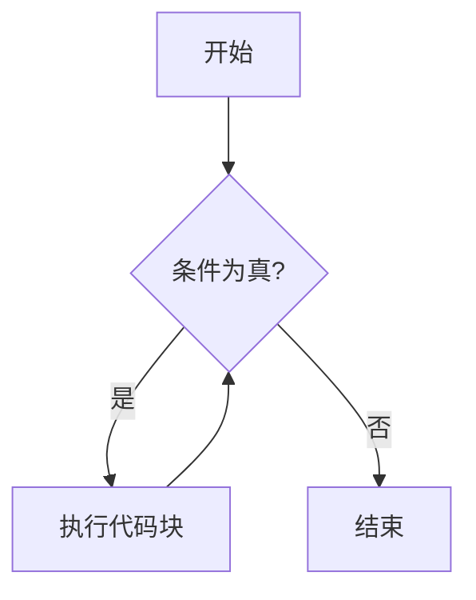

## 介绍

在Arduino编程中，控制流是决定程序执行顺序的关键部分。`while`循环是一种常用的控制流结构，它允许你重复执行一段代码，直到某个条件不再满足。`while`循环非常适合用于需要重复执行某些操作，直到达到特定条件的场景。

## While循环的基本语法

`while`循环的基本语法如下：

```cpp
while (condition) {
  // 代码块
}
```

- `condition`：这是一个布尔表达式（即结果为`true`或`false`的表达式）。只要`condition`为`true`，`while`循环中的代码块就会不断重复执行。
- `代码块`：这是需要重复执行的代码。当`condition`为`true`时，代码块会一直执行。

### 示例：简单的While循环

以下是一个简单的`while`循环示例，它会在条件为`true`时不断打印“Hello, World!”：

```cpp
int count = 0;

void setup() {
  Serial.begin(9600);
}

void loop() {
  while (count < 5) {
    Serial.println("Hello, World!");
    count++;
  }
}
```

**输出：**

```
Hello, World!
Hello, World!
Hello, World!
Hello, World!
Hello, World!
```

在这个例子中，`count`变量从0开始，每次循环都会增加1。当`count`达到5时，`while`循环的条件`count < 5`不再满足，循环停止。

## While循环的执行流程

为了更好地理解`while`循环的执行流程，我们可以用以下流程图来表示：



1. **开始**：程序进入`while`循环。
2. **条件为真?**：检查`while`循环的条件是否为`true`。
3. **执行代码块**：如果条件为`true`，则执行`while`循环中的代码块。
4. **结束**：如果条件为`false`，则退出`while`循环。

## 实际应用场景

### 1. 按钮控制LED

假设你有一个按钮和一个LED灯。你希望当按钮按下时，LED灯闪烁5次。可以使用`while`循环来实现这个功能。

```cpp
const int buttonPin = 2;
const int ledPin = 13;
int buttonState = 0;
int count = 0;

void setup() {
  pinMode(buttonPin, INPUT);
  pinMode(ledPin, OUTPUT);
}

void loop() {
  buttonState = digitalRead(buttonPin);

  if (buttonState == HIGH) {
    count = 0;
    while (count < 5) {
      digitalWrite(ledPin, HIGH);
      delay(500);
      digitalWrite(ledPin, LOW);
      delay(500);
      count++;
    }
  }
}
```

**解释：**

- 当按钮按下时，`buttonState`变为`HIGH`。
- `while`循环开始执行，LED灯会闪烁5次。
- 每次闪烁后，`count`增加1，直到`count`达到5，循环停止。

### 2. 温度传感器监控

假设你有一个温度传感器，你希望当温度超过某个阈值时，触发警报。可以使用`while`循环来持续监控温度。

```cpp
const int tempPin = A0;
const int alarmPin = 9;
float temperature = 0;

void setup() {
  pinMode(alarmPin, OUTPUT);
  Serial.begin(9600);
}

void loop() {
  temperature = analogRead(tempPin) * 0.48828125; // 将模拟信号转换为温度值

  while (temperature > 30) {
    digitalWrite(alarmPin, HIGH);
    delay(500);
    digitalWrite(alarmPin, LOW);
    delay(500);
    temperature = analogRead(tempPin) * 0.48828125; // 更新温度值
  }
}
```

**解释：**

- 当温度超过30°C时，`while`循环开始执行，触发警报（LED闪烁）。
- 每次循环都会重新读取温度值，直到温度降到30°C以下，循环停止。

## 总结

`while`循环是Arduino编程中非常强大的工具，它允许你重复执行代码块，直到某个条件不再满足。通过本文的学习，你应该已经掌握了`while`循环的基本语法、执行流程以及如何在实际项目中应用它。

:::tip
在使用`while`循环时，务必确保循环条件最终会变为`false`，否则程序可能会陷入无限循环，导致Arduino无法继续执行其他任务。
:::

## 附加资源与练习

1. **练习1**：修改LED闪烁的代码，使得LED闪烁的次数由用户通过串口输入决定。
2. **练习2**：使用`while`循环实现一个简单的计数器，当计数器达到某个值时，停止计数并打印“计数完成”。
3. **进一步学习**：阅读Arduino官方文档，了解更多关于控制流的内容，例如`for`循环和`do-while`循环。

希望本文对你理解和使用`while`循环有所帮助！继续探索Arduino的世界，你会发现更多有趣的应用场景。