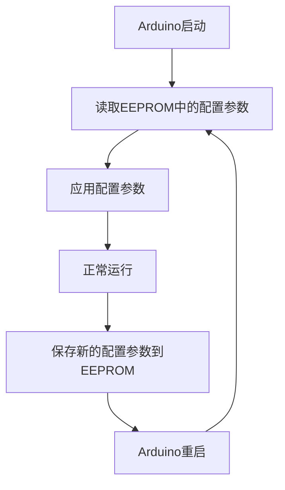

# Arduino 参数持久化

在Arduino开发中，**参数持久化**是指将数据存储在非易失性存储器中，以便在断电或重启后仍然可以访问这些数据。这对于保存配置参数、传感器校准值或其他需要在设备重启后保留的信息非常有用。

## 为什么需要参数持久化？

Arduino的微控制器通常使用易失性存储器（如RAM）来存储临时数据。然而，RAM中的数据在断电后会丢失。为了确保某些关键数据在断电后仍然可用，我们需要将这些数据存储在非易失性存储器中，如EEPROM或Flash存储器。

## EEPROM简介

EEPROM（Electrically Erasable Programmable Read-Only Memory）是一种非易失性存储器，可以在断电后保留数据。Arduino的许多型号（如Arduino Uno、Nano等）都内置了EEPROM，可以用来存储少量数据。

### EEPROM的基本操作

Arduino提供了`EEPROM`库，用于读写EEPROM中的数据。以下是一些常用的函数：

- `EEPROM.write(address, value)`：将数据写入指定地址。
- `EEPROM.read(address)`：从指定地址读取数据。
- `EEPROM.update(address, value)`：仅在数据不同时写入数据，以减少EEPROM的写入次数。

:::note
EEPROM的写入次数有限（通常为100,000次），因此应尽量减少不必要的写入操作。
:::

### 示例：保存和读取一个整数

以下代码展示了如何将一个整数保存到EEPROM中，并在重启后读取它。

```cpp
#include <EEPROM.h>

void setup() {
  Serial.begin(9600);

  int valueToSave = 1234;
  int address = 0;

  // 保存数据到EEPROM
  EEPROM.put(address, valueToSave);
  Serial.println("数据已保存到EEPROM。");

  // 从EEPROM读取数据
  int readValue;
  EEPROM.get(address, readValue);
  Serial.print("从EEPROM读取的数据: ");
  Serial.println(readValue);
}

void loop() {
  // 空循环
}
```

**输出：**
```
数据已保存到EEPROM。
从EEPROM读取的数据: 1234
```

## 实际应用场景

### 1. 保存配置参数

假设你正在开发一个智能家居设备，用户可以通过手机应用设置设备的亮度、颜色等参数。为了确保这些设置在设备重启后仍然有效，你可以将这些参数存储在EEPROM中。

### 2. 保存传感器校准值

在某些应用中，传感器可能需要定期校准。校准后的参数可以存储在EEPROM中，以便在设备重启后继续使用这些校准值。

## 总结

参数持久化是Arduino开发中的一个重要概念，尤其是在需要保存关键数据或配置时。通过使用EEPROM，我们可以确保这些数据在断电后仍然可用。虽然EEPROM的容量有限，但对于存储少量数据来说，它是一个非常实用的解决方案。

## 附加资源与练习

- **练习1**：尝试将多个不同类型的变量（如整数、浮点数、字符串）保存到EEPROM中，并在重启后读取它们。
- **练习2**：编写一个程序，允许用户通过串口输入数据并将其保存到EEPROM中，然后在重启后读取并显示这些数据。

:::tip
如果你需要存储大量数据，可以考虑使用外部存储器（如SD卡或Flash芯片）。
:::



通过以上内容，你应该对Arduino参数持久化有了一个全面的了解。希望这些知识能帮助你在未来的项目中更好地管理和保存数据！