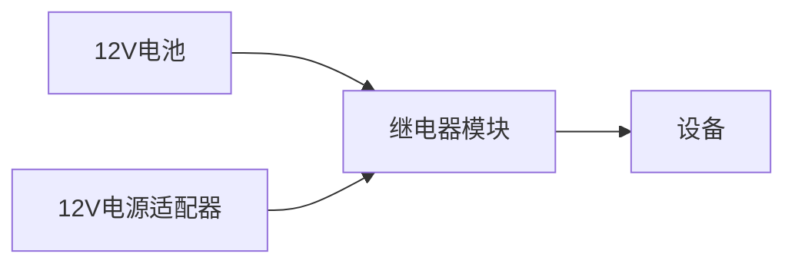

# Arduino UPS系统

## 介绍

在电子项目中，电源的稳定性至关重要。特别是在一些关键应用中，如数据采集、远程监控或自动化系统，电源中断可能导致数据丢失或设备损坏。为了解决这个问题，我们可以使用**UPS（不间断电源）系统**。UPS系统能够在主电源中断时，自动切换到备用电源（如电池），确保设备持续运行。

在本教程中，我们将学习如何使用Arduino构建一个简单的UPS系统。这个系统将监测主电源状态，并在主电源中断时自动切换到备用电池供电。

## 所需材料

- Arduino Uno
- 12V电池（如铅酸电池或锂电池）
- 12V电源适配器
- 继电器模块
- 二极管（如1N4007）
- 电阻（如10kΩ）
- 电容（如100µF）
- 面包板和连接线

## 电路设计

### 主电源监测

首先，我们需要监测主电源的状态。我们可以使用一个简单的分压电路来检测主电源是否正常供电。


### 继电器切换

当主电源中断时，我们需要切换到备用电池供电。继电器模块可以帮助我们实现这一功能。



## 代码实现

### 主电源监测代码

以下代码用于监测主电源状态。如果主电源电压低于某个阈值，Arduino将触发继电器切换到备用电池。

```cpp
const int mainPowerPin = A0;  // 主电源监测引脚
const int relayPin = 8;       // 继电器控制引脚
const float thresholdVoltage = 10.0;  // 主电源电压阈值

void setup() {
  pinMode(relayPin, OUTPUT);
  Serial.begin(9600);
}

void loop() {
  int sensorValue = analogRead(mainPowerPin);
  float voltage = sensorValue * (5.0 / 1023.0) * 3;  // 转换为实际电压

  Serial.print("主电源电压: ");
  Serial.println(voltage);

  if (voltage < thresholdVoltage) {
    digitalWrite(relayPin, HIGH);  // 切换到备用电池
    Serial.println("切换到备用电池");
  } else {
    digitalWrite(relayPin, LOW);  // 使用主电源
    Serial.println("使用主电源");
  }

  delay(1000);  // 每秒检测一次
}
```

### 代码解释

1. **主电源监测**：通过模拟输入引脚读取主电源电压。
2. **电压转换**：将模拟读数转换为实际电压值。
3. **继电器控制**：如果主电源电压低于阈值，触发继电器切换到备用电池。

## 实际应用案例

### 家庭自动化系统

在家庭自动化系统中，UPS系统可以确保在停电时，关键设备（如安全摄像头、智能门锁）仍能正常运行。例如，当主电源中断时，UPS系统可以自动切换到备用电池，确保安全摄像头继续录制。

### 远程气象站

在远程气象站中，UPS系统可以确保在恶劣天气条件下，气象数据采集设备不会因电源中断而停止工作。这对于长期数据采集和分析至关重要。

## 总结

通过本教程，我们学习了如何使用Arduino构建一个简单的UPS系统。这个系统可以监测主电源状态，并在主电源中断时自动切换到备用电池供电。这对于需要持续供电的应用场景非常有用。

## 附加资源与练习

- **练习**：尝试修改代码，使其在切换到备用电池后，能够通过LED指示灯提醒用户。
- **扩展**：研究如何将太阳能电池板集成到UPS系统中，以实现更环保的备用电源解决方案。
- **资源**：阅读Arduino官方文档，了解更多关于模拟输入和继电器控制的知识。

希望本教程对你有所帮助！如果你有任何问题或建议，欢迎在评论区留言。