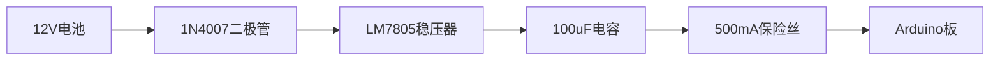
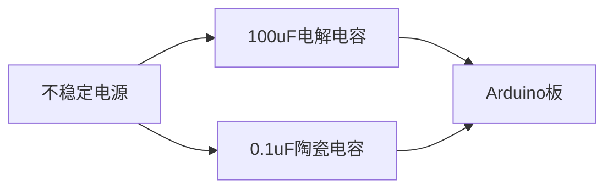

# Arduino 电源保护

在Arduino项目中，电源管理是一个至关重要的环节。不稳定的电源可能会导致Arduino板损坏或项目失败。因此，了解如何保护Arduino免受电源问题的影响是每个初学者都应该掌握的知识。

## 什么是Arduino电源保护？

Arduino电源保护是指通过一系列措施，确保Arduino板在电源波动、过压、欠压或短路等情况下仍能正常工作或安全关闭。这些措施可以防止硬件损坏，延长设备寿命，并提高项目的可靠性。

## 常见的电源问题

在Arduino项目中，可能会遇到以下几种常见的电源问题：

1. **过压**：输入电压超过Arduino板的最大额定电压。
2. **欠压**：输入电压低于Arduino板的最低工作电压。
3. **电源波动**：电压不稳定，频繁波动。
4. **短路**：电源正负极直接接触，导致电流过大。

## 电源保护措施

### 1. 使用稳压器

稳压器是一种电子元件，可以将不稳定的输入电压转换为稳定的输出电压。Arduino Uno等开发板通常内置了稳压器，但如果你使用外部电源，建议使用额外的稳压器来确保电压稳定。

```cpp
// 示例：使用LM7805稳压器
// 输入电压：7V-12V
// 输出电压：5V
```

### 2. 添加二极管保护

二极管可以防止电流反向流动，保护Arduino板免受反向电压的损害。在电源输入端串联一个二极管，可以有效防止电源接反。

```cpp
// 示例：使用1N4007二极管
// 正向电压降：0.7V
// 最大反向电压：1000V
```

### 3. 使用保险丝

保险丝是一种过流保护装置，当电流超过额定值时，保险丝会熔断，切断电路，防止设备损坏。在电源输入端添加一个保险丝，可以有效防止短路或过流。

```cpp
// 示例：使用500mA保险丝
// 额定电流：500mA
// 熔断时间：快速
```

### 4. 添加电容滤波

电容可以平滑电源波动，减少电压噪声。在电源输入端并联一个电容，可以有效减少电源波动对Arduino板的影响。

```cpp
// 示例：使用100uF电解电容
// 额定电压：16V
// 电容值：100uF
```

## 实际案例

### 案例1：使用外部电源供电

假设你正在使用一个12V的电池为Arduino供电。为了确保Arduino板的安全，你可以采取以下措施：

1. 使用LM7805稳压器将12V降压至5V。
2. 在电源输入端串联一个1N4007二极管，防止电源接反。
3. 在电源输入端并联一个100uF电解电容，平滑电源波动。
4. 添加一个500mA的保险丝，防止过流。



### 案例2：防止电源波动

假设你正在使用一个不稳定的电源为Arduino供电。为了减少电源波动的影响，你可以在电源输入端并联一个100uF电解电容和一个0.1uF陶瓷电容。



## 总结

Arduino电源保护是确保项目稳定性和安全性的关键。通过使用稳压器、二极管、保险丝和电容等元件，可以有效防止过压、欠压、电源波动和短路等问题。希望本文能帮助你更好地理解Arduino电源保护的重要性，并在实际项目中应用这些知识。

## 附加资源

- [Arduino官方文档](https://www.arduino.cc/en/Main/Documentation)
- [电子元件基础知识](https://www.electronics-tutorials.ws/)
- [电源管理电路设计](https://www.allaboutcircuits.com/)

## 练习

1. 设计一个简单的Arduino电源保护电路，使用稳压器、二极管、保险丝和电容。
2. 测试你的电路，观察在不同电源条件下的Arduino板表现。
3. 尝试使用不同的电容值，观察对电源波动的影响。

通过以上练习，你将更深入地理解Arduino电源保护的原理和应用。