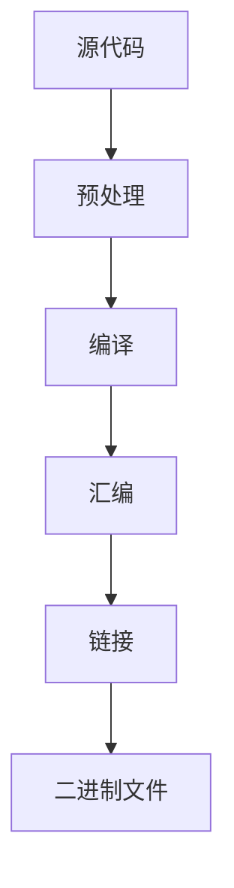

# Arduino 编译指令

Arduino编译指令是Arduino开发环境中的核心部分，它们负责将你编写的代码（通常称为“草图”）转换为微控制器可以执行的机器代码。对于初学者来说，理解这些指令的工作原理以及如何正确使用它们是非常重要的。

## 什么是Arduino编译指令？

Arduino编译指令是一系列命令，用于将Arduino代码（通常是用C/C++编写的）编译成微控制器可以理解的二进制文件。这些指令包括预处理、编译、链接等步骤，最终生成一个`.hex`文件，该文件可以被上传到Arduino板上执行。

### 编译过程概述

Arduino的编译过程可以分为以下几个步骤：

1. **预处理**：处理所有的`#include`和`#define`指令，展开宏定义。
2. **编译**：将预处理后的代码编译成汇编语言。
3. **汇编**：将汇编代码转换为机器代码（目标文件）。
4. **链接**：将所有目标文件和库文件链接在一起，生成最终的二进制文件。



## 实际应用中的编译指令

在实际的Arduino项目中，你可能会遇到一些常见的编译指令。以下是一些示例：

### 1. `#include`

`#include`指令用于包含外部库或头文件。例如，如果你想使用Arduino的`Serial`库，你需要在代码的开头添加以下指令：

```cpp
#include <Serial.h>
```

### 2. `#define`

`#define`指令用于定义常量或宏。例如，你可以定义一个LED引脚：

```cpp
#define LED_PIN 13
```

### 3. `#ifdef` 和 `#ifndef`

这些指令用于条件编译。例如，你可以根据是否定义了某个宏来决定是否编译某段代码：

```cpp
#ifdef DEBUG
    Serial.println("Debug mode is enabled");
#endif
```

## 实际案例

假设你正在开发一个项目，需要根据不同的环境（开发环境和生产环境）来启用或禁用调试信息。你可以使用`#ifdef`指令来实现这一点：

```cpp
#define DEBUG

void setup() {
    Serial.begin(9600);

    #ifdef DEBUG
        Serial.println("Debug mode is enabled");
    #endif
}

void loop() {
    // 你的主代码
}
```

在这个例子中，如果定义了`DEBUG`宏，那么在`setup()`函数中会打印调试信息。如果没有定义`DEBUG`宏，则不会打印。

## 总结

Arduino编译指令是Arduino开发中不可或缺的一部分。通过理解和使用这些指令，你可以更好地控制代码的编译过程，优化代码结构，并在不同的环境中灵活地切换功能。

### 附加资源

- [Arduino官方文档](https://www.arduino.cc/en/Guide/HomePage)
- [C/C++预处理指令](https://en.cppreference.com/w/cpp/preprocessor)

### 练习

1. 尝试在你的Arduino项目中定义一个宏，并使用`#ifdef`指令来控制某段代码的编译。
2. 研究Arduino的`Serial`库，并使用`#include`指令将其包含在你的项目中。

通过不断练习和探索，你将更加熟练地掌握Arduino编译指令的使用。