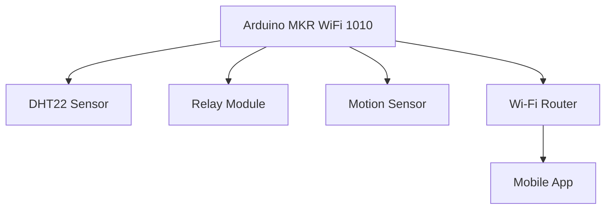
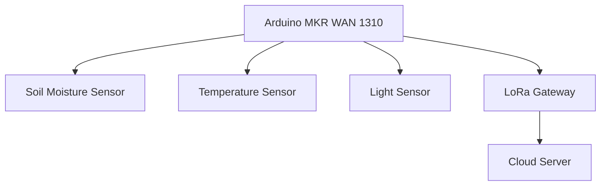

# Arduino 物联网最佳实践

物联网（IoT）正在改变我们与物理世界互动的方式，而Arduino作为一种开源硬件平台，是构建物联网项目的理想选择。本文将介绍如何通过Arduino实现物联网项目的最佳实践，帮助初学者从零开始构建可靠、高效的物联网系统。

## 什么是Arduino物联网？

Arduino物联网是指使用Arduino硬件和软件平台，将物理设备连接到互联网，实现数据采集、远程控制和自动化操作。通过Arduino，您可以轻松地将传感器、执行器和通信模块集成到物联网项目中。

## 1. 选择合适的硬件

### 1.1 Arduino开发板
Arduino提供了多种开发板，适用于不同的物联网场景。以下是一些常用的开发板：

- **Arduino Uno**：适合初学者，但网络功能有限。
- **Arduino Nano 33 IoT**：内置Wi-Fi和蓝牙，适合物联网项目。
- **Arduino MKR系列**：专为物联网设计，支持多种通信协议（如Wi-Fi、LoRa、NB-IoT）。

:::tip
对于需要低功耗和长距离通信的项目，建议选择Arduino MKR WAN 1310（支持LoRa）。
:::

### 1.2 传感器和执行器
根据项目需求选择合适的传感器和执行器。例如：
- **温湿度传感器**（如DHT22）用于环境监测。
- **继电器模块**用于控制高功率设备。
- **运动传感器**（如PIR）用于检测人体活动。

## 2. 网络连接

### 2.1 Wi-Fi连接
大多数Arduino物联网项目使用Wi-Fi进行网络连接。以下是一个简单的Wi-Fi连接示例：

```cpp
#include <WiFiNINA.h>

const char* ssid = "your_SSID";
const char* password = "your_PASSWORD";

void setup() {
  Serial.begin(9600);
  WiFi.begin(ssid, password);

  while (WiFi.status() != WL_CONNECTED) {
    delay(1000);
    Serial.println("Connecting to WiFi...");
  }
  Serial.println("Connected to WiFi");
}

void loop() {
  // Your code here
}
```

### 2.2 MQTT协议
MQTT是一种轻量级的消息传输协议，非常适合物联网应用。以下是一个使用MQTT发布数据的示例：

```cpp
#include <WiFiNINA.h>
#include <PubSubClient.h>

const char* mqtt_server = "broker.hivemq.com";
WiFiClient wifiClient;
PubSubClient client(wifiClient);

void callback(char* topic, byte* payload, unsigned int length) {
  // Handle incoming messages
}

void setup() {
  client.setServer(mqtt_server, 1883);
  client.setCallback(callback);
}

void loop() {
  if (!client.connected()) {
    reconnect();
  }
  client.loop();
}

void reconnect() {
  while (!client.connected()) {
    if (client.connect("arduinoClient")) {
      client.subscribe("your_topic");
    } else {
      delay(5000);
    }
  }
}
```

## 3. 数据安全

### 3.1 加密通信
使用TLS/SSL加密通信，确保数据在传输过程中不被窃取或篡改。Arduino MKR系列支持TLS/SSL加密。

### 3.2 认证与授权
为MQTT代理或Web服务器设置用户名和密码，限制未经授权的访问。

## 4. 实际应用案例

### 4.1 智能家居系统
使用Arduino构建智能家居系统，通过手机应用远程控制灯光、温度和安防设备。



### 4.2 农业监测系统
在农业中，使用Arduino监测土壤湿度、温度和光照强度，并通过LoRa将数据传输到远程服务器。



## 5. 总结

通过本文，您已经了解了Arduino物联网项目的最佳实践，包括硬件选择、网络连接、数据安全和实际应用案例。希望这些内容能帮助您顺利构建自己的物联网项目。

## 6. 附加资源与练习

- **练习**：尝试使用Arduino Nano 33 IoT和DHT22传感器构建一个温湿度监测系统，并将数据发布到MQTT代理。
- **资源**：
  - [Arduino官方文档](https://www.arduino.cc/en/Guide/HomePage)
  - [MQTT协议介绍](https://mqtt.org/)
  - [LoRa技术指南](https://lora-alliance.org/)

:::note
如果您在项目中遇到问题，可以访问Arduino论坛或社区寻求帮助。
:::