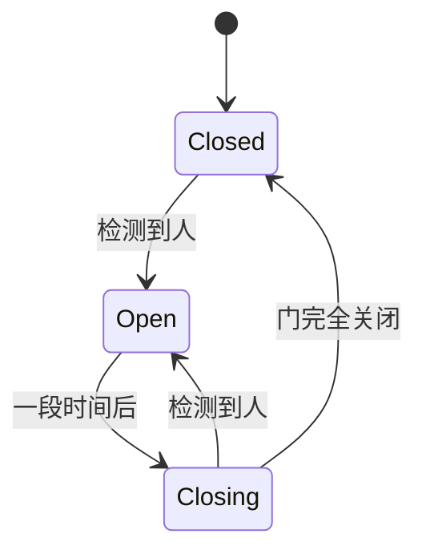

# Arduino 状态机设计

## 介绍

在Arduino编程中，状态机（State Machine）是一种强大的设计模式，用于管理复杂的行为和逻辑。状态机通过将程序分解为多个状态（State）和状态之间的转换（Transition），使得代码更易于理解、维护和扩展。状态机特别适合处理需要根据输入或事件改变行为的任务，例如控制机器人、自动化系统或交互式设备。

## 什么是状态机？

状态机是一种数学模型，用于描述系统在不同状态之间的行为。它由以下几个部分组成：

1. **状态（State）**：系统在某一时刻的特定条件或模式。
2. **事件（Event）**：触发状态转换的外部输入或条件。
3. **转换（Transition）**：从一个状态到另一个状态的变化。
4. **动作（Action）**：在状态转换时执行的操作。

状态机可以帮助你将复杂的逻辑分解为简单的状态和转换，从而简化代码结构。

## 状态机的基本结构

在Arduino中，状态机通常通过`switch`语句或`if-else`语句实现。以下是一个简单的状态机示例，展示了如何控制LED灯的开关状态。

```cpp
enum State {
  LED_OFF,
  LED_ON
};

State currentState = LED_OFF;

void setup() {
  pinMode(LED_BUILTIN, OUTPUT);
}

void loop() {
  switch (currentState) {
    case LED_OFF:
      digitalWrite(LED_BUILTIN, LOW);
      if (someCondition()) {
        currentState = LED_ON;
      }
      break;

    case LED_ON:
      digitalWrite(LED_BUILTIN, HIGH);
      if (anotherCondition()) {
        currentState = LED_OFF;
      }
      break;
  }
}

bool someCondition() {
  // 模拟某些条件
  return true;
}

bool anotherCondition() {
  // 模拟其他条件
  return true;
}
```

在这个示例中，`currentState`变量表示当前的状态。`loop()`函数根据当前状态执行相应的操作，并根据条件切换到下一个状态。

## 状态机的实际应用

### 案例：交通灯控制系统

假设我们需要设计一个简单的交通灯控制系统，包含红灯、黄灯和绿灯。交通灯的状态转换如下：

1. **红灯**：持续5秒，然后切换到绿灯。
2. **绿灯**：持续5秒，然后切换到黄灯。
3. **黄灯**：持续2秒，然后切换回红灯。

我们可以使用状态机来实现这个系统：

```cpp
enum TrafficLightState {
  RED,
  YELLOW,
  GREEN
};

TrafficLightState currentState = RED;
unsigned long lastStateChangeTime = 0;

void setup() {
  pinMode(13, OUTPUT); // 红灯
  pinMode(12, OUTPUT); // 黄灯
  pinMode(11, OUTPUT); // 绿灯
}

void loop() {
  unsigned long currentTime = millis();

  switch (currentState) {
    case RED:
      digitalWrite(13, HIGH);
      digitalWrite(12, LOW);
      digitalWrite(11, LOW);
      if (currentTime - lastStateChangeTime >= 5000) {
        currentState = GREEN;
        lastStateChangeTime = currentTime;
      }
      break;

    case YELLOW:
      digitalWrite(13, LOW);
      digitalWrite(12, HIGH);
      digitalWrite(11, LOW);
      if (currentTime - lastStateChangeTime >= 2000) {
        currentState = RED;
        lastStateChangeTime = currentTime;
      }
      break;

    case GREEN:
      digitalWrite(13, LOW);
      digitalWrite(12, LOW);
      digitalWrite(11, HIGH);
      if (currentTime - lastStateChangeTime >= 5000) {
        currentState = YELLOW;
        lastStateChangeTime = currentTime;
      }
      break;
  }
}
```

在这个案例中，我们使用`millis()`函数来跟踪状态持续的时间，并根据时间切换状态。

## 状态机的高级应用

### 使用状态机处理复杂逻辑

状态机不仅可以用于简单的任务，还可以处理更复杂的逻辑。例如，假设我们需要设计一个自动门控制系统，门的状态包括关闭、打开和正在关闭。我们可以使用状态机来管理这些状态及其转换。



```cpp
enum DoorState {
  CLOSED,
  OPEN,
  CLOSING
};

DoorState currentState = CLOSED;
unsigned long lastStateChangeTime = 0;

void setup() {
  // 初始化传感器和电机
}

void loop() {
  unsigned long currentTime = millis();

  switch (currentState) {
    case CLOSED:
      if (detectPerson()) {
        currentState = OPEN;
        lastStateChangeTime = currentTime;
      }
      break;

    case OPEN:
      if (currentTime - lastStateChangeTime >= 5000) {
        currentState = CLOSING;
        lastStateChangeTime = currentTime;
      }
      break;

    case CLOSING:
      if (detectPerson()) {
        currentState = OPEN;
      } else if (doorFullyClosed()) {
        currentState = CLOSED;
      }
      break;
  }
}

bool detectPerson() {
  // 模拟检测到人
  return false;
}

bool doorFullyClosed() {
  // 模拟门完全关闭
  return true;
}
```

在这个示例中，我们使用状态机来管理门的开关逻辑，确保门在检测到人时不会关闭。

## 总结

状态机是一种强大的设计模式，特别适合处理复杂的逻辑和行为。通过将程序分解为多个状态和转换，你可以编写出更高效、可维护的Arduino代码。本文介绍了状态机的基本概念，并通过实际案例展示了如何在Arduino中实现状态机。

:::tip
**练习**：尝试设计一个状态机来控制一个简单的家用电器，例如电风扇。电风扇的状态可以包括关闭、低速、中速和高速。根据用户输入切换状态。
:::

## 附加资源

- [Arduino官方文档](https://www.arduino.cc/reference/en/)
- [状态机设计模式详解](https://en.wikipedia.org/wiki/Finite-state_machine)
- [Arduino编程入门指南](https://www.arduino.cc/en/Guide)

通过学习和实践状态机设计，你将能够更好地管理复杂的Arduino项目，并提升你的编程技能。