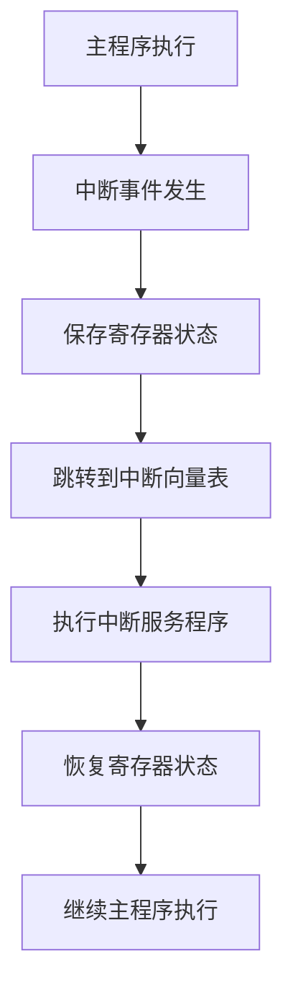

# Arduino 中断向量表

在Arduino编程中，中断是一种强大的机制，允许微控制器在执行主程序的同时，快速响应外部事件。中断向量表是理解中断机制的关键概念之一。本文将详细介绍中断向量表的工作原理，并通过代码示例和实际案例帮助你掌握这一重要概念。

## 什么是中断向量表？

中断向量表是一个存储中断服务程序（ISR）地址的表格。当某个中断事件发生时，微控制器会根据中断向量表中的地址跳转到相应的中断服务程序，执行特定的任务。中断向量表通常位于微控制器的内存中，每个中断源都有一个对应的入口。

在Arduino中，中断向量表是由硬件和编译器共同管理的。开发者只需要编写中断服务程序，并将其与特定的中断源关联起来。

## 中断向量表的工作原理

当某个中断事件发生时，微控制器会暂停当前正在执行的程序，保存当前的程序计数器（PC）和其他关键寄存器的值，然后根据中断向量表中的地址跳转到相应的中断服务程序。中断服务程序执行完毕后，微控制器会恢复之前保存的寄存器值，并继续执行主程序。

以下是一个简化的中断处理流程：



## 代码示例：使用中断向量表

在Arduino中，我们可以使用 `attachInterrupt()` 函数来关联中断服务程序。以下是一个简单的示例，展示了如何使用中断向量表来处理外部中断。

```cpp
const int interruptPin = 2;  // 使用数字引脚2作为中断输入

void setup() {
  pinMode(interruptPin, INPUT_PULLUP);  // 设置引脚为输入模式，并启用内部上拉电阻
  attachInterrupt(digitalPinToInterrupt(interruptPin), handleInterrupt, FALLING);  // 关联中断服务程序
}

void loop() {
  // 主程序代码
}

void handleInterrupt() {
  // 中断服务程序代码
  Serial.println("中断触发！");
}
```

在这个示例中，当引脚2的电平从高变低（FALLING）时，中断服务程序 `handleInterrupt()` 会被调用，并在串口监视器中打印 "中断触发！"。

:::note
**注意**：在中断服务程序中，应尽量避免使用耗时操作（如 `delay()` 或复杂的计算），以确保中断响应的实时性。
:::

## 实际应用场景

中断向量表在许多实际应用中都非常有用。以下是一些常见的应用场景：

1. **按键检测**：当用户按下按钮时，可以通过中断立即响应，而不需要不断轮询按钮状态。
2. **传感器数据采集**：某些传感器在数据准备好时会触发中断，微控制器可以立即读取数据，而不需要等待。
3. **通信协议处理**：在串行通信中，中断可以用于处理接收到的数据包，确保数据的及时处理。

## 总结

中断向量表是Arduino中断机制的核心部分，它允许微控制器快速响应外部事件。通过理解中断向量表的工作原理，并掌握如何使用 `attachInterrupt()` 函数，你可以在Arduino项目中实现高效的中断处理。

## 附加资源与练习

- **练习**：尝试修改上述代码示例，使其在中断触发时控制LED灯的开关。
- **进一步阅读**：查阅Arduino官方文档，了解更多关于中断和中断向量表的详细信息。

通过本文的学习，你应该对Arduino中断向量表有了初步的了解。希望你能在实际项目中灵活运用这一概念，提升你的Arduino编程技能！