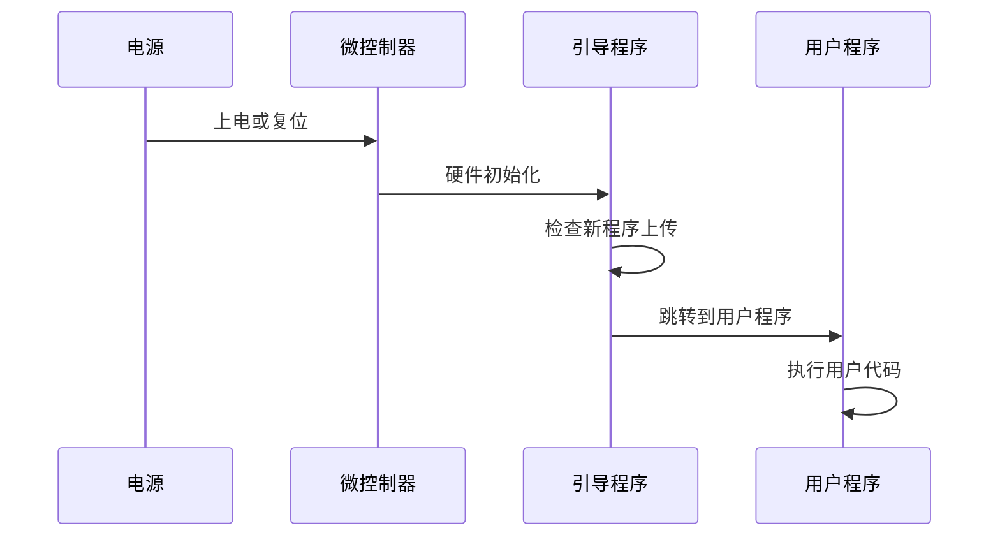

# Arduino 启动引导过程

Arduino是一款广受欢迎的开源硬件平台，广泛应用于各种电子项目和原型开发中。要充分利用Arduino的功能，了解其启动引导过程（Bootloader Process）是非常重要的。本文将详细介绍Arduino的启动引导过程，帮助你理解从硬件上电到程序执行的完整流程。

## 什么是Arduino启动引导过程？

Arduino启动引导过程是指从Arduino板上电或复位开始，到用户程序（即你编写的代码）开始执行之间的过程。这个过程由Arduino的引导程序（Bootloader）控制。引导程序是一段存储在微控制器中的特殊代码，负责初始化硬件并加载用户程序。

:::note
引导程序是Arduino能够通过USB接口轻松上传代码的关键。它允许你通过Arduino IDE将代码上传到板子上，而无需额外的编程器。
:::

## Arduino 启动引导过程的步骤

Arduino的启动引导过程可以分为以下几个步骤：

1. **硬件初始化**：当Arduino板上电或复位时，微控制器（如ATmega328P）会首先执行硬件初始化。这包括设置时钟、配置I/O引脚、初始化内存等。

2. **引导程序执行**：硬件初始化完成后，微控制器会跳转到引导程序的起始地址，开始执行引导程序代码。

3. **等待上传新程序**：引导程序会检查是否有新的程序通过串口上传。如果有，它会接收并存储新的程序到闪存中。

4. **跳转到用户程序**：如果没有检测到新程序上传，引导程序会跳转到用户程序的起始地址，开始执行用户代码。



## 引导程序的作用

引导程序的主要作用是简化Arduino的程序上传过程。它允许你通过USB接口直接将代码上传到Arduino板上，而无需使用外部编程器。此外，引导程序还提供了一些基本的调试功能，例如通过LED指示灯显示上传状态。

:::tip
如果你需要更快的启动速度或更小的程序占用空间，可以选择禁用引导程序。但这通常需要额外的硬件编程器。
:::

## 实际案例：Arduino Uno的启动引导过程

以Arduino Uno为例，其微控制器是ATmega328P。当Arduino Uno上电时，以下步骤会发生：

1. **硬件初始化**：ATmega328P会初始化其内部时钟、I/O引脚和内存。

2. **引导程序执行**：引导程序会检查串口是否有新程序上传。如果有，它会接收并存储新程序到闪存中。

3. **跳转到用户程序**：如果没有新程序上传，引导程序会跳转到用户程序的起始地址，开始执行用户代码。

```cpp
void setup() {
  // 初始化代码
  pinMode(LED_BUILTIN, OUTPUT);
}

void loop() {
  // 主循环代码
  digitalWrite(LED_BUILTIN, HIGH);
  delay(1000);
  digitalWrite(LED_BUILTIN, LOW);
  delay(1000);
}
```

在上面的代码示例中，`setup()`函数中的代码会在Arduino启动后立即执行，而`loop()`函数中的代码会不断循环执行。

## 总结

Arduino的启动引导过程是理解Arduino工作原理的关键部分。通过了解引导程序的作用和启动流程，你可以更好地掌握Arduino的运行机制，并在需要时进行优化或调试。

## 附加资源与练习

- **练习1**：尝试编写一个简单的Arduino程序，观察其启动和执行过程。
- **练习2**：研究如何禁用引导程序，并了解其对Arduino启动速度的影响。
- **资源**：阅读Arduino官方文档，了解更多关于引导程序和硬件初始化的详细信息。

通过本文的学习，你应该对Arduino的启动引导过程有了更深入的理解。继续探索和实践，你将能够更熟练地使用Arduino进行各种项目开发。