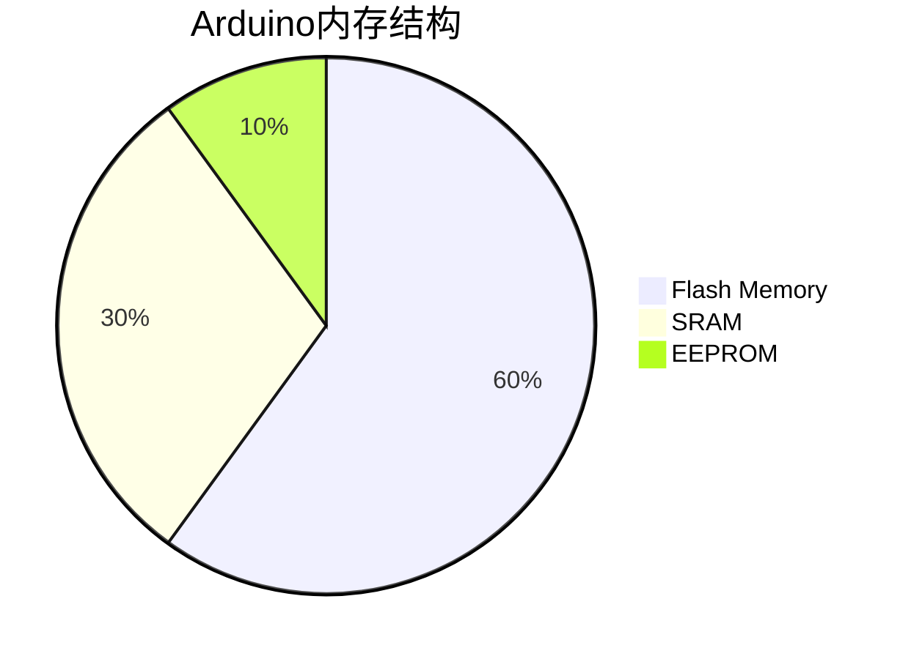

# Arduino 内存分配

在Arduino编程中，内存分配是一个关键概念，尤其是在处理复杂项目或资源受限的设备时。了解Arduino的内存结构及其分配方式，可以帮助你编写更高效、更稳定的程序。本文将详细介绍Arduino的内存分配机制，并通过实际案例帮助你更好地理解这一概念。

## 1. Arduino内存结构

Arduino的内存主要分为三部分：

1. **Flash Memory（闪存）**：用于存储程序代码（即你的`.ino`文件编译后的代码）。这部分内存是只读的，程序运行时无法修改。
2. **SRAM（静态随机存取存储器）**：用于存储程序运行时的变量、堆栈和动态分配的内存。SRAM是易失性内存，断电后数据会丢失。
3. **EEPROM（电可擦可编程只读存储器）**：用于存储需要长期保存的数据，即使断电也不会丢失。EEPROM的写入次数有限，通常用于存储配置数据或状态信息。



## 2. SRAM的管理与优化

SRAM是Arduino中最宝贵的资源，因为它的大小有限（例如，Arduino Uno只有2KB的SRAM）。如果SRAM耗尽，程序可能会崩溃或行为异常。因此，合理管理SRAM至关重要。

### 2.1 全局变量与局部变量

- **全局变量**：在程序开始时分配内存，直到程序结束才释放。它们存储在SRAM的固定位置。
- **局部变量**：在函数调用时分配内存，函数返回时释放。它们存储在堆栈中。

:::caution
尽量避免在函数中定义大型局部变量，因为堆栈空间有限，可能会导致堆栈溢出。
:::

### 2.2 动态内存分配

Arduino支持动态内存分配，使用`malloc()`和`free()`函数。然而，动态内存分配可能会导致内存碎片，尤其是在长时间运行的程序中。

```cpp
void setup() {
  Serial.begin(9600);
  int* ptr = (int*)malloc(10 * sizeof(int)); // 分配10个整数的内存
  if (ptr == NULL) {
    Serial.println("内存分配失败！");
    return;
  }
  for (int i = 0; i < 10; i++) {
    ptr[i] = i * 2;
  }
  for (int i = 0; i < 10; i++) {
    Serial.println(ptr[i]);
  }
  free(ptr); // 释放内存
}

void loop() {
  // 空循环
}
```

:::tip
在Arduino中，尽量避免频繁使用动态内存分配，尤其是在资源受限的设备上。
:::

## 3. EEPROM的使用

EEPROM用于存储需要长期保存的数据。Arduino提供了`EEPROM`库来简化对EEPROM的读写操作。

```cpp
#include <EEPROM.h>

void setup() {
  Serial.begin(9600);
  int address = 0;
  int value = 123;
  EEPROM.write(address, value); // 将值写入EEPROM
  int readValue = EEPROM.read(address); // 从EEPROM读取值
  Serial.print("读取的值: ");
  Serial.println(readValue);
}

void loop() {
  // 空循环
}
```

:::note
EEPROM的写入次数有限（通常为10万次），因此应避免频繁写入。
:::

## 4. 实际案例：内存优化

假设你正在开发一个传感器数据采集系统，需要存储大量数据。由于SRAM有限，你可以将数据存储在EEPROM中，或者使用外部存储设备（如SD卡）。

```cpp
#include <EEPROM.h>

void setup() {
  Serial.begin(9600);
  int sensorValue = analogRead(A0);
  EEPROM.write(0, sensorValue); // 将传感器数据存储在EEPROM中
  Serial.print("存储的传感器值: ");
  Serial.println(sensorValue);
}

void loop() {
  // 空循环
}
```

## 5. 总结

Arduino的内存分配是编写高效程序的关键。通过合理管理SRAM、避免不必要的动态内存分配以及有效利用EEPROM，你可以显著提升程序的性能和稳定性。

## 6. 附加资源与练习

- **练习1**：编写一个程序，使用动态内存分配存储10个浮点数，并在串口监视器中打印它们。
- **练习2**：使用EEPROM存储一个计数器，每次重启Arduino时计数器加1，并在串口监视器中显示当前计数。

:::tip
更多关于Arduino内存管理的详细信息，可以参考Arduino官方文档。
:::