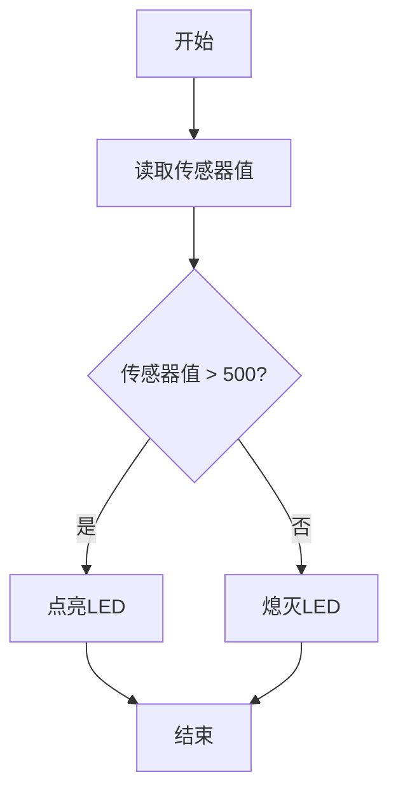

# Arduino 调试技巧

在Arduino编程中，调试是解决代码问题和验证功能的重要步骤。无论你是初学者还是有一定经验的开发者，掌握一些基本的调试技巧都能显著提高你的开发效率。本文将介绍几种常用的Arduino调试方法，并通过实际案例帮助你理解如何应用这些技巧。

## 1. 使用串口监视器

串口监视器是Arduino IDE自带的一个强大工具，可以帮助你查看程序运行时的输出信息。通过串口监视器，你可以打印变量的值、调试信息或错误信息，从而更好地理解程序的执行过程。

### 示例代码

```cpp
void setup() {
  Serial.begin(9600); // 初始化串口通信，波特率设置为9600
}

void loop() {
  int sensorValue = analogRead(A0); // 读取模拟引脚A0的值
  Serial.print("Sensor Value: ");
  Serial.println(sensorValue); // 打印传感器值到串口监视器
  delay(1000); // 延迟1秒
}
```

### 输出结果

在串口监视器中，你将看到类似以下的输出：

```
Sensor Value: 512
Sensor Value: 510
Sensor Value: 515
...
```

:::tip
确保在`Serial.begin()`中设置的波特率与串口监视器中的波特率一致，否则你将无法正确看到输出信息。
:::

## 2. 使用调试LED

在硬件调试中，LED是一种简单而有效的工具。你可以通过控制LED的亮灭状态来指示程序的运行状态或某些特定事件的发生。

### 示例代码

```cpp
void setup() {
  pinMode(LED_BUILTIN, OUTPUT); // 设置内置LED引脚为输出模式
}

void loop() {
  digitalWrite(LED_BUILTIN, HIGH); // 点亮LED
  delay(500); // 延迟500毫秒
  digitalWrite(LED_BUILTIN, LOW); // 熄灭LED
  delay(500); // 延迟500毫秒
}
```

### 实际应用

假设你正在调试一个传感器读取程序，你可以在读取到特定值时点亮LED，从而直观地看到程序是否按预期工作。

```cpp
void loop() {
  int sensorValue = analogRead(A0);
  if (sensorValue > 500) {
    digitalWrite(LED_BUILTIN, HIGH); // 如果传感器值大于500，点亮LED
  } else {
    digitalWrite(LED_BUILTIN, LOW); // 否则熄灭LED
  }
  delay(100);
}
```

## 3. 断点调试

虽然Arduino IDE本身不支持传统的断点调试，但你可以通过模拟断点的方式来实现类似的功能。例如，你可以在代码中插入`Serial.println()`语句，并在特定条件下暂停程序执行。

### 示例代码

```cpp
void setup() {
  Serial.begin(9600);
}

void loop() {
  int sensorValue = analogRead(A0);
  if (sensorValue > 500) {
    Serial.println("Breakpoint: Sensor value is greater than 500");
    while (true); // 模拟断点，暂停程序执行
  }
  delay(100);
}
```

### 输出结果

当传感器值大于500时，程序将打印一条消息并暂停执行：

```
Breakpoint: Sensor value is greater than 500
```

:::caution
使用`while (true)`来模拟断点时，程序将无限循环，直到你手动重启Arduino。请确保在调试完成后移除或注释掉这些代码。
:::

## 4. 使用条件编译进行调试

条件编译是一种在编译时选择性地包含或排除代码的方法。通过定义调试标志，你可以在调试模式下启用额外的调试代码，而在发布模式下禁用它们。

### 示例代码

```cpp
#define DEBUG // 定义调试标志

void setup() {
  Serial.begin(9600);
}

void loop() {
  int sensorValue = analogRead(A0);
  
  #ifdef DEBUG
    Serial.print("Debug: Sensor Value = ");
    Serial.println(sensorValue);
  #endif

  delay(100);
}
```

### 实际应用

在调试模式下，程序将打印传感器值；而在发布模式下，这些调试信息将被忽略。

:::note
你可以通过注释或取消注释`#define DEBUG`来切换调试模式。
:::

## 5. 使用Mermaid图表辅助调试

在某些复杂的调试场景中，绘制流程图或状态图可以帮助你更好地理解程序的逻辑。Mermaid是一种简单易用的图表绘制工具，可以在Markdown中直接使用。

### 示例流程图



### 实际应用

通过绘制流程图，你可以更清晰地看到程序的执行路径，从而更容易发现潜在的问题。

## 总结

调试是Arduino开发中不可或缺的一部分。通过使用串口监视器、调试LED、断点调试和条件编译等方法，你可以更高效地定位和解决代码中的问题。此外，绘制流程图或状态图也能帮助你更好地理解程序的逻辑。

## 附加资源与练习

- **练习1**：尝试在现有的Arduino项目中添加串口调试信息，观察程序运行时的输出。
- **练习2**：使用调试LED来指示程序中的某些特定事件，例如传感器值超过某个阈值。
- **附加资源**：阅读Arduino官方文档，了解更多关于串口通信和调试的技巧。

希望这些调试技巧能帮助你在Arduino开发中更加得心应手！如果你有任何问题或需要进一步的帮助，请随时访问我们的社区论坛。