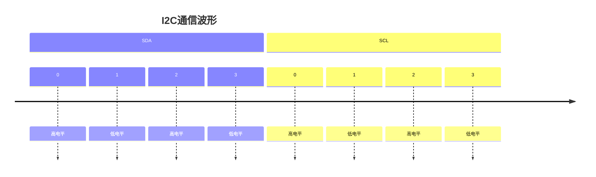

# Arduino 逻辑分析

在Arduino项目中，逻辑分析是一种用于调试和分析数字信号行为的强大工具。它可以帮助你观察和分析电路中信号的时序、电压变化以及通信协议的行为。对于初学者来说，理解逻辑分析的概念和使用方法是非常重要的，尤其是在调试复杂的项目时。

## 什么是逻辑分析？

逻辑分析是一种用于捕获和显示数字信号的工具。它可以帮助你观察信号的时序、频率、占空比以及通信协议（如I2C、SPI、UART）的行为。逻辑分析仪通常通过多个通道连接到电路中的信号线，捕获信号的变化，并将其以图形化的方式显示出来。

:::note
逻辑分析仪与示波器的区别在于，逻辑分析仪主要用于分析数字信号，而示波器可以同时分析模拟和数字信号。
:::

## 逻辑分析的基本概念

### 1. 采样率
采样率是指逻辑分析仪每秒捕获信号的次数。采样率越高，捕获的信号细节越丰富。例如，一个100MHz的采样率意味着逻辑分析仪每秒可以捕获100,000,000个数据点。

### 2. 通道数
通道数是指逻辑分析仪可以同时捕获的信号数量。常见的逻辑分析仪有4通道、8通道、16通道等。通道数越多，可以同时分析的信号线越多。

### 3. 触发条件
触发条件是指逻辑分析仪开始捕获信号的条件。你可以设置特定的信号模式或电压阈值作为触发条件，以便在特定事件发生时开始捕获信号。

## 如何使用逻辑分析仪调试Arduino项目

### 1. 连接逻辑分析仪
首先，将逻辑分析仪的通道连接到Arduino的信号线上。例如，如果你正在调试一个I2C通信项目，可以将逻辑分析仪的通道连接到SDA和SCL信号线上。

### 2. 设置采样率和触发条件
根据你的项目需求，设置逻辑分析仪的采样率和触发条件。例如，如果你正在分析一个1MHz的SPI信号，建议将采样率设置为至少10MHz。

### 3. 捕获信号
启动逻辑分析仪，捕获信号。捕获完成后，逻辑分析仪会显示信号的波形和时序图。

### 4. 分析信号
使用逻辑分析仪的软件工具分析捕获的信号。你可以观察信号的时序、频率、占空比以及通信协议的行为。

## 实际案例：调试I2C通信

假设你正在调试一个Arduino与I2C设备的通信问题。你可以使用逻辑分析仪来捕获SDA和SCL信号，分析通信过程中是否存在问题。

### 代码示例
以下是一个简单的Arduino I2C通信代码示例：

```cpp
#include <Wire.h>

void setup() {
  Wire.begin(); // 初始化I2C通信
  Serial.begin(9600);
}

void loop() {
  Wire.beginTransmission(0x68); // 向设备地址0x68发送数据
  Wire.write(0x00); // 发送数据字节
  Wire.endTransmission(); // 结束传输
  delay(1000);
}
```

### 逻辑分析仪捕获的信号
使用逻辑分析仪捕获SDA和SCL信号后，你可能会看到类似以下的波形：



通过分析波形，你可以确认I2C通信是否正常，是否存在信号抖动或通信错误。

## 总结

逻辑分析是调试Arduino项目的重要工具，尤其是在分析数字信号和通信协议时。通过理解逻辑分析的基本概念和使用方法，你可以更有效地调试和优化你的Arduino项目。

:::tip
如果你对逻辑分析感兴趣，可以尝试使用开源逻辑分析仪软件（如PulseView）和低成本硬件（如Saleae Logic Analyzer）进行实验。
:::

## 附加资源与练习

1. **练习**：尝试使用逻辑分析仪捕获Arduino的PWM信号，并分析其占空比和频率。
2. **资源**：阅读逻辑分析仪的用户手册，了解更多高级功能和设置。
3. **扩展学习**：学习如何使用逻辑分析仪调试SPI和UART通信协议。

通过不断实践和学习，你将能够熟练掌握逻辑分析工具，并将其应用于更复杂的Arduino项目中。