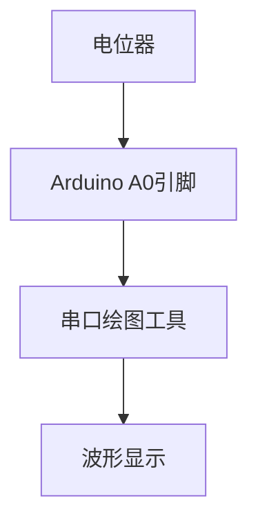

# Arduino 示波器使用

## 介绍

示波器是一种用于观察电信号波形的工具，广泛应用于电子工程和调试中。虽然专业示波器价格昂贵，但我们可以使用Arduino和一些简单的代码来构建一个基础的示波器。本文将引导你如何使用Arduino实现一个简单的示波器，并解释其工作原理。

## 所需材料

- Arduino Uno 或类似开发板
- 电位器（用于模拟输入信号）
- 连接线
- 电脑（用于显示波形）

## 基本概念

Arduino的模拟输入引脚可以读取0到5V之间的电压，并将其转换为0到1023之间的数字值。通过将这些值发送到电脑，我们可以使用串口绘图工具或其他软件来可视化信号波形。

## 代码示例

以下是一个简单的Arduino代码示例，用于读取模拟输入并将其发送到串口：

```cpp
void setup() {
  Serial.begin(9600); // 初始化串口通信
}

void loop() {
  int sensorValue = analogRead(A0); // 读取A0引脚的模拟输入
  Serial.println(sensorValue); // 将读取的值发送到串口
  delay(10); // 延迟10毫秒以稳定读取
}
```

### 输入和输出

- **输入**：将电位器的中间引脚连接到Arduino的A0引脚，两端分别连接到5V和GND。
- **输出**：打开Arduino IDE的串口绘图工具（`工具` -> `串口绘图工具`），你将看到电位器旋转时波形的变化。

## 逐步讲解

1. **初始化串口通信**：在`setup()`函数中，使用`Serial.begin(9600)`初始化串口通信，波特率设置为9600。
2. **读取模拟输入**：在`loop()`函数中，使用`analogRead(A0)`读取A0引脚的模拟输入值。
3. **发送数据到串口**：使用`Serial.println(sensorValue)`将读取的值发送到串口。
4. **延迟**：使用`delay(10)`延迟10毫秒，以确保读取的稳定性。

## 实际应用场景

### 案例：测量电位器信号

假设你正在调试一个电路，需要观察电位器输出的信号变化。通过将电位器连接到Arduino的A0引脚，并运行上述代码，你可以在串口绘图工具中实时观察电位器旋转时的信号变化。



## 总结

通过本文，你学会了如何使用Arduino构建一个简单的示波器。虽然这个示波器的功能有限，但它足以帮助你理解基本的信号测量和可视化方法。你可以进一步扩展这个项目，例如增加更多的输入通道或提高采样率。

## 附加资源

- [Arduino官方文档](https://www.arduino.cc/reference/en/)
- [串口绘图工具使用指南](https://www.arduino.cc/en/software)
- [电子信号基础](https://en.wikipedia.org/wiki/Electrical_signal)

## 练习

1. 修改代码，使其能够同时读取两个模拟输入（A0和A1），并在串口绘图工具中显示两个波形。
2. 尝试增加采样率，观察波形变化。
3. 使用不同的传感器（如光敏电阻）替换电位器，观察不同信号的变化。

:::tip
提示：在调试过程中，确保你的电路连接正确，避免短路或损坏Arduino。
:::

:::caution
注意：Arduino的模拟输入电压范围是0到5V，超过此范围可能会损坏Arduino。
:::