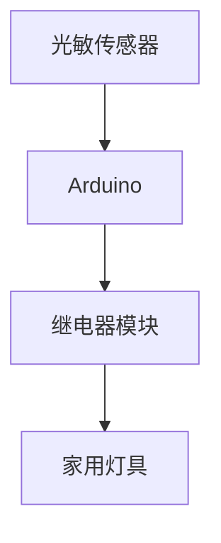

# Arduino 家庭自动化

## 介绍

家庭自动化是指通过技术手段自动控制家中的各种设备，例如灯光、温度、安防系统等。Arduino作为一种开源电子原型平台，因其易用性和灵活性，成为实现家庭自动化的理想工具。通过Arduino，你可以轻松地控制家用设备，并根据需求编写自定义逻辑。

在本教程中，我们将从基础概念开始，逐步讲解如何使用Arduino实现家庭自动化，并通过实际案例展示其应用场景。

---

## 基础概念

### 什么是家庭自动化？

家庭自动化是通过电子设备和软件系统，自动控制家中的各种设备，以提高生活的便利性、安全性和能源效率。常见的应用包括：

- **灯光控制**：根据时间或光线强度自动开关灯。
- **温度控制**：根据室内温度自动调节空调或暖气。
- **安防系统**：通过传感器检测入侵并触发警报。

### 为什么选择Arduino？

Arduino是一个开源的硬件和软件平台，适合初学者和专业人士使用。它的优势包括：

- **易于编程**：使用简单的C/C++语言编写代码。
- **丰富的扩展模块**：支持各种传感器和执行器。
- **低成本**：硬件价格低廉，适合个人项目。

---

## 所需硬件

在开始之前，你需要准备以下硬件：

1. **Arduino开发板**（如Arduino Uno）。
2. **传感器**（如温度传感器、光敏传感器）。
3. **执行器**（如继电器、LED灯）。
4. **连接线**和**面包板**。
5. **电源适配器**。

---

## 实现步骤

### 1. 连接硬件

首先，将传感器和执行器连接到Arduino开发板。以下是一个简单的示例，使用光敏传感器控制LED灯的开关。

```cpp
// 引脚定义
const int lightSensorPin = A0; // 光敏传感器连接到模拟引脚A0
const int ledPin = 13;         // LED连接到数字引脚13

void setup() {
  pinMode(ledPin, OUTPUT);     // 设置LED引脚为输出模式
  Serial.begin(9600);          // 初始化串口通信
}

void loop() {
  int lightValue = analogRead(lightSensorPin); // 读取光敏传感器的值
  Serial.println(lightValue);                 // 打印传感器值到串口监视器

  if (lightValue < 500) {                     // 如果光线较暗
    digitalWrite(ledPin, HIGH);               // 打开LED
  } else {
    digitalWrite(ledPin, LOW);                // 关闭LED
  }

  delay(100);                                 // 延迟100毫秒
}
```

### 2. 编写代码

上述代码的功能是：当环境光线较暗时，自动打开LED灯；当光线充足时，关闭LED灯。你可以根据需要修改阈值（`500`）来调整灵敏度。

### 3. 测试与调试

将代码上传到Arduino开发板，观察LED灯的行为。如果光线变化时LED灯没有正确响应，可以调整传感器的位置或代码中的阈值。

---

## 实际案例

### 案例1：智能灯光系统

假设你希望在家中实现一个智能灯光系统，可以根据时间或光线强度自动开关灯。你可以使用光敏传感器和继电器模块来控制家中的照明设备。



### 案例2：温度控制系统

如果你希望根据室内温度自动调节空调或暖气，可以使用温度传感器（如DHT11）和继电器模块。当温度超过设定值时，Arduino会触发继电器，打开或关闭空调。

```cpp
#include <DHT.h>

#define DHTPIN 2          // DHT11传感器连接到数字引脚2
#define DHTTYPE DHT11     // 传感器类型

DHT dht(DHTPIN, DHTTYPE);

void setup() {
  Serial.begin(9600);
  dht.begin();
}

void loop() {
  float temperature = dht.readTemperature(); // 读取温度值
  Serial.print("Temperature: ");
  Serial.println(temperature);

  if (temperature > 25) {                   // 如果温度高于25°C
    // 触发继电器，打开空调
  } else {
    // 关闭空调
  }

  delay(2000);                              // 每2秒读取一次
}
```

---

## 总结

通过本教程，你已经了解了如何使用Arduino实现家庭自动化的基础知识和实际应用。从简单的灯光控制到复杂的温度调节，Arduino为家庭自动化提供了无限的可能性。

:::tip
尝试扩展你的项目，例如添加更多的传感器或通过Wi-Fi模块实现远程控制。
:::

---

## 附加资源与练习

1. **练习**：尝试使用运动传感器实现一个安防系统，当检测到运动时触发警报。
2. **资源**：
   - [Arduino官方文档](https://www.arduino.cc/)
   - [DHT11传感器使用指南](https://learn.adafruit.com/dht)
   - [家庭自动化项目合集](https://create.arduino.cc/projecthub)

继续探索Arduino的世界，你会发现更多有趣的应用场景！