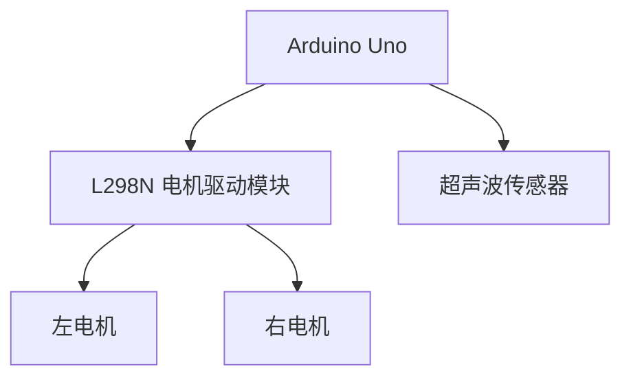

# Arduino 机器人入门

Arduino是一个开源的电子原型平台，因其易用性和灵活性而广受欢迎。通过Arduino，你可以轻松构建各种电子项目，包括机器人。本文将带你从零开始，学习如何使用Arduino构建和编程一个简单的机器人。

## 什么是Arduino机器人？

Arduino机器人是一种基于Arduino微控制器的自动化设备，能够执行特定任务。它通常由传感器、执行器（如电机）和Arduino板组成。通过编程，你可以控制机器人的行为，例如移动、避障或跟随线路。

## 所需材料

在开始之前，你需要准备以下材料：

- Arduino Uno 或类似的开发板
- 电机驱动模块（如L298N）
- 直流电机（2个）
- 车轮（2个）
- 底盘
- 超声波传感器（用于避障）
- 电池组
- 连接线

## 步骤1：组装机器人

首先，将电机安装到底盘上，并连接车轮。然后，将电机连接到电机驱动模块。电机驱动模块的作用是控制电机的转速和方向。

### 连接示意图



## 步骤2：编写基本移动代码

接下来，我们将编写一个简单的Arduino程序，使机器人能够前进、后退、左转和右转。

```cpp
// 定义电机引脚
const int motorLeft1 = 2;
const int motorLeft2 = 3;
const int motorRight1 = 4;
const int motorRight2 = 5;

void setup() {
  // 设置电机引脚为输出模式
  pinMode(motorLeft1, OUTPUT);
  pinMode(motorLeft2, OUTPUT);
  pinMode(motorRight1, OUTPUT);
  pinMode(motorRight2, OUTPUT);
}

void loop() {
  // 前进
  moveForward();
  delay(2000); // 前进2秒

  // 后退
  moveBackward();
  delay(2000); // 后退2秒

  // 左转
  turnLeft();
  delay(1000); // 左转1秒

  // 右转
  turnRight();
  delay(1000); // 右转1秒
}

void moveForward() {
  digitalWrite(motorLeft1, HIGH);
  digitalWrite(motorLeft2, LOW);
  digitalWrite(motorRight1, HIGH);
  digitalWrite(motorRight2, LOW);
}

void moveBackward() {
  digitalWrite(motorLeft1, LOW);
  digitalWrite(motorLeft2, HIGH);
  digitalWrite(motorRight1, LOW);
  digitalWrite(motorRight2, HIGH);
}

void turnLeft() {
  digitalWrite(motorLeft1, LOW);
  digitalWrite(motorLeft2, HIGH);
  digitalWrite(motorRight1, HIGH);
  digitalWrite(motorRight2, LOW);
}

void turnRight() {
  digitalWrite(motorLeft1, HIGH);
  digitalWrite(motorLeft2, LOW);
  digitalWrite(motorRight1, LOW);
  digitalWrite(motorRight2, HIGH);
}
```

:::tip
在编写代码时，确保电机引脚与硬件连接一致。你可以通过调整`delay()`函数中的时间来控制机器人的移动时间。
:::

## 步骤3：添加避障功能

为了使机器人能够避开障碍物，我们可以使用超声波传感器。超声波传感器可以测量机器人与障碍物之间的距离，并根据距离调整机器人的行为。

```cpp
// 定义超声波传感器引脚
const int trigPin = 9;
const int echoPin = 10;

void setup() {
  // 初始化超声波传感器
  pinMode(trigPin, OUTPUT);
  pinMode(echoPin, INPUT);
  Serial.begin(9600);
}

void loop() {
  long duration, distance;
  
  // 发送超声波脉冲
  digitalWrite(trigPin, LOW);
  delayMicroseconds(2);
  digitalWrite(trigPin, HIGH);
  delayMicroseconds(10);
  digitalWrite(trigPin, LOW);
  
  // 读取回波时间
  duration = pulseIn(echoPin, HIGH);
  
  // 计算距离
  distance = duration * 0.034 / 2;
  
  Serial.print("Distance: ");
  Serial.println(distance);
  
  if (distance < 20) { // 如果距离小于20厘米
    moveBackward(); // 后退
    delay(1000);
    turnRight(); // 右转
    delay(500);
  } else {
    moveForward(); // 前进
  }
}
```

:::caution
在实际应用中，超声波传感器的测量精度可能会受到环境因素的影响。你可以通过调整代码中的距离阈值来优化机器人的避障行为。
:::

## 实际应用案例

### 案例1：自动避障机器人

通过上述代码，你可以构建一个能够自动避开障碍物的机器人。这种机器人可以应用于家庭清洁、仓库管理等场景。

### 案例2：线路跟随机器人

你还可以通过添加红外传感器，使机器人能够跟随地面上的黑线行驶。这种机器人常用于自动化生产线或教育演示。

## 总结

通过本文，你已经学会了如何使用Arduino构建和编程一个简单的机器人。我们从基本的移动控制开始，逐步添加了避障功能。Arduino机器人的应用非常广泛，你可以根据自己的需求进一步扩展功能。

## 附加资源与练习

- **练习1**：尝试为机器人添加更多的传感器，例如光敏电阻或温度传感器，并编写相应的代码。
- **练习2**：研究如何通过蓝牙模块远程控制机器人。
- **资源**：访问Arduino官方文档，了解更多关于电机控制和传感器使用的详细信息。

希望你能通过本文掌握Arduino机器人的基础知识，并在未来的项目中大展身手！