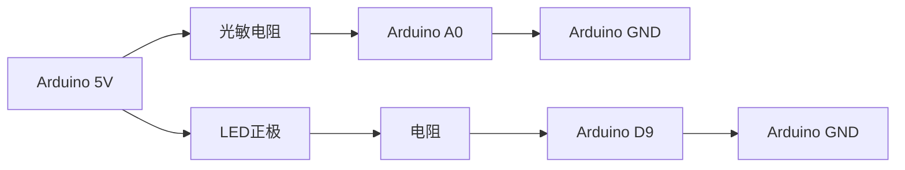

## 介绍

Arduino艺术装置是将电子技术与艺术创作结合的创新形式。通过Arduino微控制器，艺术家和开发者可以创建互动装置，将传感器、灯光、声音和运动等元素融入艺术作品中。这种装置不仅具有视觉吸引力，还能与观众互动，带来独特的体验。

在本教程中，我们将逐步讲解如何使用Arduino构建一个简单的互动艺术装置，并提供一个实际案例来展示其应用。

---

## 所需材料

在开始之前，请确保你拥有以下材料：

- Arduino Uno 或类似开发板
- 若干LED灯
- 电阻（220Ω）
- 光敏电阻（LDR）
- 电位器
- 按钮
- 跳线
- 面包板

---

## 步骤1：连接电路

首先，我们将连接一个简单的电路，使用光敏电阻和LED灯。光敏电阻会根据环境光线的变化改变电阻值，从而控制LED的亮度。

### 电路图



### 代码示例

```cpp
int ldrPin = A0;  // 光敏电阻连接到A0
int ledPin = 9;   // LED连接到D9

void setup() {
  pinMode(ledPin, OUTPUT);
  Serial.begin(9600);
}

void loop() {
  int ldrValue = analogRead(ldrPin);  // 读取光敏电阻的值
  int brightness = map(ldrValue, 0, 1023, 0, 255);  // 将值映射到0-255
  analogWrite(ledPin, brightness);  // 设置LED亮度
  Serial.println(brightness);  // 打印亮度值到串口监视器
  delay(100);
}
```

### 解释

- `analogRead(ldrPin)`：读取光敏电阻的值，范围是0到1023。
- `map()`：将光敏电阻的值映射到0-255，以便控制LED的亮度。
- `analogWrite(ledPin, brightness)`：根据映射后的值设置LED的亮度。

---

## 步骤2：添加互动元素

为了让装置更具互动性，我们可以添加一个按钮来控制LED的开关。

### 电路图


### 代码示例

```cpp
int buttonPin = 2;  // 按钮连接到D2
int ledPin = 9;     // LED连接到D9
bool ledState = LOW;  // LED初始状态

void setup() {
  pinMode(buttonPin, INPUT);
  pinMode(ledPin, OUTPUT);
}

void loop() {
  if (digitalRead(buttonPin) == HIGH) {  // 检测按钮是否按下
    ledState = !ledState;  // 切换LED状态
    digitalWrite(ledPin, ledState);
    delay(500);  // 防抖延迟
  }
}
```

### 解释

- `digitalRead(buttonPin)`：读取按钮的状态。
- `ledState = !ledState`：切换LED的状态（开/关）。
- `delay(500)`：防止按钮抖动。

---

## 实际案例：互动灯光墙

### 场景描述

假设我们要创建一个互动灯光墙，观众可以通过手势或触摸改变灯光的颜色和亮度。我们可以使用多个LED和传感器来实现这一效果。

### 实现步骤

1. 使用多个RGB LED灯，连接到Arduino的PWM引脚。
2. 添加超声波传感器或触摸传感器，检测观众的距离或触摸。
3. 根据传感器的输入，动态调整LED的颜色和亮度。

### 代码示例

```cpp
int redPin = 9;    // 红色LED连接到D9
int greenPin = 10; // 绿色LED连接到D10
int bluePin = 11;  // 蓝色LED连接到D11
int sensorPin = A0; // 传感器连接到A0

void setup() {
  pinMode(redPin, OUTPUT);
  pinMode(greenPin, OUTPUT);
  pinMode(bluePin, OUTPUT);
}

void loop() {
  int sensorValue = analogRead(sensorPin);  // 读取传感器值
  int redValue = map(sensorValue, 0, 1023, 0, 255);  // 映射红色亮度
  int greenValue = map(sensorValue, 0, 1023, 255, 0);  // 映射绿色亮度
  int blueValue = 255 - redValue;  // 映射蓝色亮度

  analogWrite(redPin, redValue);
  analogWrite(greenPin, greenValue);
  analogWrite(bluePin, blueValue);
}
```

### 解释

- 根据传感器的输入值，动态调整RGB LED的颜色。
- `map()`函数用于将传感器值映射到LED的亮度范围。

---

## 总结

通过本教程，你学会了如何使用Arduino创建简单的互动艺术装置。我们介绍了如何连接电路、编写代码，并通过实际案例展示了如何将这些技术应用到艺术创作中。

:::tip
尝试扩展你的项目，添加更多传感器或LED灯，创造出更复杂的互动装置！
:::

---

## 附加资源

- [Arduino官方文档](https://www.arduino.cc/reference/en/)
- [互动艺术装置案例研究](https://www.instructables.com/Interactive-Art-Projects/)
- [Arduino编程入门指南](https://www.arduino.cc/en/Guide)

---

## 练习

1. 修改代码，使LED的亮度随温度传感器的输入变化。
2. 尝试使用多个按钮控制不同的LED灯。
3. 设计一个装置，使用伺服电机和LED灯创建动态光影效果。

祝你创作愉快！