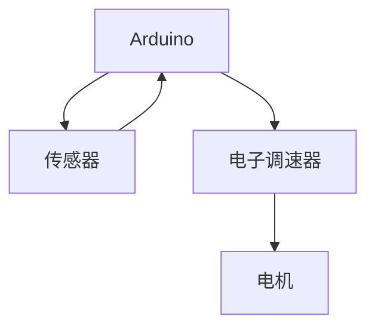

# Arduino 无人机控制

无人机（Drone）是一种通过遥控或自主飞行的飞行器，广泛应用于航拍、物流、农业等领域。Arduino作为一种开源的电子原型平台，可以用来控制无人机的飞行。本文将带你从基础概念开始，逐步学习如何使用Arduino控制无人机。

## 1. 无人机的基本组成

无人机通常由以下几个部分组成：

- **飞行控制器（Flight Controller）**：负责控制无人机的飞行姿态和方向。
- **电机（Motor）**：驱动螺旋桨旋转，提供升力。
- **电子调速器（ESC）**：控制电机的转速。
- **传感器（Sensor）**：如陀螺仪、加速度计等，用于检测无人机的姿态。
- **遥控器（Remote Controller）**：用于手动控制无人机。

## 2. Arduino与无人机的结合

Arduino可以作为无人机的飞行控制器，通过读取传感器数据并控制电机来实现无人机的稳定飞行。以下是一个简单的Arduino无人机控制系统的示意图：



## 3. 代码示例：控制无人机的基本飞行

以下是一个简单的Arduino代码示例，用于控制无人机的电机转速。假设我们使用PWM信号来控制电子调速器（ESC），从而控制电机的转速。

```cpp
#include <Servo.h>

Servo esc1, esc2, esc3, esc4;

void setup() {
  esc1.attach(3);  // 将ESC连接到Arduino的3号引脚
  esc2.attach(5);  // 将ESC连接到Arduino的5号引脚
  esc3.attach(6);  // 将ESC连接到Arduino的6号引脚
  esc4.attach(9);  // 将ESC连接到Arduino的9号引脚

  // 初始化ESC，设置电机为停止状态
  esc1.writeMicroseconds(1000);
  esc2.writeMicroseconds(1000);
  esc3.writeMicroseconds(1000);
  esc4.writeMicroseconds(1000);
  delay(5000);  // 等待ESC初始化完成
}

void loop() {
  // 设置电机转速为中等速度
  esc1.writeMicroseconds(1500);
  esc2.writeMicroseconds(1500);
  esc3.writeMicroseconds(1500);
  esc4.writeMicroseconds(1500);
  delay(2000);

  // 停止电机
  esc1.writeMicroseconds(1000);
  esc2.writeMicroseconds(1000);
  esc3.writeMicroseconds(1000);
  esc4.writeMicroseconds(1000);
  delay(2000);
}
```

:::note
**注意**：在实际应用中，电机的转速需要根据无人机的姿态进行调整，以确保飞行的稳定性。
:::

## 4. 实际应用案例：无人机悬停控制

无人机的悬停控制是无人机飞行中的一个重要功能。通过读取陀螺仪和加速度计的数据，Arduino可以调整电机的转速，使无人机保持在空中某一位置。

以下是一个简单的悬停控制算法的伪代码：

```cpp
void hoverControl() {
  float currentAltitude = readAltitudeSensor();
  float targetAltitude = 10.0;  // 目标高度为10米

  if (currentAltitude < targetAltitude) {
    increaseMotorSpeed();
  } else if (currentAltitude > targetAltitude) {
    decreaseMotorSpeed();
  }
}
```

:::tip
**提示**：在实际应用中，悬停控制算法需要结合PID控制器来实现更精确的控制。
:::

## 5. 总结

通过本文的学习，你应该已经了解了如何使用Arduino控制无人机的基本原理和实现方法。从控制电机转速到实现悬停控制，Arduino为无人机的开发提供了强大的支持。

## 6. 附加资源与练习

- **练习1**：尝试修改代码，使无人机能够根据遥控器的输入调整飞行方向。
- **练习2**：研究PID控制器，并尝试将其应用到无人机的悬停控制中。
- **资源**：Arduino官方文档、无人机飞行控制算法相关书籍。

:::caution
**警告**：在实验过程中，请确保在安全的环境下进行，避免无人机失控造成伤害。
:::