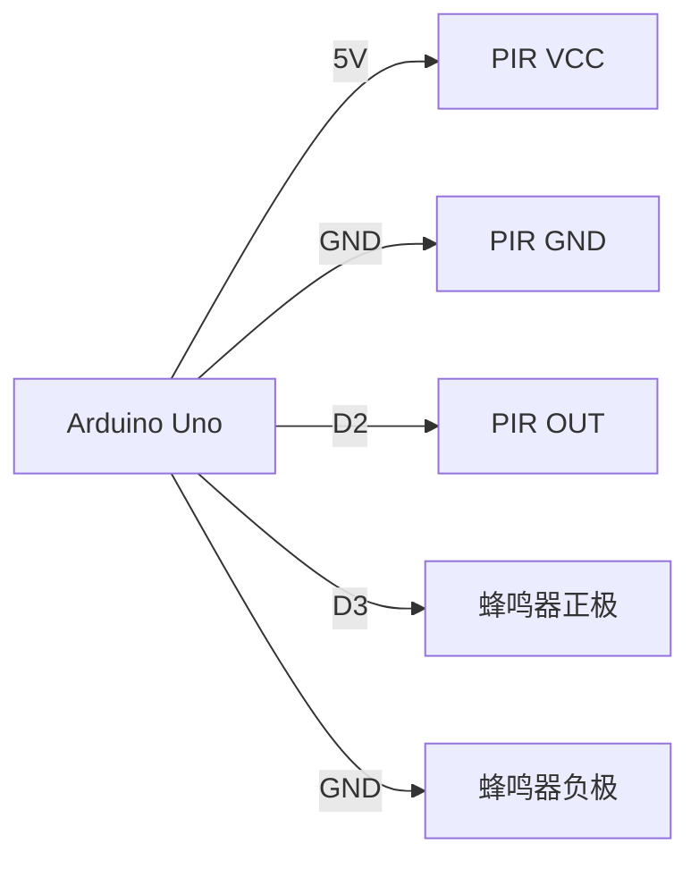

# Arduino 安全系统

Arduino安全系统是一个基于Arduino微控制器的简单但功能强大的项目，适合初学者学习如何将硬件与软件结合，实现实际应用。通过本教程，你将学会如何使用Arduino构建一个基本的安全系统，包括传感器、警报器和控制逻辑的实现。

## 介绍

安全系统在日常生活中非常常见，例如家庭防盗系统、办公室门禁系统等。Arduino安全系统的核心思想是通过传感器检测环境变化（如运动、光线或声音），并在检测到异常时触发警报。本教程将使用一个简单的红外传感器（PIR）来检测运动，并通过蜂鸣器发出警报。

## 所需材料

- Arduino Uno
- PIR运动传感器
- 蜂鸣器
- 连接线
- 面包板

## 电路连接

首先，将PIR传感器和蜂鸣器连接到Arduino。以下是连接方式：

- PIR传感器的VCC引脚连接到Arduino的5V引脚。
- PIR传感器的GND引脚连接到Arduino的GND引脚。
- PIR传感器的OUT引脚连接到Arduino的数字引脚2。
- 蜂鸣器的正极连接到Arduino的数字引脚3。
- 蜂鸣器的负极连接到Arduino的GND引脚。



## 代码实现

接下来，我们将编写Arduino代码来读取PIR传感器的信号，并在检测到运动时触发蜂鸣器。

```cpp
int pirPin = 2;  // PIR传感器连接到数字引脚2
int buzzerPin = 3;  // 蜂鸣器连接到数字引脚3

void setup() {
  pinMode(pirPin, INPUT);  // 设置PIR传感器为输入模式
  pinMode(buzzerPin, OUTPUT);  // 设置蜂鸣器为输出模式
  Serial.begin(9600);  // 初始化串口通信
}

void loop() {
  int pirState = digitalRead(pirPin);  // 读取PIR传感器的状态

  if (pirState == HIGH) {  // 如果检测到运动
    digitalWrite(buzzerPin, HIGH);  // 触发蜂鸣器
    Serial.println("Motion detected!");  // 在串口监视器中打印信息
  } else {
    digitalWrite(buzzerPin, LOW);  // 关闭蜂鸣器
  }
}
```

### 代码解释

1. **引脚定义**：我们定义了PIR传感器和蜂鸣器连接的引脚。
2. **setup()函数**：设置PIR传感器为输入模式，蜂鸣器为输出模式，并初始化串口通信。
3. **loop()函数**：不断读取PIR传感器的状态。如果检测到运动（`pirState == HIGH`），则触发蜂鸣器并在串口监视器中打印信息。

## 实际应用场景

假设你希望在家中安装一个简单的防盗系统。你可以将Arduino安全系统放置在门口或窗户附近。当有人靠近时，PIR传感器会检测到运动并触发蜂鸣器，提醒你有异常情况发生。

:::tip
你可以进一步扩展这个系统，例如添加一个LED指示灯，当检测到运动时，LED灯也会亮起。或者，你可以将系统连接到互联网，通过Wi-Fi模块发送通知到你的手机。
:::

## 总结

通过本教程，你学会了如何使用Arduino构建一个简单的安全系统。我们使用了PIR传感器来检测运动，并通过蜂鸣器发出警报。这个项目不仅帮助你理解了Arduino的基本工作原理，还为你在实际应用中提供了基础。

## 附加资源与练习

1. **扩展项目**：尝试将系统与LCD显示屏结合，显示检测到的运动次数。
2. **深入学习**：研究如何将Arduino连接到Wi-Fi模块，实现远程监控。
3. **练习**：修改代码，使蜂鸣器在检测到运动后发出不同频率的声音。

希望你能通过这个项目进一步探索Arduino的无限可能！