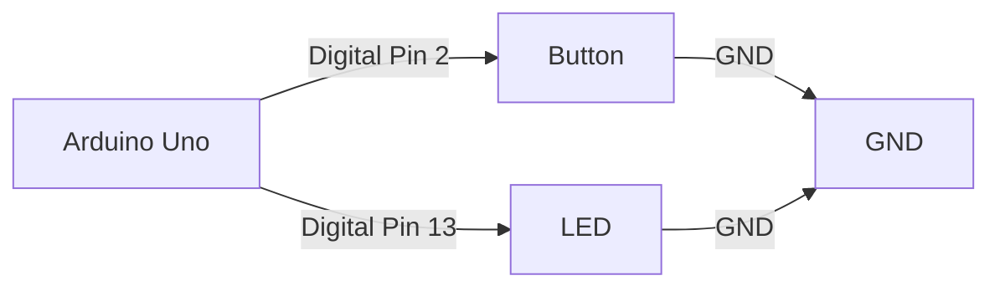

# Arduino 游戏设计

Arduino是一款功能强大的开源电子平台，广泛应用于各种创意项目中，包括游戏设计。通过Arduino，你可以将硬件与软件结合，创造出有趣的互动游戏。本文将带你从零开始，学习如何使用Arduino设计简单的游戏，并通过实际案例展示其应用。

## 什么是Arduino游戏设计？

Arduino游戏设计是指利用Arduino开发板、传感器、按钮、LED灯等硬件组件，结合编程代码，创造出互动性强的游戏。这些游戏可以是简单的反应测试游戏，也可以是复杂的迷宫或射击游戏。Arduino游戏设计不仅有趣，还能帮助你深入理解硬件与软件的交互原理。

## 所需材料

在开始之前，你需要准备以下材料：
- Arduino开发板（如Arduino Uno）
- 按钮
- LED灯
- 电阻
- 连接线
- 面包板

## 第一步：搭建硬件

我们将设计一个简单的反应测试游戏。玩家需要在LED灯亮起时尽快按下按钮，Arduino会记录反应时间。

### 硬件连接
1. 将一个按钮连接到Arduino的数字引脚2和GND。
2. 将一个LED灯连接到Arduino的数字引脚13和GND，中间串联一个220Ω电阻。



## 第二步：编写代码

接下来，我们编写Arduino代码来实现游戏逻辑。

```cpp
const int buttonPin = 2;  // 按钮连接到数字引脚2
const int ledPin = 13;    // LED连接到数字引脚13

unsigned long startTime = 0;  // 记录游戏开始时间
unsigned long reactionTime = 0;  // 记录玩家反应时间
bool gameStarted = false;  // 游戏是否开始

void setup() {
  pinMode(buttonPin, INPUT);  // 设置按钮为输入
  pinMode(ledPin, OUTPUT);    // 设置LED为输出
  Serial.begin(9600);         // 初始化串口通信
}

void loop() {
  if (!gameStarted) {
    // 随机延迟后开始游戏
    delay(random(1000, 5000));
    digitalWrite(ledPin, HIGH);  // 点亮LED
    startTime = millis();        // 记录开始时间
    gameStarted = true;
  }

  if (digitalRead(buttonPin) == HIGH && gameStarted) {
    // 玩家按下按钮
    reactionTime = millis() - startTime;  // 计算反应时间
    digitalWrite(ledPin, LOW);            // 关闭LED
    Serial.print("Reaction Time: ");
    Serial.println(reactionTime);         // 输出反应时间
    gameStarted = false;                  // 重置游戏状态
  }
}
```

### 代码解释
- `random(1000, 5000)`：生成一个1到5秒的随机延迟，模拟游戏开始的不确定性。
- `millis()`：返回Arduino启动后的毫秒数，用于计算反应时间。
- `digitalRead(buttonPin)`：读取按钮状态，判断玩家是否按下按钮。

## 第三步：运行游戏

将代码上传到Arduino开发板，运行游戏。当LED灯亮起时，尽快按下按钮，Arduino会通过串口监视器显示你的反应时间。

:::tip
你可以通过调整随机延迟的范围或增加多个LED灯来增加游戏的难度和趣味性。
:::

## 实际案例：迷宫游戏

除了简单的反应测试游戏，你还可以设计更复杂的游戏，比如迷宫游戏。使用Arduino和LCD屏幕，玩家可以通过按钮控制一个角色在迷宫中移动，避开障碍物，最终到达终点。

### 硬件扩展
- 添加一个LCD屏幕显示迷宫和角色。
- 使用多个按钮控制角色的上下左右移动。

### 代码扩展
- 使用二维数组表示迷宫地图。
- 通过按钮输入更新角色位置。
- 检测角色是否碰到障碍物或到达终点。

```cpp
// 示例代码片段：迷宫游戏逻辑
int maze[5][5] = {
  {0, 1, 0, 0, 0},
  {0, 1, 1, 1, 0},
  {0, 0, 0, 1, 0},
  {1, 1, 0, 1, 0},
  {0, 0, 0, 0, 0}
};

int playerX = 0;
int playerY = 0;

void movePlayer(int dx, int dy) {
  int newX = playerX + dx;
  int newY = playerY + dy;
  if (newX >= 0 && newX < 5 && newY >= 0 && newY < 5 && maze[newY][newX] == 0) {
    playerX = newX;
    playerY = newY;
  }
}
```

## 总结

通过本文，你已经学会了如何使用Arduino设计简单的游戏。从硬件搭建到代码编写，再到实际案例的扩展，Arduino游戏设计为你提供了一个充满创意的学习平台。你可以在此基础上继续探索，设计更多有趣的游戏。

:::note
**附加资源与练习**
- 尝试设计一个双人游戏，使用两个按钮控制两个角色。
- 探索如何使用传感器（如超声波传感器）来增加游戏的互动性。
- 参考Arduino官方文档和社区项目，获取更多灵感和帮助。
:::