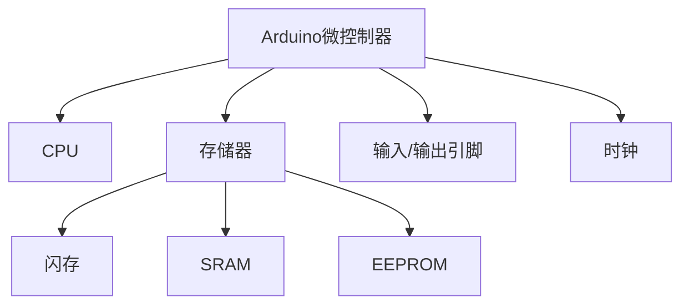

# Arduino 微控制器

## 介绍

Arduino微控制器是Arduino开发板的核心组件，负责执行程序代码并控制外部设备。它是一种小型计算机，能够读取传感器数据、处理信息并控制执行器（如电机、LED等）。Arduino微控制器通常基于Atmel AVR系列芯片，例如ATmega328P，这是Arduino Uno开发板的核心。

对于初学者来说，理解Arduino微控制器的工作原理是学习电子编程的重要一步。本文将逐步讲解Arduino微控制器的基本概念、编程方法以及实际应用。

---

## Arduino 微控制器的基本结构

Arduino微控制器由以下几个主要部分组成：

1. **中央处理器（CPU）**：负责执行程序指令。
2. **存储器**：
   - **闪存（Flash Memory）**：用于存储程序代码。
   - **SRAM（静态随机存取存储器）**：用于存储程序运行时的临时数据。
   - **EEPROM（电可擦可编程只读存储器）**：用于存储需要长期保存的数据。
3. **输入/输出引脚（I/O Pins）**：用于连接传感器、执行器等外部设备。
4. **时钟（Clock）**：提供时间基准，控制指令的执行速度。

以下是一个简单的Arduino微控制器结构图：



---

## 编程Arduino微控制器

Arduino微控制器通过Arduino IDE进行编程。Arduino IDE使用C/C++语言的一个简化版本，称为Arduino语言。以下是一个简单的代码示例，展示了如何让Arduino微控制器控制一个LED灯闪烁：

```cpp
// 定义LED连接的引脚
const int ledPin = 13;

void setup() {
  // 将LED引脚设置为输出模式
  pinMode(ledPin, OUTPUT);
}

void loop() {
  // 打开LED
  digitalWrite(ledPin, HIGH);
  delay(1000); // 等待1秒
  // 关闭LED
  digitalWrite(ledPin, LOW);
  delay(1000); // 等待1秒
}
```

### 代码解释
- `pinMode(ledPin, OUTPUT)`：将引脚设置为输出模式，以便控制LED。
- `digitalWrite(ledPin, HIGH)`：将引脚电压设置为高电平，点亮LED。
- `digitalWrite(ledPin, LOW)`：将引脚电压设置为低电平，关闭LED。
- `delay(1000)`：暂停程序执行1秒。

:::tip
在Arduino IDE中，`setup()`函数在程序开始时运行一次，而`loop()`函数会不断重复执行。
:::

---

## 实际应用案例

### 案例1：温度监控系统
Arduino微控制器可以用于构建一个简单的温度监控系统。通过连接温度传感器（如LM35），Arduino可以读取环境温度并在串口监视器中显示。

```cpp
// 定义温度传感器连接的引脚
const int tempPin = A0;

void setup() {
  // 初始化串口通信
  Serial.begin(9600);
}

void loop() {
  // 读取传感器值
  int sensorValue = analogRead(tempPin);
  // 将传感器值转换为温度（摄氏度）
  float temperature = (sensorValue * 5.0 / 1024.0) * 100;
  // 打印温度值到串口监视器
  Serial.print("Temperature: ");
  Serial.print(temperature);
  Serial.println(" °C");
  delay(1000); // 等待1秒
}
```

### 案例2：智能家居灯光控制
Arduino微控制器可以与光敏电阻结合，实现根据环境光线自动调节灯光亮度的功能。

```cpp
// 定义光敏电阻和LED连接的引脚
const int lightSensorPin = A0;
const int ledPin = 9;

void setup() {
  // 将LED引脚设置为输出模式
  pinMode(ledPin, OUTPUT);
}

void loop() {
  // 读取光敏电阻的值
  int lightLevel = analogRead(lightSensorPin);
  // 将光敏电阻的值映射到LED亮度（0-255）
  int brightness = map(lightLevel, 0, 1023, 0, 255);
  // 设置LED亮度
  analogWrite(ledPin, brightness);
  delay(100); // 短暂延迟
}
```

---

## 总结

Arduino微控制器是Arduino开发板的核心，能够执行程序代码并控制外部设备。通过学习其基本结构、编程方法以及实际应用，初学者可以快速掌握Arduino的基础知识，并开始构建自己的电子项目。

:::note
如果你对Arduino微控制器感兴趣，可以尝试以下练习：
1. 修改LED闪烁代码，使LED以不同的频率闪烁。
2. 使用温度传感器和LCD显示屏，构建一个实时温度显示系统。
3. 结合多个传感器和执行器，设计一个简单的智能家居系统。
:::

---

## 附加资源

- [Arduino官方文档](https://www.arduino.cc/en/Guide/Introduction)
- [Arduino编程入门教程](https://www.arduino.cc/en/Tutorial/BuiltInExamples)
- [Arduino社区论坛](https://forum.arduino.cc/)

希望本文能帮助你更好地理解Arduino微控制器！如果你有任何问题，欢迎在评论区留言。