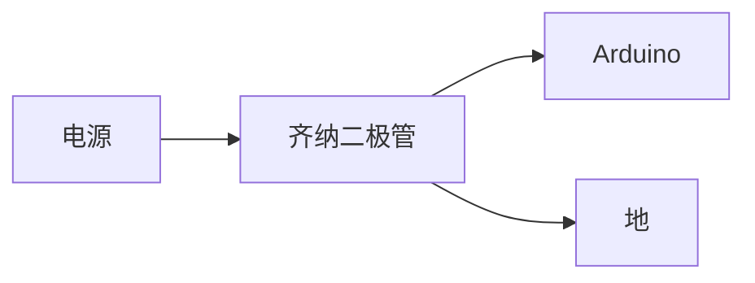
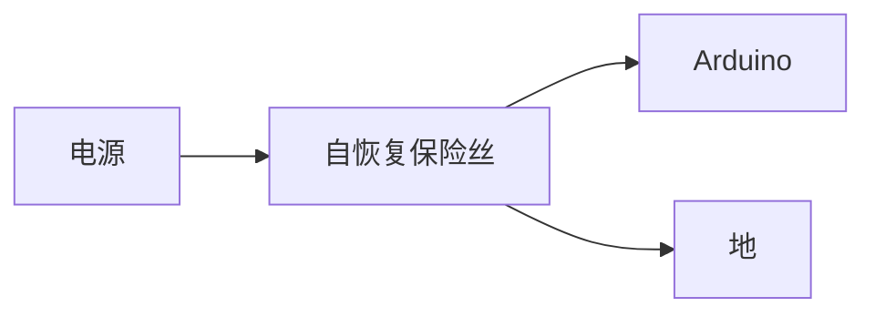
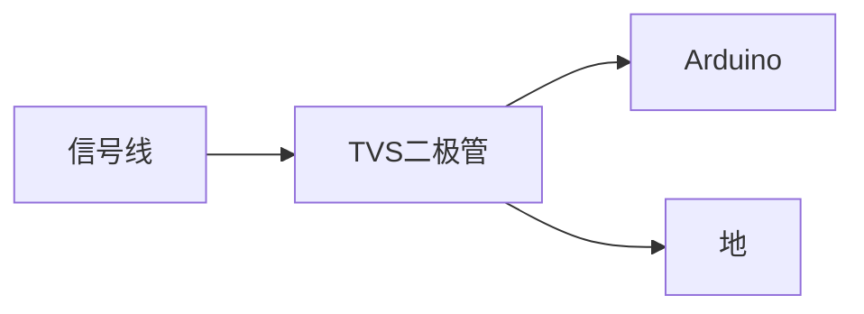
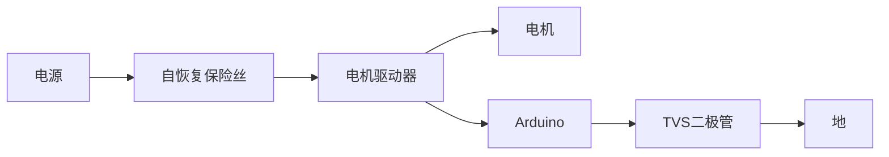

## 介绍

在Arduino项目中，电路保护是确保硬件安全运行的关键步骤。Arduino开发板虽然功能强大，但如果未采取适当的保护措施，可能会因过压、过流或静电放电（ESD）而损坏。本文将详细介绍如何为Arduino电路添加保护措施，并提供实际案例和代码示例。

## 为什么需要电路保护？

Arduino开发板通常工作在5V或3.3V的电压下，而外部设备（如传感器、电机或电源）可能会引入更高的电压或电流。此外，静电放电也可能对敏感的电子元件造成损害。通过添加适当的保护电路，可以有效防止这些潜在问题，延长Arduino的使用寿命。

## 常见的电路保护措施

### 1. 过压保护

过压保护用于防止输入电压超过Arduino的额定电压。常用的方法包括使用齐纳二极管或TVS（瞬态电压抑制）二极管。

#### 齐纳二极管保护电路

齐纳二极管可以在电压超过其击穿电压时导通，将多余的电压分流到地。以下是一个简单的齐纳二极管保护电路示例：



:::note
齐纳二极管的击穿电压应略高于Arduino的工作电压。例如，对于5V Arduino，可以选择5.1V的齐纳二极管。
:::

### 2. 过流保护

过流保护用于防止电流超过Arduino的额定电流。常用的方法包括使用保险丝或自恢复保险丝（PTC）。

#### 自恢复保险丝保护电路

自恢复保险丝在电流超过额定值时会自动断开电路，当电流恢复正常后会自动恢复导通。以下是一个自恢复保险丝的应用示例：



:::tip
自恢复保险丝的额定电流应略高于Arduino的工作电流。例如，对于500mA的工作电流，可以选择750mA的自恢复保险丝。
:::

### 3. 静电放电（ESD）保护

静电放电可能会损坏Arduino的敏感元件。常用的ESD保护方法包括使用TVS二极管或ESD保护芯片。

#### TVS二极管保护电路

TVS二极管可以在静电放电时迅速导通，将静电能量分流到地。以下是一个TVS二极管的保护电路示例：



:::caution
TVS二极管的击穿电压应略高于信号线的正常工作电压。例如，对于5V信号线，可以选择6V的TVS二极管。
:::

## 实际案例：Arduino与电机驱动电路的保护

在Arduino控制电机的项目中，电机可能会产生反向电动势（EMF），对Arduino造成损害。以下是一个带有过压和过流保护的电机驱动电路示例：



:::warning
电机驱动器应使用适当的TVS二极管和自恢复保险丝，以防止反向电动势和过流对Arduino的损害。
:::

## 代码示例：Arduino与传感器的保护电路

以下是一个Arduino与传感器的保护电路示例代码：

```cpp
void setup() {
  pinMode(A0, INPUT); // 设置A0引脚为输入模式
  Serial.begin(9600); // 初始化串口通信
}

void loop() {
  int sensorValue = analogRead(A0); // 读取A0引脚的模拟值
  Serial.println(sensorValue);     // 打印传感器值到串口监视器
  delay(100);                      // 延迟100毫秒
}
```

:::note
在实际应用中，建议在传感器信号线上添加TVS二极管，以防止静电放电对Arduino的损害。
:::

## 总结

电路保护是Arduino项目中不可忽视的重要环节。通过添加过压、过流和静电放电保护措施，可以有效防止硬件损坏，确保项目的稳定性和安全性。希望本文的内容能帮助你在Arduino项目中更好地保护电路。

## 附加资源

- [Arduino官方文档](https://www.arduino.cc/en/Guide/Introduction)
- [电子元件保护指南](https://www.sparkfun.com/tutorials/106)
- [电路保护设计实例](https://www.allaboutcircuits.com/technical-articles/)

## 练习

1. 设计一个带有过压和过流保护的Arduino电路，用于控制LED灯。
2. 尝试在Arduino与传感器的连接中添加TVS二极管，并测试其效果。
3. 研究并实现一个带有自恢复保险丝的电机驱动电路。

祝你学习愉快！