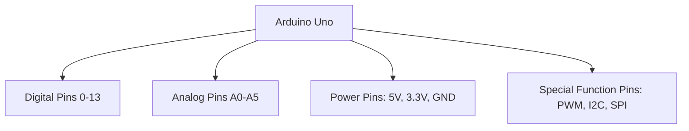

## 介绍

Arduino是一款广泛应用于电子项目和原型设计的开源硬件平台。它的核心是一个微控制器，通过引脚与外部设备进行通信。Arduino引脚映射是指将微控制器的物理引脚与Arduino开发板上的引脚编号对应起来的过程。理解引脚映射对于正确使用Arduino至关重要，因为它决定了你如何连接传感器、执行器和其他外部设备。

## Arduino 引脚的基本分类

Arduino的引脚通常分为以下几类：

1. **数字引脚（Digital Pins）**：用于输入或输出数字信号（高电平或低电平）。
2. **模拟引脚（Analog Pins）**：用于读取模拟信号（如电压值）。
3. **电源引脚（Power Pins）**：提供电源（如5V、3.3V）和接地（GND）。
4. **特殊功能引脚（Special Function Pins）**：如PWM输出、串口通信、I2C、SPI等。

## Arduino 引脚映射表

不同的Arduino开发板（如Uno、Nano、Mega等）具有不同的引脚布局和功能。以下是一个常见的Arduino Uno引脚映射表：



:::note
**注意**：不同型号的Arduino开发板可能有不同的引脚数量和功能。请务必查阅你所使用的开发板的官方文档。
:::

## 数字引脚的使用

数字引脚可以配置为输入或输出模式。以下是一个简单的示例，展示如何将数字引脚配置为输出模式并控制LED的亮灭：

```cpp
void setup() {
  // 将数字引脚13设置为输出模式
  pinMode(13, OUTPUT);
}

void loop() {
  // 将引脚13设置为高电平，点亮LED
  digitalWrite(13, HIGH);
  delay(1000); // 等待1秒

  // 将引脚13设置为低电平，熄灭LED
  digitalWrite(13, LOW);
  delay(1000); // 等待1秒
}
```

:::tip
**提示**：在Arduino Uno上，数字引脚13通常连接了一个板载LED，因此你可以直接使用这个引脚来测试代码。
:::

## 模拟引脚的使用

模拟引脚用于读取模拟信号，如来自电位器或光敏电阻的电压值。以下是一个读取模拟信号的示例：

```cpp
void setup() {
  // 初始化串口通信
  Serial.begin(9600);
}

void loop() {
  // 读取模拟引脚A0的值
  int sensorValue = analogRead(A0);

  // 将读取的值打印到串口监视器
  Serial.println(sensorValue);
  delay(100); // 等待100毫秒
}
```

:::caution
**注意**：模拟引脚只能用于读取模拟信号，不能直接输出模拟信号。如果需要输出模拟信号，可以使用PWM引脚。
:::

## 特殊功能引脚

Arduino的某些引脚具有特殊功能，如PWM输出、I2C通信和SPI通信。以下是一个使用PWM引脚控制LED亮度的示例：

```cpp
void setup() {
  // 将数字引脚9设置为输出模式
  pinMode(9, OUTPUT);
}

void loop() {
  // 逐渐增加LED亮度
  for (int brightness = 0; brightness <= 255; brightness++) {
    analogWrite(9, brightness);
    delay(10); // 等待10毫秒
  }

  // 逐渐降低LED亮度
  for (int brightness = 255; brightness >= 0; brightness--) {
    analogWrite(9, brightness);
    delay(10); // 等待10毫秒
  }
}
```

:::warning
**警告**：并非所有数字引脚都支持PWM功能。在Arduino Uno上，只有引脚3、5、6、9、10和11支持PWM输出。
:::

## 实际应用案例

### 案例1：使用光敏电阻控制LED亮度

在这个案例中，我们将使用光敏电阻读取环境光强度，并根据光强度调整LED的亮度。

```cpp
void setup() {
  // 将数字引脚9设置为输出模式
  pinMode(9, OUTPUT);
}

void loop() {
  // 读取光敏电阻的值
  int lightLevel = analogRead(A0);

  // 将读取的值映射到PWM范围（0-255）
  int brightness = map(lightLevel, 0, 1023, 0, 255);

  // 使用PWM控制LED亮度
  analogWrite(9, brightness);
  delay(100); // 等待100毫秒
}
```

### 案例2：使用按钮控制LED开关

在这个案例中，我们将使用按钮控制LED的开关状态。

```cpp
void setup() {
  // 将数字引脚2设置为输入模式
  pinMode(2, INPUT);
  // 将数字引脚13设置为输出模式
  pinMode(13, OUTPUT);
}

void loop() {
  // 读取按钮状态
  int buttonState = digitalRead(2);

  // 如果按钮被按下，点亮LED
  if (buttonState == HIGH) {
    digitalWrite(13, HIGH);
  } else {
    digitalWrite(13, LOW);
  }
}
```

## 总结

通过本文，你应该已经了解了Arduino引脚映射的基本概念，并掌握了如何正确使用数字引脚、模拟引脚和特殊功能引脚。我们还通过实际案例展示了这些概念的应用场景。

## 附加资源与练习

- **练习1**：尝试使用不同的PWM引脚控制多个LED的亮度。
- **练习2**：使用光敏电阻和按钮结合，实现一个光控开关。
- **资源**：查阅Arduino官方文档，了解更多关于引脚映射和特殊功能的信息。

希望这些内容能帮助你更好地理解和使用Arduino的引脚功能！继续探索和实践，你会发现Arduino的无限可能。