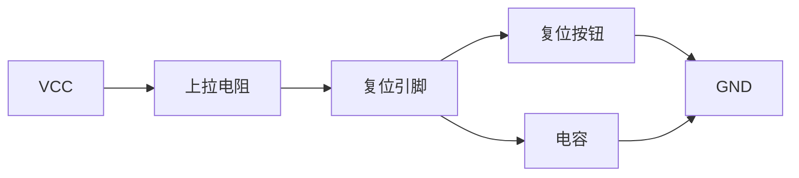

## 介绍

在Arduino项目中，复位电路是一个至关重要的组成部分。它允许用户在需要时手动或自动重置Arduino微控制器，使其恢复到初始状态。复位电路通常由一个简单的按钮和一个电容组成，用于确保微控制器在电源波动或程序崩溃时能够可靠地复位。

## 复位电路的基本原理

复位电路的核心功能是在特定条件下将Arduino的复位引脚（通常标记为`RESET`）拉低，从而触发微控制器的复位操作。复位引脚通常通过一个上拉电阻连接到VCC（电源电压），以确保在正常情况下保持高电平。当复位按钮被按下时，复位引脚被拉低，微控制器进入复位状态。

### 复位电路的组成

一个典型的复位电路包括以下组件：
- **复位按钮**：用于手动触发复位。
- **电容**：用于在电源上电时自动触发复位。
- **上拉电阻**：确保复位引脚在正常情况下保持高电平。



## 复位电路的工作原理

当复位按钮被按下时，复位引脚被直接连接到GND，导致其电压瞬间下降。微控制器检测到这一变化后，会立即停止当前操作并重新启动。电容的作用是在电源上电时，通过短暂的充电过程，确保复位引脚在电源稳定之前保持低电平，从而触发复位。

### 代码示例

以下是一个简单的Arduino代码示例，展示了如何在程序中检测复位操作：

```cpp
void setup() {
  Serial.begin(9600);
  Serial.println("系统启动...");
}

void loop() {
  // 模拟程序运行
  Serial.println("程序运行中...");
  delay(1000);

  // 检测复位按钮是否被按下
  if (digitalRead(RESET_BUTTON_PIN) == LOW) {
    Serial.println("复位按钮被按下，系统即将重启...");
    delay(100); // 延时以确保复位操作完成
    asm volatile ("jmp 0"); // 强制跳转到程序起始地址，模拟复位
  }
}
```

:::note
在实际应用中，`RESET_BUTTON_PIN`应替换为连接到复位按钮的实际引脚号。
:::

## 实际应用场景

### 1. 电源波动时的自动复位

在电源不稳定的环境中，复位电路可以确保Arduino在电源波动时自动复位，避免程序进入不可预测的状态。

### 2. 程序崩溃后的手动复位

当Arduino程序由于某些原因崩溃或进入死循环时，用户可以通过按下复位按钮手动重启系统，恢复其正常功能。

### 3. 调试与开发

在开发和调试过程中，复位电路允许开发者快速重启系统，测试代码的初始状态和运行效果。

## 总结

复位电路是Arduino硬件设计中不可或缺的一部分，它确保了系统在异常情况下能够可靠地恢复到初始状态。通过理解复位电路的工作原理和实际应用，初学者可以更好地设计和调试自己的Arduino项目。

## 附加资源与练习

- **练习1**：尝试在Arduino Uno上搭建一个简单的复位电路，并编写代码检测复位按钮的按下事件。
- **练习2**：研究Arduino的看门狗定时器（Watchdog Timer），了解其与复位电路的关系。
- **附加资源**：阅读Arduino官方文档中关于复位电路的详细说明，进一步加深理解。

:::tip
在设计和调试复位电路时，务必确保电容和电阻的值选择适当，以避免误触发或复位失败。
:::