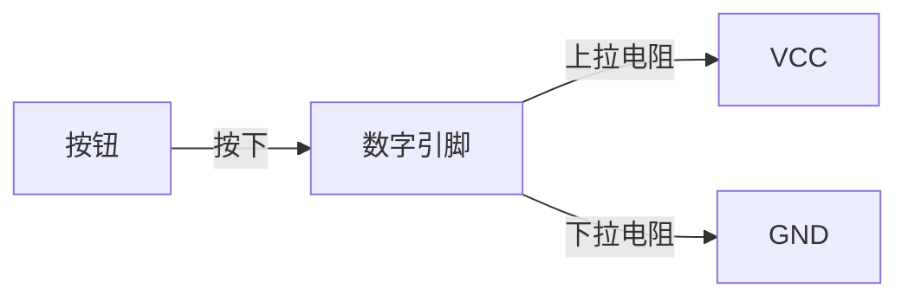
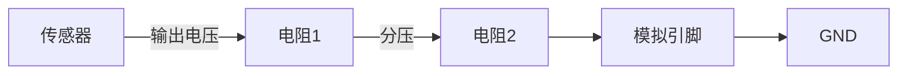

## 介绍

Arduino接口电路是连接Arduino与外部设备（如传感器、执行器、显示器等）的关键部分。通过接口电路，Arduino可以读取外部设备的信号或控制外部设备的行为。理解接口电路的工作原理对于构建复杂的Arduino项目至关重要。

## 基本概念

### 数字接口与模拟接口

Arduino板上有两种主要类型的接口：**数字接口**和**模拟接口**。

- **数字接口**：用于读取或输出数字信号（高电平或低电平）。数字接口通常用于控制LED、按钮、继电器等设备。
- **模拟接口**：用于读取模拟信号（如电压值）。模拟接口通常用于连接传感器，如温度传感器、光敏电阻等。

### 输入与输出

- **输入**：Arduino通过输入接口读取外部设备的状态或信号。例如，读取按钮是否被按下。
- **输出**：Arduino通过输出接口控制外部设备的行为。例如，点亮LED或驱动电机。

## 接口电路的工作原理

### 上拉电阻与下拉电阻

在数字接口电路中，上拉电阻和下拉电阻用于确保输入信号的稳定性。

- **上拉电阻**：将输入引脚拉高到高电平（通常为5V或3.3V），防止引脚悬空时产生不确定的状态。
- **下拉电阻**：将输入引脚拉低到低电平（0V），防止引脚悬空时产生不确定的状态。



### 分压电路

在模拟接口电路中，分压电路用于将传感器的输出电压调整到Arduino可以读取的范围。



## 代码示例

### 读取按钮状态

以下代码展示了如何使用上拉电阻读取按钮的状态：

```cpp
const int buttonPin = 2;  // 按钮连接到数字引脚2
const int ledPin = 13;    // LED连接到数字引脚13

void setup() {
  pinMode(buttonPin, INPUT_PULLUP);  // 使用内部上拉电阻
  pinMode(ledPin, OUTPUT);
}

void loop() {
  int buttonState = digitalRead(buttonPin);  // 读取按钮状态
  if (buttonState == LOW) {  // 如果按钮被按下
    digitalWrite(ledPin, HIGH);  // 点亮LED
  } else {
    digitalWrite(ledPin, LOW);  // 关闭LED
  }
}
```

### 读取模拟传感器值

以下代码展示了如何读取模拟传感器的值：

```cpp
const int sensorPin = A0;  // 传感器连接到模拟引脚A0

void setup() {
  Serial.begin(9600);  // 初始化串口通信
}

void loop() {
  int sensorValue = analogRead(sensorPin);  // 读取传感器值
  Serial.println(sensorValue);  // 打印传感器值到串口监视器
  delay(100);  // 延迟100毫秒
}
```

## 实际应用案例

### 案例1：温度监控系统

在这个案例中，Arduino通过模拟接口读取温度传感器的值，并根据温度值控制风扇的开关。

```cpp
const int tempSensorPin = A0;  // 温度传感器连接到模拟引脚A0
const int fanPin = 9;          // 风扇连接到数字引脚9

void setup() {
  pinMode(fanPin, OUTPUT);
  Serial.begin(9600);
}

void loop() {
  int tempValue = analogRead(tempSensorPin);  // 读取温度值
  float voltage = tempValue * (5.0 / 1023.0);  // 将模拟值转换为电压
  float temperature = (voltage - 0.5) * 100;  // 将电压转换为温度

  Serial.print("Temperature: ");
  Serial.println(temperature);

  if (temperature > 30) {  // 如果温度高于30度
    digitalWrite(fanPin, HIGH);  // 打开风扇
  } else {
    digitalWrite(fanPin, LOW);  // 关闭风扇
  }

  delay(1000);  // 延迟1秒
}
```

### 案例2：光控LED

在这个案例中，Arduino通过模拟接口读取光敏电阻的值，并根据光照强度控制LED的亮度。

```cpp
const int lightSensorPin = A0;  // 光敏电阻连接到模拟引脚A0
const int ledPin = 9;           // LED连接到数字引脚9

void setup() {
  pinMode(ledPin, OUTPUT);
}

void loop() {
  int lightValue = analogRead(lightSensorPin);  // 读取光敏电阻值
  int brightness = map(lightValue, 0, 1023, 0, 255);  // 将光敏电阻值映射到PWM范围
  analogWrite(ledPin, brightness);  // 控制LED亮度
  delay(100);  // 延迟100毫秒
}
```

## 总结

Arduino接口电路是连接Arduino与外部设备的核心部分。通过理解数字接口、模拟接口、上拉电阻、下拉电阻以及分压电路的工作原理，你可以构建各种复杂的Arduino项目。本文提供了代码示例和实际应用案例，帮助你更好地掌握这些概念。

## 附加资源与练习

- **练习1**：尝试修改温度监控系统的代码，使其在温度低于20度时打开加热器。
- **练习2**：设计一个简单的光控报警系统，当光照强度低于某个阈值时，触发蜂鸣器报警。

:::tip
如果你对Arduino接口电路有更多疑问，可以参考Arduino官方文档或相关教程，进一步深入学习。
:::