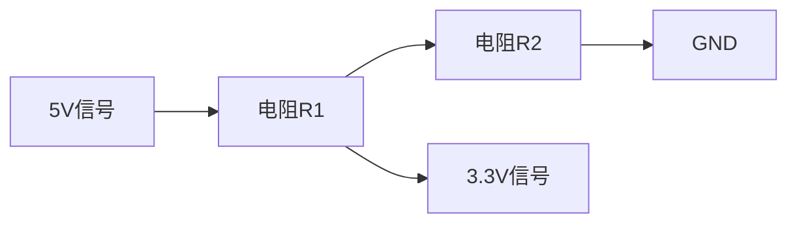

# Arduino 电平转换

## 介绍

在Arduino项目中，电平转换是一个常见的需求。Arduino的输入输出引脚通常工作在5V或3.3V电平，而许多外部设备（如传感器、模块或其他微控制器）可能使用不同的电压电平。为了确保设备之间的正常通信，我们需要进行电平转换。

电平转换的基本原理是将一个电压电平的信号转换为另一个电压电平的信号。例如，将5V信号转换为3.3V信号，或者将3.3V信号转换为5V信号。本文将详细介绍如何在Arduino中实现电平转换，并提供实际案例。

## 电平转换的基本原理

电平转换的核心是通过电路或芯片将输入信号的电压转换为输出信号的电压。常见的电平转换方法包括：

1. **电阻分压器**：通过电阻分压将高电压信号降低到低电压信号。
2. **电平转换芯片**：使用专用的电平转换芯片（如TXB0108、TXS0108E等）进行双向或单向电平转换。
3. **MOSFET电平转换器**：使用MOSFET（场效应管）构建简单的电平转换电路。

### 电阻分压器

电阻分压器是最简单的电平转换方法之一。它通过两个电阻将高电压信号分压为低电压信号。例如，将5V信号转换为3.3V信号，可以使用以下电路：



计算公式为：

```
Vout = Vin * (R2 / (R1 + R2))
```

例如，如果R1 = 10kΩ，R2 = 20kΩ，则：

```
Vout = 5V * (20kΩ / (10kΩ + 20kΩ)) = 3.33V
```

:::note
电阻分压器适用于单向电平转换，且输出电流较小的情况。如果需要双向电平转换或较大电流，建议使用电平转换芯片。
:::

### 电平转换芯片

电平转换芯片是一种专门用于电平转换的集成电路。它们通常支持双向电平转换，并且能够处理较大的电流。常见的电平转换芯片包括TXB0108、TXS0108E等。

以TXB0108为例，它是一个8通道双向电平转换芯片，支持1.2V至3.6V和1.65V至5.5V之间的电平转换。使用TXB0108进行电平转换非常简单，只需将输入信号连接到芯片的A端口，输出信号连接到B端口即可。


:::tip
电平转换芯片通常具有自动方向检测功能，无需额外的控制信号即可实现双向电平转换。
:::

### MOSFET电平转换器

MOSFET电平转换器是一种基于MOSFET的电平转换电路。它通常由两个MOSFET和一个电阻组成，能够实现双向电平转换。MOSFET电平转换器的优点是电路简单、成本低，适用于低频率信号的电平转换。


## 实际案例

### 案例1：Arduino与3.3V传感器的通信

假设我们有一个3.3V的传感器，需要与5V的Arduino进行通信。我们可以使用电阻分压器将Arduino的5V信号转换为3.3V信号，以便传感器能够正确读取。

```cpp
// Arduino代码示例
void setup() {
  pinMode(2, OUTPUT);  // 设置引脚2为输出
}

void loop() {
  digitalWrite(2, HIGH);  // 输出5V信号
  delay(1000);
  digitalWrite(2, LOW);   // 输出0V信号
  delay(1000);
}
```

在电路中，我们可以使用10kΩ和20kΩ的电阻构建一个电阻分压器，将5V信号转换为3.3V信号。

### 案例2：Arduino与ESP8266的通信

ESP8266是一种常用的Wi-Fi模块，工作电压为3.3V。如果我们需要将ESP8266与5V的Arduino进行通信，可以使用电平转换芯片TXB0108。

```cpp
// Arduino代码示例
void setup() {
  pinMode(2, OUTPUT);  // 设置引脚2为输出
}

void loop() {
  digitalWrite(2, HIGH);  // 输出5V信号
  delay(1000);
  digitalWrite(2, LOW);   // 输出0V信号
  delay(1000);
}
```

在电路中，我们可以将Arduino的5V信号连接到TXB0108的A端口，ESP8266的3.3V信号连接到TXB0108的B端口，从而实现双向电平转换。

## 总结

电平转换是Arduino项目中常见的需求，特别是在与不同电压设备通信时。本文介绍了电阻分压器、电平转换芯片和MOSFET电平转换器等常见的电平转换方法，并提供了实际案例。希望本文能帮助你更好地理解和应用电平转换技术。

## 附加资源与练习

- **练习1**：尝试使用电阻分压器将Arduino的5V信号转换为3.3V信号，并使用示波器观察输出信号。
- **练习2**：使用电平转换芯片TXB0108实现Arduino与ESP8266的双向通信。
- **资源**：查阅TXB0108数据手册，了解更多关于电平转换芯片的使用细节。

:::caution
在进行电平转换时，务必确保电路设计正确，避免损坏设备。
:::