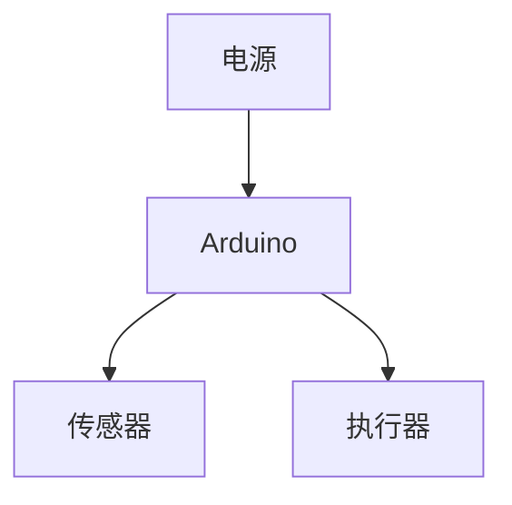
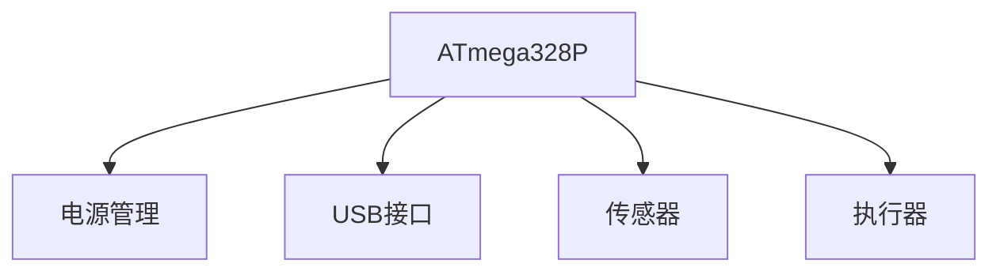

# Arduino PCB设计

## 介绍

Arduino是一个强大的开源硬件平台，广泛应用于各种电子项目中。虽然Arduino开发板本身已经非常方便，但在某些情况下，你可能需要为你的项目设计一个定制的PCB（印刷电路板）。PCB设计可以帮助你优化电路布局、减少尺寸、提高可靠性，并简化批量生产。

本文将带你了解Arduino PCB设计的基础知识，从概念到实际应用，帮助你为你的项目制作一个定制的PCB。

## 什么是PCB？

PCB（印刷电路板）是一种用于连接电子元件的基板。它通过铜线（称为“走线”）将电子元件连接在一起，从而实现电路功能。PCB通常由绝缘材料（如FR-4）制成，表面覆盖有铜层，通过蚀刻工艺形成所需的电路图案。

## PCB设计的基本步骤

### 1. 确定电路需求
在设计PCB之前，首先需要明确电路的功能需求。这包括：
- 需要哪些电子元件？
- 电路的输入和输出是什么？
- 电路的工作电压和电流是多少？

### 2. 绘制电路原理图
电路原理图是电路的图形表示，展示了各个元件之间的连接关系。你可以使用EDA（电子设计自动化）工具，如KiCad、Eagle或Altium Designer来绘制原理图。

### 3. 设计PCB布局
在绘制完原理图后，下一步是设计PCB布局。PCB布局决定了元件在板上的位置以及走线的路径。设计时需要考虑以下因素：
- 元件的位置和方向
- 走线的宽度和间距
- 电源和地线的布局
- 信号完整性和电磁兼容性

### 4. 生成Gerber文件
Gerber文件是PCB制造的标准文件格式。它包含了PCB的每一层（如铜层、丝印层、焊盘层等）的信息。生成Gerber文件后，你可以将其发送给PCB制造商进行生产。

## 实际案例：Arduino Uno的定制PCB

假设你正在设计一个基于Arduino Uno的项目，并且希望将整个电路集成到一个定制的PCB上。以下是一个简单的步骤示例：

### 1. 确定电路需求
- 你需要一个Arduino Uno的核心功能，包括ATmega328P微控制器、电源管理、USB接口等。
- 你还需要连接一些传感器和执行器。

### 2. 绘制电路原理图
使用KiCad绘制Arduino Uno的电路原理图。确保所有元件都正确连接，并且电源和地线布局合理。

### 3. 设计PCB布局
在KiCad中，将元件放置在PCB板上，并绘制走线。确保走线尽可能短，并且避免交叉。

### 4. 生成Gerber文件
完成PCB布局后，生成Gerber文件并发送给PCB制造商。

## 总结

PCB设计是Arduino项目开发中的一个重要环节。通过设计定制的PCB，你可以优化电路布局、减少尺寸、提高可靠性，并简化批量生产。本文介绍了PCB设计的基本步骤，并通过一个实际案例展示了如何为Arduino Uno设计一个定制的PCB。

## 附加资源

- [KiCad官方文档](https://kicad.org/)
- [Eagle教程](https://www.autodesk.com/products/eagle/overview)
- [PCB设计基础](https://www.pcbway.com/blog/PCB_Design_Tutorial.html)

## 练习

1. 使用KiCad绘制一个简单的LED闪烁电路的原理图。
2. 设计一个PCB布局，将LED和电阻放置在板上，并绘制走线。
3. 生成Gerber文件，并尝试将其发送给PCB制造商进行生产。

通过完成这些练习，你将更好地理解PCB设计的流程，并为未来的Arduino项目打下坚实的基础。