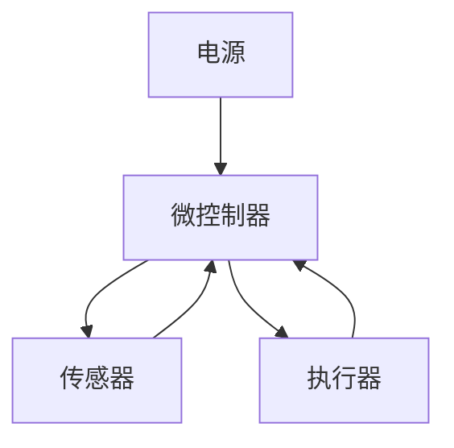

# Arduino 产品化设计

Arduino是一个强大的原型开发平台，但将Arduino项目转化为可量产的产品需要更多的规划和设计。本文将引导你了解Arduino产品化设计的关键步骤，帮助你从原型阶段迈向产品化。

## 什么是Arduino产品化设计？

Arduino产品化设计是指将Arduino原型转化为可量产、可销售的产品的过程。这包括硬件设计优化、软件稳定性提升、生产准备和测试等多个方面。产品化设计的目标是确保产品在性能、可靠性和成本上满足市场需求。

## 1. 硬件设计优化

### 1.1 选择合适的微控制器

在原型阶段，Arduino Uno或Nano等开发板非常方便，但在产品化阶段，你可能需要选择更小、更便宜的微控制器。例如，使用ATmega328P的裸芯片，而不是整个开发板。

```cpp
// 示例：使用ATmega328P的裸芯片
#include <Arduino.h>

void setup() {
  pinMode(LED_BUILTIN, OUTPUT);
}

void loop() {
  digitalWrite(LED_BUILTIN, HIGH);
  delay(1000);
  digitalWrite(LED_BUILTIN, LOW);
  delay(1000);
}
```

### 1.2 PCB设计

将Arduino项目转化为PCB（印刷电路板）是产品化的关键步骤。使用EDA工具（如KiCad或Altium Designer）设计PCB，确保电路布局合理，减少噪声和干扰。



### 1.3 电源管理

确保电源设计满足产品的功耗需求。使用稳压器、电池管理芯片等组件，确保设备在不同电源条件下稳定运行。

## 2. 软件优化

### 2.1 代码优化

在产品化阶段，代码需要更加高效和稳定。避免使用延迟函数（如`delay()`），改用非阻塞代码结构。

```cpp
// 示例：非阻塞代码结构
unsigned long previousMillis = 0;
const long interval = 1000;

void loop() {
  unsigned long currentMillis = millis();
  if (currentMillis - previousMillis >= interval) {
    previousMillis = currentMillis;
    digitalWrite(LED_BUILTIN, !digitalRead(LED_BUILTIN));
  }
}
```

### 2.2 固件更新

设计固件更新机制，以便在产品发布后能够远程更新固件。可以使用OTA（Over-The-Air）更新技术。

## 3. 测试与验证

### 3.1 功能测试

在产品化之前，进行全面的功能测试，确保所有功能按预期工作。使用自动化测试工具（如Arduino Unit Testing）进行测试。

### 3.2 环境测试

测试产品在不同环境条件下的表现，如温度、湿度、振动等。确保产品在各种环境下都能稳定运行。

## 4. 生产准备

### 4.1 物料清单（BOM）

创建详细的物料清单，列出所有需要的组件和供应商信息。确保组件的可获得性和成本控制。

### 4.2 生产流程

设计生产流程，包括PCB组装、焊接、测试和包装。确保生产流程高效且可重复。

## 实际案例：智能家居控制器

假设你正在开发一个智能家居控制器，使用Arduino作为原型。在产品化阶段，你需要：

1. 选择ATmega328P裸芯片作为微控制器。
2. 设计PCB，集成Wi-Fi模块和传感器。
3. 优化代码，使用非阻塞结构和OTA更新。
4. 进行功能测试和环境测试，确保产品稳定。
5. 准备物料清单和生产流程，确保产品可量产。

## 总结

Arduino产品化设计是一个复杂但必要的过程，涉及硬件设计、软件优化、测试和生产准备等多个方面。通过合理的规划和设计，你可以将Arduino原型转化为可量产的产品，满足市场需求。

## 附加资源

- [Arduino官方文档](https://www.arduino.cc/en/Guide)
- [KiCad PCB设计教程](https://kicad.org/)
- [Arduino Unit Testing](https://github.com/mmurdoch/arduinounit)

## 练习

1. 尝试将你的Arduino项目转化为PCB设计，使用KiCad或其他EDA工具。
2. 优化你的Arduino代码，使用非阻塞结构替代`delay()`函数。
3. 设计一个简单的测试计划，确保你的产品在不同环境条件下稳定运行。
