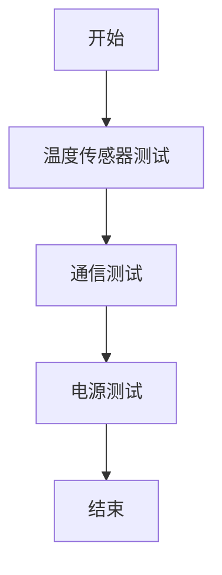

# Arduino 生产测试

在生产环境中，Arduino设备的测试是确保其可靠性和一致性的关键步骤。无论是批量生产还是小规模制造，测试过程都至关重要。本文将详细介绍Arduino生产测试的基本概念、方法和实际应用。

## 什么是Arduino生产测试？

Arduino生产测试是指在设备制造完成后，通过一系列自动化或半自动化的测试流程，验证Arduino设备的功能是否正常。这些测试通常包括硬件测试、软件测试以及两者的集成测试。

:::note
生产测试的目标是确保每个设备在出厂前都能正常工作，减少返修率和客户投诉。
:::

## 生产测试的基本步骤

### 1. 硬件测试

硬件测试主要检查Arduino板的物理连接和组件是否正常工作。常见的硬件测试包括：

- **电源测试**：确保电源输入和输出符合规格。
- **引脚测试**：验证所有数字和模拟引脚的功能。
- **通信接口测试**：检查I2C、SPI、UART等通信接口是否正常。

```cpp
void setup() {
  Serial.begin(9600);
  pinMode(LED_BUILTIN, OUTPUT);
}

void loop() {
  digitalWrite(LED_BUILTIN, HIGH);
  delay(1000);
  digitalWrite(LED_BUILTIN, LOW);
  delay(1000);
  Serial.println("LED Blinking Test Passed");
}
```

### 2. 软件测试

软件测试主要验证Arduino固件的功能是否正常。常见的软件测试包括：

- **功能测试**：验证每个功能模块是否按预期工作。
- **性能测试**：检查设备的响应时间和资源使用情况。
- **边界测试**：测试设备在极端条件下的表现。

```cpp
void setup() {
  Serial.begin(9600);
}

void loop() {
  int sensorValue = analogRead(A0);
  Serial.println(sensorValue);
  delay(100);
}
```

### 3. 集成测试

集成测试是硬件和软件测试的结合，确保两者能够协同工作。常见的集成测试包括：

- **传感器测试**：验证传感器数据是否准确。
- **执行器测试**：检查执行器（如电机、继电器）是否按预期工作。

```cpp
void setup() {
  Serial.begin(9600);
  pinMode(2, OUTPUT);
}

void loop() {
  int sensorValue = analogRead(A0);
  if (sensorValue > 512) {
    digitalWrite(2, HIGH);
  } else {
    digitalWrite(2, LOW);
  }
  Serial.println(sensorValue);
  delay(100);
}
```

## 实际案例：自动化生产线上的Arduino测试

假设我们有一个自动化生产线，生产带有温度传感器的Arduino设备。每个设备在出厂前都需要通过以下测试：

1. **温度传感器测试**：将设备置于已知温度环境中，验证传感器读数是否准确。
2. **通信测试**：通过I2C接口与主控板通信，验证数据传输是否正常。
3. **电源测试**：检查设备在不同电压下的表现。



:::tip
在实际生产中，可以使用自动化测试设备（ATE）来加速测试过程，并减少人为错误。
:::

## 总结

Arduino生产测试是确保设备质量和可靠性的重要步骤。通过硬件测试、软件测试和集成测试，可以全面验证设备的功能和性能。在实际应用中，自动化测试设备可以大大提高测试效率和准确性。

## 附加资源

- [Arduino官方文档](https://www.arduino.cc/en/Guide)
- [Arduino生产测试指南](https://www.arduino.cc/en/Guide/ProductionTesting)
- [Arduino论坛](https://forum.arduino.cc/)

## 练习

1. 编写一个Arduino程序，测试所有数字引脚的功能。
2. 设计一个自动化测试流程，验证Arduino设备的I2C通信是否正常。
3. 在实际环境中，测试Arduino设备在不同温度下的表现。

通过以上内容，你应该对Arduino生产测试有了全面的了解。希望这些知识能帮助你在实际项目中更好地应用Arduino技术。