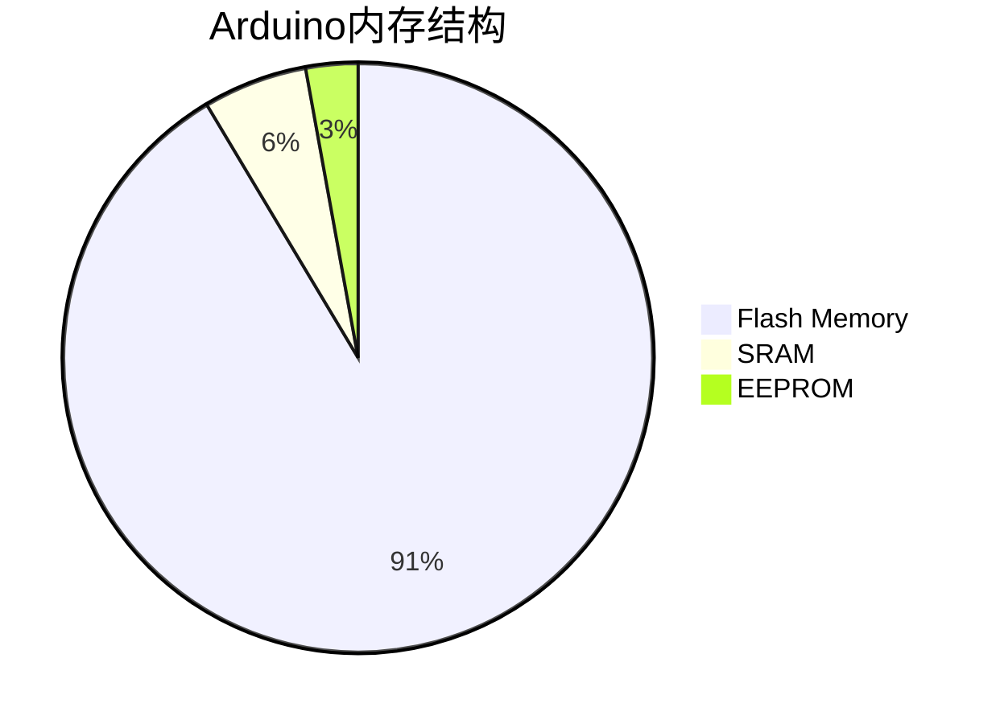

# Arduino 内存管理

Arduino是一种基于微控制器的开发平台，其内存资源相对有限。因此，理解Arduino的内存管理机制对于编写高效、稳定的程序至关重要。本文将详细介绍Arduino的内存结构、内存分配方式以及如何避免常见的内存问题。

## 1. Arduino内存结构

Arduino的内存主要分为三部分：

1. **Flash Memory（闪存）**：用于存储程序代码。这部分内存是非易失性的，即使断电也不会丢失数据。
2. **SRAM（静态随机存取存储器）**：用于存储程序运行时的变量和数据。SRAM是易失性的，断电后数据会丢失。
3. **EEPROM（电可擦可编程只读存储器）**：用于存储需要长期保存的数据。EEPROM是非易失性的，但写入次数有限。



:::note
不同型号的Arduino内存大小可能有所不同。例如，Arduino Uno的Flash Memory为32KB，SRAM为2KB，EEPROM为1KB。
:::

## 2. 内存分配

在Arduino中，内存分配主要发生在SRAM中。SRAM用于存储全局变量、局部变量、动态分配的内存等。了解如何有效地使用SRAM是编写高效程序的关键。

### 2.1 全局变量和局部变量

全局变量在程序启动时分配内存，并在整个程序运行期间保持不变。局部变量在函数调用时分配内存，并在函数返回时释放。

```cpp
int globalVar = 10; // 全局变量，存储在SRAM中

void setup() {
  int localVar = 20; // 局部变量，存储在SRAM中
  Serial.begin(9600);
  Serial.println(globalVar);
  Serial.println(localVar);
}

void loop() {
  // 主循环
}
```

### 2.2 动态内存分配

Arduino支持使用`malloc`和`free`进行动态内存分配。然而，由于SRAM有限，动态内存分配应谨慎使用，以避免内存碎片和内存不足的问题。

```cpp
void setup() {
  Serial.begin(9600);
  int* dynamicArray = (int*)malloc(10 * sizeof(int)); // 动态分配内存
  if (dynamicArray == NULL) {
    Serial.println("内存分配失败");
    return;
  }
  for (int i = 0; i < 10; i++) {
    dynamicArray[i] = i;
  }
  free(dynamicArray); // 释放内存
}

void loop() {
  // 主循环
}
```

:::caution
动态内存分配可能导致内存碎片，尤其是在长时间运行的程序中。尽量避免在Arduino中使用动态内存分配。
:::

## 3. 内存优化技巧

由于Arduino的SRAM有限，优化内存使用是编写高效程序的关键。以下是一些常见的内存优化技巧：

### 3.1 使用`PROGMEM`存储常量数据

`PROGMEM`关键字可以将常量数据存储在Flash Memory中，从而节省SRAM。

```cpp
#include <avr/pgmspace.h>

const char myString[] PROGMEM = "这是一个存储在Flash Memory中的字符串";

void setup() {
  Serial.begin(9600);
  char buffer[50];
  strcpy_P(buffer, myString); // 从Flash Memory中读取数据
  Serial.println(buffer);
}

void loop() {
  // 主循环
}
```

### 3.2 使用`F()`宏减少字符串内存占用

`F()`宏可以将字符串字面量存储在Flash Memory中，从而减少SRAM的使用。

```cpp
void setup() {
  Serial.begin(9600);
  Serial.println(F("这是一个存储在Flash Memory中的字符串"));
}

void loop() {
  // 主循环
}
```

### 3.3 减少全局变量的使用

尽量减少全局变量的使用，尤其是在内存有限的Arduino中。局部变量在函数返回时会自动释放内存，从而减少内存占用。

## 4. 实际案例

假设你正在开发一个Arduino项目，需要存储大量的传感器数据。由于SRAM有限，你可以使用EEPROM来存储这些数据。

```cpp
#include <EEPROM.h>

void setup() {
  Serial.begin(9600);
  int sensorValue = analogRead(A0);
  EEPROM.write(0, sensorValue); // 将传感器数据写入EEPROM
  int storedValue = EEPROM.read(0); // 从EEPROM中读取数据
  Serial.println(storedValue);
}

void loop() {
  // 主循环
}
```

:::tip
EEPROM的写入次数有限（通常为10万次），因此应避免频繁写入数据。
:::

## 5. 总结

Arduino的内存管理是编写高效、稳定程序的关键。通过理解Arduino的内存结构、合理分配内存以及使用优化技巧，你可以充分利用有限的资源，避免常见的内存问题。

## 6. 附加资源与练习

- **练习1**：编写一个程序，使用`PROGMEM`存储一个大型数组，并在运行时读取该数组。
- **练习2**：尝试使用`F()`宏优化程序中的字符串存储，并比较优化前后的内存使用情况。
- **附加资源**：阅读Arduino官方文档，了解更多关于内存管理的详细信息。

通过不断实践和优化，你将能够编写出更加高效、稳定的Arduino程序。