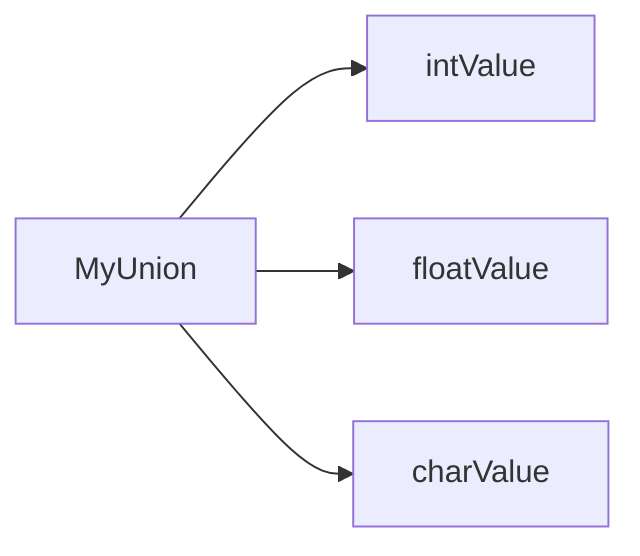

# Arduino 联合体

## 介绍

在Arduino编程中，联合体（Union）是一种特殊的数据结构，它允许在同一内存位置存储不同的数据类型。联合体的所有成员共享同一块内存空间，这意味着在任何时候，联合体只能存储其中一个成员的值。联合体的大小由其最大的成员决定。

联合体在处理需要节省内存或需要以不同方式解释同一数据块的场景时非常有用。例如，当你需要将一个整数和一个浮点数存储在同一内存位置时，联合体可以派上用场。

## 联合体的定义

联合体的定义与结构体（Struct）类似，但使用关键字 `union` 而不是 `struct`。以下是一个简单的联合体定义示例：

```cpp
union MyUnion {
  int intValue;
  float floatValue;
  char charValue;
};
```

在这个例子中，`MyUnion` 联合体包含三个成员：`intValue`、`floatValue` 和 `charValue`。这些成员共享同一块内存空间。

## 联合体的使用

联合体的使用方式与结构体类似，但需要注意的是，联合体的所有成员共享同一块内存空间。因此，当你为其中一个成员赋值时，其他成员的值可能会被覆盖。

以下是一个简单的示例，展示了如何使用联合体：

```cpp
union MyUnion {
  int intValue;
  float floatValue;
  char charValue;
};

void setup() {
  Serial.begin(9600);

  MyUnion myUnion;

  myUnion.intValue = 42;
  Serial.print("intValue: ");
  Serial.println(myUnion.intValue);

  myUnion.floatValue = 3.14;
  Serial.print("floatValue: ");
  Serial.println(myUnion.floatValue);

  myUnion.charValue = 'A';
  Serial.print("charValue: ");
  Serial.println(myUnion.charValue);
}

void loop() {
  // 空循环
}
```

### 输出

```
intValue: 42
floatValue: 3.14
charValue: A
```

在这个示例中，我们首先将 `intValue` 设置为 `42`，然后将其覆盖为 `floatValue` 的 `3.14`，最后再覆盖为 `charValue` 的 `'A'`。每次赋值都会覆盖之前的值。

## 联合体的内存布局

为了更好地理解联合体的内存布局，我们可以使用以下Mermaid图表来展示联合体的内存分配情况：



在这个图表中，`MyUnion` 联合体的所有成员共享同一块内存空间。联合体的大小由其最大的成员决定，因此 `MyUnion` 的大小为 `float` 类型的大小（通常为4字节）。

## 实际应用案例

联合体在处理需要以不同方式解释同一数据块的场景时非常有用。以下是一个实际应用案例，展示了如何使用联合体来解析传感器数据：

```cpp
union SensorData {
  struct {
    byte sensorID;
    byte sensorType;
    int sensorValue;
  } data;
  byte rawData[4];
};

void setup() {
  Serial.begin(9600);

  SensorData sensorData;

  // 模拟从传感器读取的原始数据
  sensorData.rawData[0] = 0x01; // sensorID
  sensorData.rawData[1] = 0x02; // sensorType
  sensorData.rawData[2] = 0x03; // sensorValue (高字节)
  sensorData.rawData[3] = 0x04; // sensorValue (低字节)

  // 解析传感器数据
  Serial.print("Sensor ID: ");
  Serial.println(sensorData.data.sensorID);
  Serial.print("Sensor Type: ");
  Serial.println(sensorData.data.sensorType);
  Serial.print("Sensor Value: ");
  Serial.println(sensorData.data.sensorValue);
}

void loop() {
  // 空循环
}
```

### 输出

```
Sensor ID: 1
Sensor Type: 2
Sensor Value: 772
```

在这个示例中，我们使用联合体来解析从传感器读取的原始数据。通过联合体，我们可以将原始字节数组解释为结构体，从而方便地访问传感器的各个字段。

## 总结

联合体是Arduino编程中一种非常有用的数据结构，它允许在同一内存位置存储不同的数据类型。联合体的所有成员共享同一块内存空间，因此在使用时需要小心，以避免数据覆盖。联合体在处理需要节省内存或需要以不同方式解释同一数据块的场景时非常有用。

## 附加资源与练习

- **练习1**：定义一个联合体，包含 `int`、`float` 和 `char` 类型的成员，并在 `setup()` 函数中分别赋值和打印这些成员的值。
- **练习2**：使用联合体解析一个包含多个字段的传感器数据包，并打印出每个字段的值。

通过以上练习，你可以更好地理解联合体的使用方法和实际应用场景。